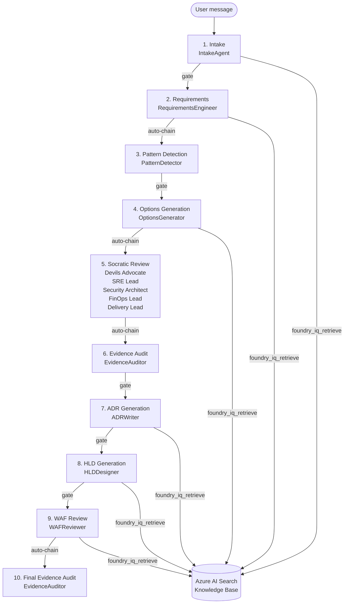

# Archimedes — AI Architecture Workbench

Archimedes is a multi-agent reasoning system built on **Microsoft Agent Framework** that turns
a one-line business need into a fully grounded, evidence-backed architecture.  A judge describes
a problem; Archimedes runs ten specialised agents in sequence — each grounding its output in
Azure Architecture Center documents retrieved from an Azure AI Search knowledge base — and
produces requirements, three architecture options, a five-persona Socratic challenge, an ADR,
a high-level design, and a WAF review, all versioned and diffable.

## Microsoft Agent Framework

All LLM-backed pipeline stages (`IntakeAgent`, `RequirementsEngineer`, `OptionsGenerator`,
`ADRWriter`, `HLDDesigner`, `WAFReviewer`) run as **Microsoft Agent Framework agents** via
`agent_framework.Agent` and `agent_framework.foundry.FoundryChatClient`.

The Socratic review stage runs a **MAF concurrent workflow**: five specialist personas
(`DevilsAdvocate`, `SRELead`, `SecurityArchitect`, `FinOpsLead`, `DeliveryLead`) execute in
parallel via `ConcurrentBuilder.with_aggregator()` from `agent_framework.orchestrations`.
A sixth `SynthesizerAgent` fans in all persona findings and produces the final recommendation.

```python
# Concurrent Socratic review — 5 MAF agents in parallel
workflow = (
    ConcurrentBuilder(participants=[devils_advocate, sre_lead, security_architect,
                                    finops_lead, delivery_lead])
    .with_aggregator(socrates_aggregator)   # fan-in: runs synthesizer, returns SocraticReview
    .build()
)
events = await workflow.run(architecture_context)
```

The application-level `StageController` stays outside MAF — it owns quality gates, artifact
versioning, evidence persistence, and selective re-reasoning on requirement changes.

## How it reasons

Every stage in the pipeline calls `foundry_iq_retrieve` before writing a word.  Azure AI Search
returns semantically-ranked excerpts from curated Azure reference docs. The agent attaches those
excerpts as `EvidenceSource` records linked to every claim it makes. An `EvidenceAuditor` then
independently checks every claim–evidence link, flags ungrounded assumptions as
`requires_user_validation`, and blocks the pipeline if critical coverage is missing.



## Foundry IQ — grounded knowledge retrieval

Every LLM-backed stage calls the `foundry_iq_retrieve` tool before producing output.
The tool posts a semantic search query to Azure AI Search, retrieves the top-k excerpts from
the `archimedes-arch-idx` index (Azure Architecture Center reference docs, CAF, WAF guidance),
and returns them as structured evidence.  The agent must cite the source document and excerpt
in every factual claim — claims without evidence links are flagged by the `EvidenceAuditor`
as ungrounded assumptions requiring human validation.

## Socratic challenge

After options are generated, five specialist personas run **in parallel** (Python `asyncio.gather`)
against the architecture context.  Each persona scores findings on severity and extracts
signals directly from the artifact — scale targets, SLA thresholds, compliance flags, cost
scores, component counts — so findings are specific to the architecture under review, not
generic advice.

| Persona | Focus |
|---|---|
| Devil's Advocate | Challenges the primary option's key assumption |
| SRE / Ops Lead | Availability targets, failure modes, runbook gaps |
| Security Architect | Threat surface, compliance controls (PCI-DSS, GDPR, etc.) |
| FinOps Lead | Cost scores, reserved capacity, over-provisioning risk |
| Delivery Lead | Complexity signals, team skill gaps, time-to-market risk |

A synthesizer ranks the options by weighted persona score and generates a pre-mortem narrative.

## Quick start

```bash
git clone <repo-url> && cd archemedes
python -m venv .venv && .venv\Scripts\activate   # Windows; use source .venv/bin/activate on Mac/Linux
pip install -r requirements.txt        # includes agent-framework and agent-framework-foundry
cp .env.example .env                   # fill in FOUNDRY_PROJECT_ENDPOINT (and optionally ARCH_SEARCH_*)
uvicorn src.api.main:app --reload --host 0.0.0.0 --port 8000 &
streamlit run streamlit_ui/app.py
```

Open `http://localhost:8501`, paste the demo scenario below, then click **Proceed** after each
stage gate to walk the full pipeline.

### React workbench foundation

The new React/Next.js UI lives in `ui/`. It currently contains the Phase 1 foundation shell,
shared components, design tokens, and mock data mode.

```bash
cd ui
npm install
npm run dev
```

Open `http://localhost:3000`.

### Mock-only start (no Azure required)

```bash
# .env
ARCHIMEDES_API_VALIDATE_REQUIRED_ENV=false
ARCHIMEDES_API_STORAGE_BACKEND=memory
USE_MOCK_KB=true
```

## Demo scenario

> Design a real-time fraud detection platform on Azure for a fintech processing  
> 10K TPS with PCI-DSS constraints and 99.95% availability.

Expected Socrates output (stage 5) will reference:
- **10K TPS** throughput target from the requirements artifact
- **PCI-DSS** compliance flag extracted from the business need
- **Azure Event Hubs** / **AKS** services from the options artifact
- **99.95% SLA** availability target in SRE persona findings

## Judging criteria alignment

| Criterion | Weight | How Archimedes addresses it |
|---|---|---|
| **Reliability** | 20% | 10-stage pipeline with quality gates, ETags for optimistic concurrency, re-reasoning on requirement changes |
| **Reasoning** | 20% | MAF `Agent.run()` grounds every claim in KB evidence via `foundry_iq_retrieve` tool; five MAF persona agents run concurrently via `ConcurrentBuilder` for Socratic review; `EvidenceAuditor` links every claim to a source |
| **Accuracy** | 20% | Azure AI Search semantic retrieval with extractive captions; every factual claim carries `evidence_ids`; ungrounded claims are flagged and surfaced to the user |
| **User Experience** | 15% | Streamlit chat UI with stage gate confirmations; structured artifact views for Requirements, ADR, WAF; session history sidebar; assumption validation buttons |
| **Creativity** | 15% | MAF-concurrent 5-persona Socratic challenge: five real LLM agents run in parallel via `ConcurrentBuilder`, each producing context-specific findings; synthesizer pre-mortem; automatic dependency-aware selective re-reasoning on requirement changes |
| **Community** | 10% | Public repo; quickstart in 5 commands; mock mode requires no Azure account |

## Environment variables

| Variable | Required | Purpose |
|---|---|---|
| `FOUNDRY_PROJECT_ENDPOINT` | Yes (live agents) | Azure AI Foundry project endpoint (used by MAF `FoundryChatClient`) |
| `FOUNDRY_API_KEY` | Local live agents | API key for endpoint+key authentication; if omitted, MAF uses `DefaultAzureCredential` |
| `DEFAULT_ARCHITECTURE_MODEL` | No | Model deployment name (default `gpt-4.1`) |
| `ARCHIMEDES_API_STORAGE_BACKEND` | No | `memory` or `cosmos` |
| `ARCHIMEDES_API_COSMOS_ENDPOINT` | If cosmos | Cosmos DB account URL |
| `ARCHIMEDES_API_VALIDATE_REQUIRED_ENV` | No | Set `false` to start without Azure |
| `USE_MOCK_KB` | No | `true` = fixture KB; `false` = Azure AI Search |
| `ARCH_SEARCH_ENDPOINT` | If real KB | Full Azure AI Search endpoint URL |
| `ARCH_SEARCH_API_KEY` | If real KB | Azure AI Search query key |

## Repository layout

```
src/api/            FastAPI application (routes, storage, DI)
src/archimedes/     Core business logic
  agents/           MAF agent factory + deterministic detectors
  models/           Pydantic schemas for all domain objects
  orchestrator/     Stage controller + dependency re-reasoning engine
  socrates/         MAF concurrent 5-persona Socratic debate engine
  state/            State manager, quality gates, diff service
  storage/          Cosmos DB client
  tools/            Azure AI Search retriever + mock KB adapter
prompts/            Agent system prompts (one per stage)
streamlit_ui/       Legacy Streamlit UI
ui/                 React/Next.js UI workspace
tests/              pytest suite (~89 tests)
docs/design/        15 design documents (source of truth)
kb_sources/         Curated Azure reference documents for the KB index
```
