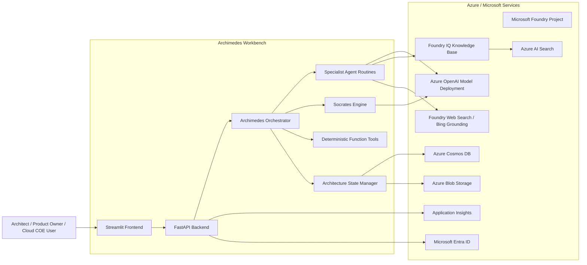
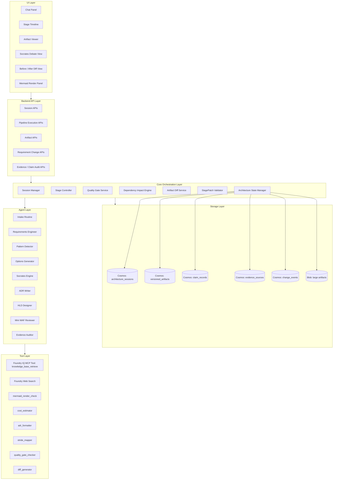
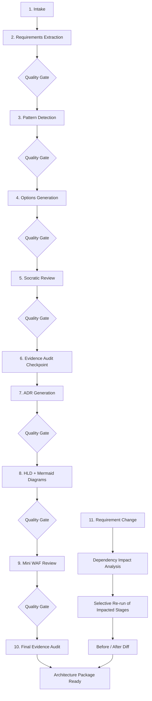
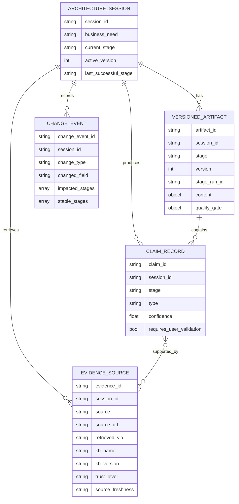
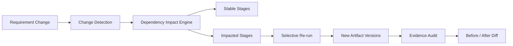
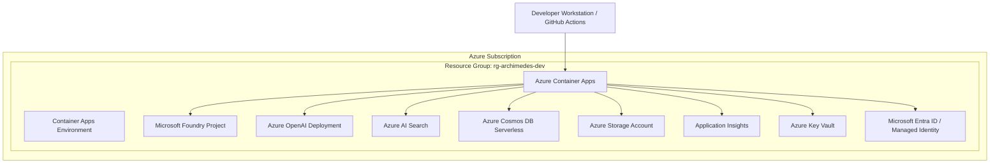

# Archimedes High-Level Design

**Document ID:** `01-archimedes-hld.md`  
**Solution:** Archimedes — AI Architecture Workbench  
**Version:** v2.2  
**Status:** Implementation-ready baseline  
**Last updated:** 2026-06-09  
**Primary stack:** Microsoft Agent Framework, Microsoft Foundry, Foundry IQ, Azure AI Search, Azure OpenAI, Azure Cosmos DB, Azure Blob Storage, Azure Container Apps, Streamlit

---

## 1. Executive Summary

Archimedes is an AI architecture workbench that turns a raw business need into evidence-backed architecture decisions and professional architecture artifacts.

It guides a user through an architecture lifecycle:

1. Intake
2. Requirements extraction
3. Pattern detection
4. Architecture options generation
5. Socratic decision stress-test
6. Evidence audit checkpoint
7. ADR generation
8. High-level design generation
9. Mini Well-Architected Framework review
10. Final evidence audit
11. Requirement-change impact analysis, selective re-reasoning, and before/after diff

Socrates is embedded inside Archimedes as the adversarial decision-quality engine. It runs multiple architecture-focused personas in parallel and synthesizes their findings into blind spots, pre-mortems, confidence levels, assumptions, and recommended decisions.

The system is intentionally designed as an architecture workbench, not a simple chatbot. Its core architectural differentiators are:

- Structured stage pipeline with quality gates.
- Canonical, versioned architecture session state.
- Agent outputs applied only through validated patches.
- Claims and evidence stored separately for auditability.
- Foundry IQ grounded retrieval for Microsoft/Azure architecture knowledge.
- Deterministic function tools for validation, formatting, impact analysis, and cost modeling.
- Requirement-change re-reasoning with selective artifact regeneration.
- Before/after artifact diff as a key demo and product feature.

---

## 2. Goals and Non-Goals

### 2.1 Goals

Archimedes should:

- Convert loosely stated business needs into structured architecture requirements.
- Detect relevant architecture patterns before solution option generation.
- Generate multiple architecture options with explicit trade-offs.
- Stress-test decisions through Socrates adversarial reasoning.
- Generate professional architecture artifacts such as ADRs, HLD diagrams, mini WAF reviews, and evidence reports.
- Ground architecture recommendations in curated Microsoft/Azure documentation through Foundry IQ.
- Separate facts, assumptions, and recommendations.
- Preserve full audit trail through claims, evidence, stage artifacts, and change history.
- Support requirement changes and regenerate only impacted stages.
- Provide a simple but impressive MVP user experience through Streamlit.

### 2.2 Non-Goals for MVP

The MVP will not attempt to provide:

- Deep enterprise RBAC and multi-tenant governance.
- Full compliance automation for frameworks such as PCI-DSS, HIPAA, SOC 2, or ISO 27001.
- Deep FinOps-grade cost modeling.
- Full implementation backlog generation for production delivery.
- Production-grade collaborative editing.
- Full migration planning.
- Native Figma/diagram editing.
- Replacement for a human architecture review board.

These capabilities can be added later after the end-to-end reasoning loop is stable.

---

## 3. Design Principles

| Principle | Design Implication |
|---|---|
| Evidence-backed decisions | Major facts must be grounded in Foundry IQ, Web Search, or deterministic tools. |
| Human-readable architecture artifacts | Every stage produces useful artifacts, not only internal JSON. |
| Agents do not mutate state directly | Agents return `StagePatch` objects; the Architecture State Manager validates and applies them. |
| Facts, assumptions, and recommendations are different | Claims and evidence are modeled separately. |
| Quality gates control progression | Stages produce `passed`, `passed_with_warnings`, or `failed` outcomes. |
| Re-reason selectively | Requirement changes trigger only impacted stage regeneration. |
| Keep deterministic logic outside the LLM | Cost estimation, quality gate checks, dependency impact, diff generation, and render checks are function tools. |
| Use Microsoft-native capabilities where they fit | Foundry IQ, Azure AI Search, Azure OpenAI, Cosmos DB, Blob Storage, Container Apps, and Microsoft Agent Framework form the core stack. |
| Avoid over-agentification | Specialist routines are prompt-based agents/routines; Socrates is where multi-perspective orchestration visibly adds value. |

---

## 4. System Context

---

## 5. Logical Architecture

---

## 6. Major Components

### 6.1 Streamlit Frontend

The MVP frontend provides a lightweight workbench experience.

Primary panels:

- **Chat Panel**: user input and guided conversation.
- **Stage Timeline**: current pipeline stage, stage status, and quality gate badges.
- **Artifact Panel**: ADRs, HLD narrative, options matrix, WAF review, and audit summaries.
- **Socrates Debate View**: persona findings, synthesis, blind spots, and pre-mortem.
- **Mermaid Render Panel**: architecture diagrams generated by the HLD Designer.
- **Before/After Diff View**: visual explanation of what changed after a requirement update.

Details are covered in `14-frontend-specification.md`.

### 6.2 FastAPI Backend

The backend hosts:

- Session APIs.
- Pipeline execution APIs.
- Artifact retrieval APIs.
- Requirement-change APIs.
- Evidence and claim audit APIs.
- WebSocket or polling endpoint for stage progress.

FastAPI also hosts the app-level orchestration runtime and integrates with Microsoft Agent Framework, function tools, Cosmos DB, Blob Storage, Foundry IQ, and Azure OpenAI.

Details are covered in `05-api-contracts.md`.

### 6.3 Archimedes Orchestrator

The Orchestrator is the lifecycle controller.

Responsibilities:

- Create and update architecture sessions.
- Determine the next stage to run.
- Invoke specialist routines.
- Invoke Socrates when options are ready.
- Enforce quality gates.
- Invoke Evidence Auditor at checkpoint and final audit stages.
- Handle requirement-change events.
- Use the dependency impact engine to identify impacted stages.
- Coordinate selective re-runs and artifact versioning.
- Produce progress events for the frontend.

The orchestrator is the main “brain” of the system, but it must not directly mutate persisted state. All writes go through the Architecture State Manager.

### 6.4 Specialist Agent Routines

Specialist routines are Microsoft Agent Framework agents or prompt-based routines with focused instructions. They are not independent hosted runtimes in the MVP.

Specialist routines:

| Routine | Purpose |
|---|---|
| Intake Routine | Captures raw business need and creates the initial architecture session. |
| Requirements Engineer | Extracts functional requirements, NFRs, constraints, assumptions, open questions, and quality gate status. |
| Pattern Detector | Detects primary and secondary architecture patterns. |
| Options Generator | Generates 2–4 viable architecture options and at least one rejected option. |
| ADR Writer | Converts the selected decision into a MADR-style Architecture Decision Record. |
| HLD Designer | Generates HLD narrative and Mermaid diagrams. |
| Mini WAF Reviewer | Reviews the proposed architecture against the five Azure Well-Architected pillars at MVP depth. |
| Evidence Auditor | Reviews claims, citations, evidence relevance, trust, freshness, and contradictions. |

Full prompts and routine specifications are covered in `07-agent-specifications.md`.

### 6.5 Socrates Engine

Socrates is the adversarial reasoning engine embedded inside Archimedes.

It uses architecture-focused personas:

- Devil’s Advocate
- SRE / Operations Lead
- Security Architect
- FinOps Lead
- Delivery Lead
- Optional deep-mode personas: Customer / Business Sponsor, Data Architect, and others

Execution model:

- A Dispatcher broadcasts the decision context to persona executors.
- Personas analyze independently.
- Findings fan in to the Synthesizer.
- The Synthesizer produces a decision-quality brief.

Socrates depth levels:

| Depth | Personas | Cross-exam | Usage |
|---|---:|---|---|
| Light | 3 | No | Quick review |
| Standard | 5 | No | MVP demo default |
| Deep | 7+ | Yes | Later advanced review |

Details are covered in `08-socrates-engine.md`.

### 6.6 Architecture State Manager

The Architecture State Manager is the deterministic write path.

Responsibilities:

- Validate `StagePatch` objects.
- Enforce idempotency.
- Enforce optimistic concurrency through `base_version`, `target_version`, `stage_run_id`, `idempotency_key`, `patch_hash`, and Cosmos DB etag checks.
- Apply valid patches to the correct storage containers.
- Persist versioned artifacts.
- Persist claims and evidence sources.
- Persist change events.
- Update session state and stage execution status.

Agents never write directly to Cosmos DB.

Details are covered in `04-database-design.md` and `03-pydantic-schemas.md`.

### 6.7 Tool Layer

Function tools handle deterministic work that should not be left to the LLM.

MVP tools:

| Tool | Purpose |
|---|---|
| `knowledge_base_retrieve` | Foundry IQ MCP retrieval tool for grounded Microsoft/Azure knowledge. |
| `foundry_web_search` | Current public web search for service updates, docs, and pricing references where needed. |
| `mermaid_render_check` | Checks whether Mermaid output can render; exact implementation may use mermaid-cli or frontend render feedback. |
| `cost_estimator` | Assumption-first Azure cost estimate using curated pricing data. |
| `adr_formatter` | Formats ADRs in a consistent structure. |
| `stride_mapper` | Produces a lightweight STRIDE threat mapping. |
| `quality_gate_checker` | Deterministically evaluates stage quality gates. |
| `dependency_engine` | Computes impacted and stable stages after a requirement change. |
| `diff_generator` | Produces before/after artifact diff summaries. |

Details are covered in `09-tool-specifications.md`.

---

## 7. Stage Pipeline

### 7.1 Stage Status

Each stage execution tracks:

- `pending`
- `running`
- `completed`
- `failed`
- `skipped`

Each execution has:

- `stage_run_id`
- `started_at`
- `completed_at`
- `retry_count`
- `failure_reason`

This enables pause/resume, retries, and demo recovery.

### 7.2 Quality Gate Status

Quality gates produce:

- `passed`
- `passed_with_warnings`
- `failed`

Blocking failures prevent stage advancement. Warnings allow continuation but are shown explicitly to the user.

Details are covered in `06-stage-pipeline.md`.

---

## 8. Data Architecture

The system uses split storage rather than one large Decision Object document.

### 8.1 Cosmos DB Containers

| Container | Purpose | Partition Key |
|---|---|---|
| `architecture_sessions` | Current session summary and stage state | `/session_id` |
| `versioned_artifacts` | One artifact per stage per version | `/session_id` |
| `claim_records` | Claims produced by agents and tools | `/session_id` |
| `evidence_sources` | Retrieved source chunks and metadata | `/session_id` |
| `change_events` | Requirement changes and re-reasoning audit trail | `/session_id` |

Large artifacts are stored in Azure Blob Storage and referenced from Cosmos DB.

Details are covered in `04-database-design.md`.

---

## 9. Knowledge Grounding Architecture

Archimedes uses Foundry IQ as the primary knowledge grounding layer.

### 9.1 Foundry IQ Knowledge Base

The knowledge base should include curated Microsoft/Azure sources:

- Azure Architecture Center
- Azure Well-Architected Framework documentation
- Azure service limits and SLA documentation
- Azure security baselines
- Cloud Adoption Framework and landing zone guidance
- Azure reference architectures
- Cloud design patterns

Foundry IQ is exposed to agents through the MCP-based `knowledge_base_retrieve` tool. Custom logic such as cost estimation, STRIDE mapping, Mermaid render checking, and dependency impact must remain outside the knowledge base as app-local function tools.

Details are covered in `10-foundry-iq-knowledge-base.md`.

### 9.2 Web Search

Foundry Web Search / Bing grounding is used only where the system needs current public information such as:

- Current service announcements.
- Current documentation pages not yet curated into the KB.
- Public pricing reference links.
- Recently changed limits or preview/GA status.

For MVP, web search should support the output, not dominate it. Foundry IQ should remain the primary grounding mechanism.

---

## 10. Claims and Evidence

Archimedes separates claims from evidence.

### 10.1 Claim Types

| Type | Meaning |
|---|---|
| Fact | A statement supported by a relevant, trusted source. |
| Assumption | A belief inferred from context or missing user information. |
| Recommendation | An architecture judgment informed by facts and assumptions. |

### 10.2 Evidence Source Metadata

Each evidence source tracks:

- Source name.
- Source URL.
- Retrieval method.
- Retrieved timestamp.
- KB name and KB version.
- Source document version.
- Excerpt or chunk reference.
- Trust level.
- Freshness.
- Related claim IDs.

### 10.3 Evidence Auditor

The Evidence Auditor checks:

- Whether each important claim has relevant evidence.
- Whether the citation actually supports the claim.
- Whether the source is trusted.
- Whether the evidence is stale.
- Whether assumptions require user validation.
- Whether evidence sources contradict each other.

Evidence audit runs twice:

1. After Socrates, to validate options and adversarial reasoning.
2. Before final output, to validate the full architecture package.

Details are covered in `11-evidence-and-claims.md`.

---

## 11. Requirement Change and Re-Reasoning

Requirement changes are handled through the Dependency Impact Engine.

Example:

> Change: scale target changes from 10K TPS to 100K TPS and multi-region active-active.

The engine identifies:

- Impacted stages.
- Stable stages.
- Artifacts requiring new versions.
- Claims and evidence requiring re-audit.
- Diff views to show what changed.

This is a core demo feature and should be implemented early enough to rehearse properly.

Details are covered in `12-dependency-and-rereasoning.md`.

---

## 12. Deployment Architecture

### 12.1 MVP Hosting Choice

The MVP uses:

- Azure Container Apps for FastAPI backend and Streamlit frontend.
- Azure Cosmos DB Serverless for state.
- Azure Blob Storage for large artifacts.
- Azure AI Search backing Foundry IQ.
- Azure OpenAI model deployment through Foundry.
- Application Insights for telemetry.
- Managed identity wherever possible.

Details are covered in `13-infrastructure-and-deployment.md`.

---

## 13. Security and Compliance View

MVP security controls:

- Microsoft Entra ID authentication for the frontend/backend where feasible.
- Managed identities for Azure service access.
- No secrets in code or environment files committed to Git.
- Key Vault for secrets if secrets are required.
- RBAC-scoped access to Foundry, Azure AI Search, Cosmos DB, and Storage.
- HTTPS-only frontend/backend access.
- Application Insights telemetry without sensitive prompt payloads unless explicitly enabled for debugging.
- Basic STRIDE mapping for generated architectures.

Deep compliance mapping is deferred.

---

## 14. Observability

The MVP should capture:

- Session ID.
- Stage run ID.
- Stage status.
- LLM call count per stage.
- Tool call count per stage.
- Latency per stage.
- Quality gate status.
- Evidence audit status.
- Failure reason and retry count.
- Requirement-change impact result.

Application Insights is the primary telemetry sink. Additional structured logs can be emitted from the FastAPI backend.

---

## 15. MVP Demo Scenario

### 15.1 Initial Prompt

> Design a real-time fraud detection platform on Azure for a fintech processing 10K TPS with PCI-DSS constraints and 99.95% availability.

### 15.2 Expected Flow

Archimedes should:

1. Extract requirements.
2. Detect real-time streaming and transactional/event-driven patterns.
3. Generate architecture options.
4. Run Socrates standard-depth stress test.
5. Produce an evidence audit checkpoint.
6. Generate ADR.
7. Generate HLD with Mermaid diagrams.
8. Produce mini WAF review.
9. Run final evidence audit.

### 15.3 Requirement Change

> Actually, make it 100K TPS and multi-region active-active.

Archimedes should:

- Detect impacted stages.
- Preserve stable stages.
- Re-run impacted stages.
- Generate new artifact versions.
- Show before/after diff.

Details are covered in `15-demo-scenario.md`.

---

## 16. Key Risks

| Risk | Impact | Mitigation |
|---|---|---|
| Foundry IQ KB quality is poor | Generic or weak recommendations | Curate aggressively; test retrieval early with demo scenario. |
| Preview API drift | Build instability | Encapsulate Foundry IQ integration behind an adapter. |
| Socrates latency | Poor demo flow | Use standard depth by default; reserve deep mode for later. |
| State/versioning complexity | Bugs during re-reasoning | Build State Manager and patch validation early. |
| Citation quality is weak | Trust issue | Run Evidence Auditor after Socrates and before final output. |
| Frontend scope creep | Implementation delay | Use Streamlit MVP only. |
| Mermaid rendering failures | Broken artifact display | Use render check and fallback to raw Mermaid. |
| Cost estimates appear too precise | Credibility risk | Use assumption-first cost ranges and sensitivity labels. |

---

## 17. Document Map

This HLD is the master document. Detailed specifications are split into focused documents:

| Document | Purpose |
|---|---|
| `01-archimedes-hld.md` | Top-level architecture and master design. |
| `02-domain-models.md` | Domain/entity model definitions and relationships. |
| `03-pydantic-schemas.md` | Pydantic model code for core data structures. |
| `04-database-design.md` | Cosmos DB containers, partition keys, indexing, versioning. |
| `05-api-contracts.md` | FastAPI endpoints, request/response contracts. |
| `06-stage-pipeline.md` | Stage transitions, stage execution, quality gates. |
| `07-agent-specifications.md` | Agent/routine definitions and system prompts. |
| `08-socrates-engine.md` | Socratic workflow, personas, depth levels. |
| `09-tool-specifications.md` | Function tool signatures and behavior. |
| `10-foundry-iq-knowledge-base.md` | KB sources, curation, MCP integration, retrieval config. |
| `11-evidence-and-claims.md` | Claim/evidence model and audit flow. |
| `12-dependency-and-rereasoning.md` | Dependency mapping, change detection, diff service. |
| `13-infrastructure-and-deployment.md` | Azure resources, deployment, environment configuration. |
| `14-frontend-specification.md` | Streamlit UI layout and panels. |
| `15-demo-scenario.md` | Demo walkthrough and expected outputs. |

---

## 18. External Reference Links

These links should be validated periodically because Microsoft Foundry and Agent Framework capabilities are evolving.

- Microsoft Foundry Agent Service overview: https://learn.microsoft.com/en-us/azure/foundry/agents/overview
- Hosted agents in Foundry Agent Service: https://learn.microsoft.com/en-us/azure/foundry/agents/concepts/hosted-agents
- Connect Agents to Foundry IQ Knowledge Bases: https://learn.microsoft.com/en-us/azure/foundry/agents/how-to/foundry-iq-connect
- Azure AI Search agentic retrieval and MCP endpoint: https://learn.microsoft.com/en-us/azure/search/agentic-retrieval-how-to-retrieve
- Microsoft Agent Framework workflows: https://learn.microsoft.com/en-us/agent-framework/workflows/
- Microsoft Agent Framework workflow edges: https://learn.microsoft.com/en-us/agent-framework/workflows/edges
- Azure Cosmos DB document versioning design pattern: https://learn.microsoft.com/en-us/samples/azure-samples/cosmos-db-design-patterns/document-versioning/

---

## 19. Open Decisions

| Decision | Current Direction | Owner |
|---|---|---|
| Frontend authentication for MVP | Simple local/dev auth or Entra ID depending on contest/demo constraints | Implementation |
| Mermaid render check mechanism | Prefer mermaid-cli if easy; otherwise browser render feedback | Implementation |
| Cost data source | Curated JSON initially; later pricing API/Calculator integration | Implementation |
| Foundry IQ KB ingestion method | Curated docs copied to Blob/Search-backed KB | Implementation |
| Hosted Agent usage | Avoid for core MVP; app-hosted orchestration through FastAPI | Implementation |
| Deep Socrates mode | Defer until standard mode is stable | Implementation |

---

## 20. Implementation Readiness

The architecture is ready to move into implementation planning, with the following first build priorities:

1. Repository structure and environment configuration.
2. Pydantic schemas for session, patches, artifacts, claims, evidence, and quality gates.
3. Cosmos DB containers and storage abstractions.
4. Architecture State Manager.
5. Foundry IQ KB setup and retrieval test.
6. First two stages: intake and requirements extraction.
7. Pattern detector and options generator.
8. Socrates standard-depth workflow.
9. Artifact viewer and stage timeline in Streamlit.
10. Requirement-change selective re-run and diff view.

