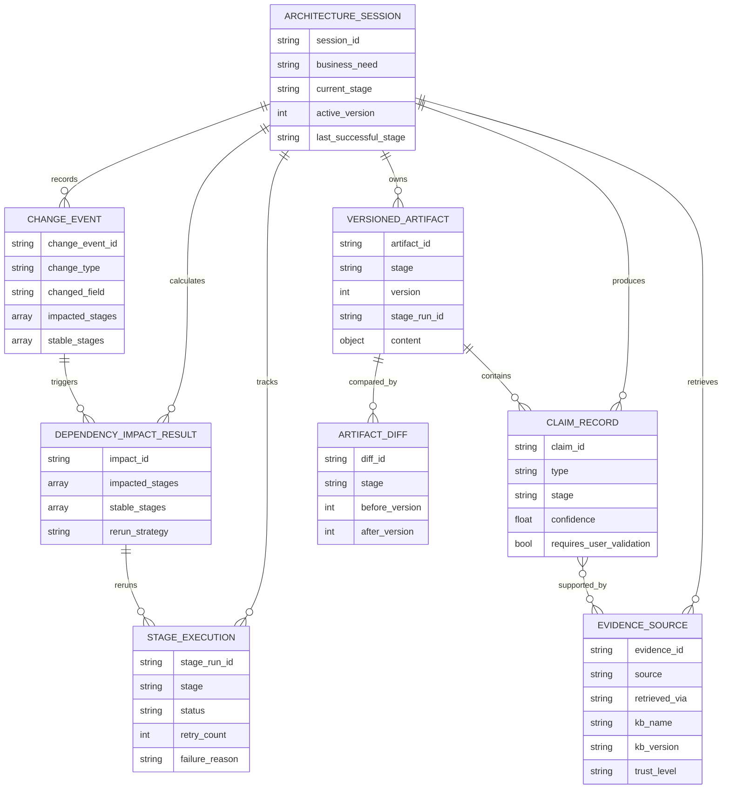
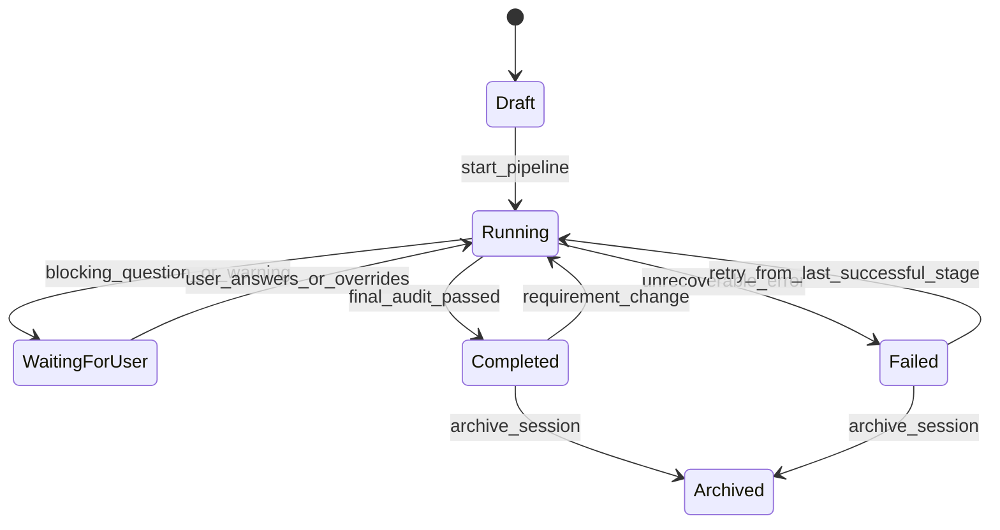
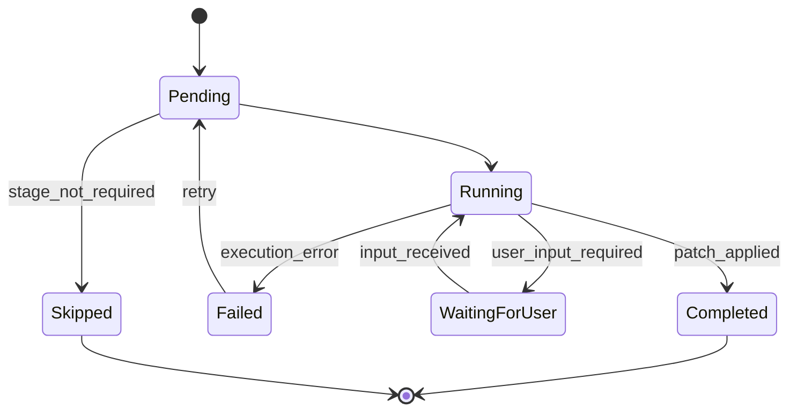
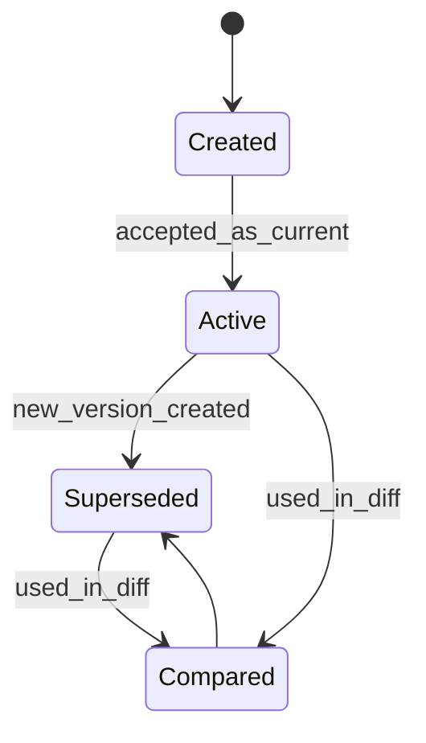
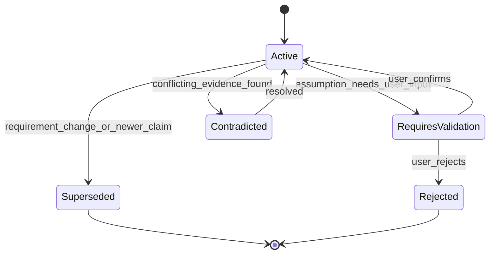

# Archimedes Domain Models

**Document ID:** `02-domain-models.md`  
**Solution:** Archimedes — AI Architecture Workbench  
**Version:** v2.2  
**Status:** Implementation-ready baseline  
**Last updated:** 2026-06-09  
**Related document:** `01-archimedes-hld.md`

---

## 1. Purpose

This document defines the core domain model for Archimedes.

It describes the main business/domain entities, their relationships, lifecycle states, ownership boundaries, and invariants. It intentionally avoids full implementation code. Concrete Pydantic classes, validators, defaults, and serialization details are covered in `03-pydantic-schemas.md`.

The domain model is centered around one main concept:

> **An Architecture Session captures the complete lifecycle of converting a raw business need into evidence-backed architecture artifacts, while preserving stage history, claims, evidence, decisions, and requirement-change reasoning.**

---

## 2. Scope

This document covers:

- Core entities and aggregates.
- Entity relationships.
- Stage and artifact lifecycle concepts.
- Claims and evidence model.
- Requirement-change and re-reasoning model.
- Socrates review model.
- Quality gate model.
- Domain invariants and validation rules.
- Ownership boundaries between orchestration, agents, tools, and storage.

This document does not cover:

- Pydantic implementation code. See `03-pydantic-schemas.md`.
- Cosmos DB physical container design. See `04-database-design.md`.
- API endpoint contracts. See `05-api-contracts.md`.
- Full stage execution logic. See `06-stage-pipeline.md`.
- Full agent prompts. See `07-agent-specifications.md`.
- Socrates WorkflowBuilder implementation. See `08-socrates-engine.md`.
- Function tool signatures. See `09-tool-specifications.md`.

---

## 3. Domain Boundaries

Archimedes has five main domain areas.

| Domain Area | Responsibility | Primary Entities |
|---|---|---|
| Session & Lifecycle | Track the active architecture session, stage progress, versions, and recovery metadata. | `ArchitectureSession`, `StageExecution`, `StagePatch` |
| Architecture Reasoning | Capture requirements, patterns, options, decisions, ADR/HLD/WAF outputs. | `RequirementSet`, `ArchitecturePattern`, `ArchitectureOption`, `ArchitectureDecision`, `VersionedArtifact` |
| Socratic Review | Capture adversarial persona analysis and synthesis. | `SocraticReview`, `PersonaFinding`, `SocraticSynthesis` |
| Evidence & Claims | Separate what the system asserts from where support came from. | `ClaimRecord`, `EvidenceSource`, `EvidenceAuditReport` |
| Change & Re-Reasoning | Track requirement changes, impacted stages, stable stages, selective re-runs, and artifact diffs. | `ChangeEvent`, `DependencyImpactResult`, `ArtifactDiff` |

---

## 4. Naming Conventions

| Naming Rule | Convention |
|---|---|
| Entity names | PascalCase, for example `ArchitectureSession` |
| Persisted IDs | Lowercase snake-style prefix + generated suffix, for example `session_01hxyz` |
| Stage names | Lowercase snake_case, for example `requirements_extraction` |
| Artifact versions | Positive integer per stage, starting at `1` |
| Stage run IDs | Unique per execution attempt, for example `run_requirements_01hxyz` |
| Claim IDs | `claim_...` |
| Evidence IDs | `evidence_...` |
| Change event IDs | `change_...` |

Recommended ID prefixes:

| Entity | Prefix |
|---|---|
| `ArchitectureSession` | `session_` |
| `StageExecution` | `stage_run_` |
| `VersionedArtifact` | `artifact_` |
| `ClaimRecord` | `claim_` |
| `EvidenceSource` | `evidence_` |
| `ChangeEvent` | `change_` |
| `StagePatch` | `patch_` |
| `ArtifactDiff` | `diff_` |

---

## 5. High-Level Domain Model

---

## 6. Core Aggregate: ArchitectureSession

### 6.1 Description

`ArchitectureSession` is the root aggregate of the Archimedes domain.

It represents one end-to-end architecture reasoning engagement initiated by a user. A session starts with a raw business need and evolves through the stage pipeline until it produces an architecture package. Requirement changes may create new artifact versions within the same session.

### 6.2 Responsibilities

`ArchitectureSession` owns or references:

- Raw and refined business need.
- Current stage.
- Active version.
- Stage execution status.
- Detected architecture patterns.
- Quality gate summary.
- Dependency map summary.
- Current selected architecture option or decision.
- Recovery metadata.

It does not store all detailed artifacts inline. Large and versioned outputs are stored as `VersionedArtifact` records.

### 6.3 Key Attributes

| Attribute | Type | Description |
|---|---|---|
| `session_id` | string | Stable unique session identifier. |
| `title` | string | Short human-readable title generated from the business need. |
| `business_need` | string | Raw or lightly normalized business need provided by the user. |
| `created_at` | datetime | Session creation timestamp. |
| `updated_at` | datetime | Last update timestamp. |
| `current_stage` | enum/string | Current pipeline stage. |
| `last_successful_stage` | enum/string/null | Most recent successfully completed stage. |
| `active_version` | integer | Current session-level version marker. |
| `stage_executions` | map | Current execution status by stage. |
| `quality_gates` | map | Latest quality gate result by stage. |
| `detected_patterns` | list | Primary and secondary patterns detected for the session. |
| `selected_option_id` | string/null | Currently recommended or selected architecture option. |
| `dependency_map` | object | Summary of requirement-to-stage dependency mapping. |
| `status` | enum | Overall session status. |

### 6.4 Session Status Values

| Status | Meaning |
|---|---|
| `draft` | Session created but pipeline has not started. |
| `running` | At least one stage is currently executing. |
| `waiting_for_user` | A stage requires user input or user override. |
| `completed` | Architecture package is ready. |
| `failed` | Pipeline failed and requires retry or manual correction. |
| `archived` | Session is no longer active. |

### 6.5 Invariants

- `session_id` is immutable after creation.
- `active_version` must be greater than or equal to the highest accepted artifact version for the active stage.
- `current_stage` must be one of the defined pipeline stages.
- `last_successful_stage` cannot point to a stage that has not completed successfully.
- A session cannot move to `completed` until the final evidence audit is complete or explicitly overridden by the user.

---

## 7. StageExecution

### 7.1 Description

`StageExecution` represents one attempt to run a specific pipeline stage.

A stage may be run multiple times because of failure, retry, or requirement-change re-reasoning. Each attempt receives a new `stage_run_id`.

### 7.2 Key Attributes

| Attribute | Type | Description |
|---|---|---|
| `stage_run_id` | string | Unique ID for this specific execution attempt. |
| `session_id` | string | Parent architecture session. |
| `stage` | enum/string | Stage being executed. |
| `status` | enum | Execution status. |
| `started_at` | datetime/null | Execution start timestamp. |
| `completed_at` | datetime/null | Execution completion timestamp. |
| `retry_count` | integer | Number of retries for this execution. |
| `failure_reason` | string/null | Failure reason if status is `failed`. |
| `input_artifact_versions` | map | Artifact versions used as input. |
| `output_artifact_version` | integer/null | Artifact version created by this execution. |
| `llm_call_count` | integer | Number of LLM calls used. |
| `tool_call_count` | integer | Number of tool calls used. |

### 7.3 Stage Execution Status Values

| Status | Meaning |
|---|---|
| `pending` | Stage is queued but not started. |
| `running` | Stage is executing. |
| `completed` | Stage completed and output patch was applied. |
| `failed` | Stage failed. |
| `skipped` | Stage was skipped intentionally. |
| `waiting_for_user` | Stage needs additional input or override. |

### 7.4 Invariants

- A `running` stage must have `started_at` populated.
- A `completed` stage must have `completed_at` populated.
- A `completed` stage that produces content must reference an output `VersionedArtifact`.
- A failed execution must include a `failure_reason`.
- Retrying a failed stage creates a new `stage_run_id`; it should not overwrite the old attempt.

---

## 8. StagePatch

### 8.1 Description

`StagePatch` is the only accepted write contract from an agent/routine/tool output into persisted state.

Agents do not write directly to Cosmos DB. They produce a patch. The Architecture State Manager validates the patch, checks idempotency and optimistic concurrency, evaluates quality gate status, then persists accepted changes.

### 8.2 Key Attributes

| Attribute | Type | Description |
|---|---|---|
| `patch_id` | string | Unique patch ID. |
| `session_id` | string | Target session. |
| `stage` | string | Stage producing the patch. |
| `stage_run_id` | string | Execution attempt that produced the patch. |
| `base_version` | integer | Artifact/session version this patch was computed from. |
| `target_version` | integer | Version this patch intends to create. |
| `idempotency_key` | string | Stable key to prevent duplicate patch application. |
| `patch_hash` | string | Hash of patch content for replay and duplicate detection. |
| `patch` | object | Stage-specific content payload. |
| `claims` | list | Claims produced by this patch. |
| `evidence_sources` | list | Evidence sources retrieved or used by this patch. |
| `quality_gate_result` | object | Quality gate result for this stage. |
| `requires_user_input` | list | Questions or missing details needed from user. |

### 8.3 Invariants

- `target_version` must be greater than `base_version` for normal artifact-producing stages.
- `idempotency_key` must be unique per applied patch.
- `patch_hash` must match the serialized patch payload.
- A patch with blocking quality gate failures must not be applied unless the domain explicitly allows a special override flow.
- `stage_run_id` must match an existing `StageExecution` in `running` or `waiting_for_user` state.

---

## 9. Requirements Domain

### 9.1 RequirementSet

`RequirementSet` captures the structured requirements extracted from the raw business need and follow-up inputs.

It contains:

- Functional requirements.
- Non-functional requirements.
- Constraints.
- Assumptions.
- Open questions.
- Evaluation criteria.

### 9.2 Requirement

A `Requirement` is a specific need, condition, or target that affects the architecture.

| Attribute | Type | Description |
|---|---|---|
| `requirement_id` | string | Stable requirement ID such as `FR-001` or `NFR-001`. |
| `category` | enum | Functional, performance, reliability, security, compliance, data, integration, cost, timeline, etc. |
| `description` | string | Human-readable requirement. |
| `priority` | enum | `must`, `should`, `could`, `wont` or similar. |
| `measurable_target` | string/null | Quantified target, if available. |
| `source` | enum/string | User, inferred, Foundry IQ, Web Search, or agent judgment. |
| `status` | enum | Confirmed, assumed, open, superseded. |
| `requires_validation` | boolean | Whether the user must validate this requirement. |
| `impacts_stages` | list | Stages impacted by changes to this requirement. |

### 9.3 Requirement Categories

| Category | Examples |
|---|---|
| `functional` | Real-time fraud scoring, alert generation, dashboard. |
| `performance` | TPS, p95/p99 latency, throughput, concurrency. |
| `reliability` | Availability target, RTO, RPO, failover mode. |
| `security` | Identity, access control, encryption, secrets. |
| `compliance` | PCI-DSS, HIPAA, GDPR, SOC 2, ISO 27001. |
| `data` | Retention, lineage, residency, sensitivity, volume. |
| `integration` | Upstream/downstream systems, APIs, events. |
| `operability` | Monitoring, alerting, deployment, support model. |
| `cost` | Budget cap, cost sensitivity, FinOps requirements. |
| `timeline` | MVP deadline, migration window, delivery phases. |
| `platform_constraint` | Azure-only, managed services preferred, no Kubernetes, etc. |

### 9.4 Requirement Status Values

| Status | Meaning |
|---|---|
| `confirmed` | Explicitly stated or confirmed by user. |
| `assumed` | Inferred by the system and requires validation. |
| `open` | Question remains unresolved. |
| `superseded` | Replaced by a newer requirement version. |
| `rejected` | Explicitly rejected or declared out of scope. |

### 9.5 OpenQuestion

`OpenQuestion` captures a question that may block or influence later stages.

| Attribute | Type | Description |
|---|---|---|
| `question_id` | string | Unique question ID. |
| `question` | string | Question text. |
| `related_requirement_ids` | list | Requirements affected by this question. |
| `impact_if_unanswered` | string | What may go wrong if left unresolved. |
| `default_assumption` | string/null | Assumption to use if user does not answer. |
| `status` | enum | Open, answered, deferred, ignored. |

---

## 10. Pattern Detection Domain

### 10.1 ArchitecturePattern

`ArchitecturePattern` represents a recognized architecture style or solution pattern relevant to the business need.

Examples:

- `real_time_streaming`
- `rag_application`
- `event_driven_integration`
- `batch_analytics`
- `multi_agent_workflow`
- `transactional_system`
- `migration_modernization`
- `iot_ingestion`

### 10.2 Key Attributes

| Attribute | Type | Description |
|---|---|---|
| `pattern_id` | string | Pattern identifier. |
| `name` | string | Human-readable pattern name. |
| `confidence` | float | Confidence score from 0.0 to 1.0. |
| `is_primary` | boolean | Whether this is the dominant pattern. |
| `signals` | list | Words/requirements that triggered the pattern. |
| `typical_pipeline` | string | Standard flow for this pattern. |
| `azure_services_to_explore` | list | Candidate Azure services for options generation. |
| `pattern_specific_nfrs` | list | NFRs implied by this pattern. |

### 10.3 Invariants

- At least one primary pattern must be identified before architecture options generation.
- More than one pattern may be present, but only one should be marked as primary unless explicitly allowed.
- Pattern detection should not make final service choices; it only narrows the solution space.

---

## 11. Architecture Options Domain

### 11.1 ArchitectureOption

`ArchitectureOption` represents one possible solution approach.

The Options Generator should produce 2–4 viable options and at least one explicitly rejected option.

### 11.2 Key Attributes

| Attribute | Type | Description |
|---|---|---|
| `option_id` | string | Stable option ID such as `OPT-A`. |
| `name` | string | Option name. |
| `summary` | string | Short description. |
| `status` | enum | Viable, recommended, rejected, superseded. |
| `mapped_patterns` | list | Patterns this option addresses. |
| `components` | list | Logical and Azure service components. |
| `data_flows` | list | Major data movement paths. |
| `tradeoff_scores` | object | Cost, complexity, scalability, time-to-market, operational burden, etc. |
| `risks` | list | Key risks. |
| `assumptions` | list | Option-specific assumptions. |
| `evidence_claim_ids` | list | Claims supporting the option. |

### 11.3 Option Status Values

| Status | Meaning |
|---|---|
| `viable` | Can meet the requirements with trade-offs. |
| `recommended` | Selected or currently preferred. |
| `rejected` | Explicitly rejected with rationale. |
| `superseded` | Replaced by a newer option after re-reasoning. |
| `hybrid` | Created by combining parts of other options. |

### 11.4 ArchitectureComponent

An `ArchitectureComponent` represents a logical or physical component in an option or HLD.

| Attribute | Type | Description |
|---|---|---|
| `component_id` | string | Stable component ID. |
| `name` | string | Component name. |
| `component_type` | enum/string | API, event broker, database, model endpoint, search index, workflow, etc. |
| `azure_service` | string/null | Azure service mapping, if known. |
| `responsibility` | string | What the component does. |
| `criticality` | enum | Low, medium, high, critical. |
| `trust_zone` | string/null | Security/trust boundary. |
| `scaling_notes` | string/null | Scale behavior or limits. |

### 11.5 TradeoffScore

`TradeoffScore` captures option scoring across evaluation dimensions.

| Attribute | Type | Description |
|---|---|---|
| `dimension` | string | Cost, complexity, scalability, reliability, etc. |
| `score` | integer | Usually 1–10. Higher should mean better unless otherwise specified. |
| `weight` | float | Importance weight. |
| `rationale` | string | Why the score was assigned. |
| `confidence` | float | Confidence in the score. |

---

## 12. Socrates Domain

### 12.1 SocraticReview

`SocraticReview` captures the adversarial reasoning result for a set of architecture options.

It is produced after options generation and before the ADR.

### 12.2 Key Attributes

| Attribute | Type | Description |
|---|---|---|
| `review_id` | string | Unique Socrates review ID. |
| `session_id` | string | Parent session. |
| `stage_run_id` | string | Stage execution that produced the review. |
| `depth` | enum | Light, standard, or deep. |
| `input_option_ids` | list | Options being reviewed. |
| `persona_findings` | list | Findings from each persona. |
| `synthesis` | object | Final synthesis from the Synthesizer. |
| `quality_gate_result` | object | Socratic review quality gate. |

### 12.3 PersonaFinding

| Attribute | Type | Description |
|---|---|---|
| `persona` | string | Persona name, such as `Security Architect`. |
| `option_id` | string/null | Option being discussed. |
| `finding` | string | Finding text. |
| `finding_type` | enum | Risk, opportunity, blind spot, assumption, mitigation, objection. |
| `severity` | enum | Low, medium, high, critical. |
| `claim_ids` | list | Claims generated by this finding. |

### 12.4 SocraticSynthesis

| Attribute | Type | Description |
|---|---|---|
| `recommended_option_id` | string/null | Recommended option after debate. |
| `confidence` | float | Confidence score. |
| `blind_spots` | list | Key blind spots discovered. |
| `premortem` | list | Failure scenarios. |
| `key_assumptions` | list | Assumptions requiring validation. |
| `recommended_mitigations` | list | Risk mitigations. |
| `hybrid_option_proposed` | boolean | Whether a hybrid option is proposed. |

### 12.5 Socrates Depth Values

| Depth | Personas | Intended Usage |
|---|---|---|
| `light` | 3 | Quick sanity check. |
| `standard` | 5 | MVP default and demo mode. |
| `deep` | 7+ with optional cross-examination | Advanced analysis after MVP. |

---

## 13. Decision and Artifact Domain

### 13.1 ArchitectureDecision

`ArchitectureDecision` captures the selected option and rationale. It is the semantic basis for the ADR.

| Attribute | Type | Description |
|---|---|---|
| `decision_id` | string | Unique decision ID. |
| `session_id` | string | Parent session. |
| `selected_option_id` | string | Selected architecture option. |
| `decision_summary` | string | Concise decision statement. |
| `rationale` | string | Why this option was selected. |
| `tradeoffs` | list | Accepted trade-offs. |
| `rejected_option_ids` | list | Rejected options. |
| `consequences` | list | Consequences of the decision. |
| `confidence` | float | Confidence score. |
| `claim_ids` | list | Claims supporting the decision. |

### 13.2 VersionedArtifact

`VersionedArtifact` stores the output of a stage.

Artifacts are versioned because requirement changes may regenerate only some stages.

### 13.3 Artifact Types

| Artifact Type | Produced By | Description |
|---|---|---|
| `requirements_summary` | Requirements Engineer | Structured requirements and open questions. |
| `pattern_detection_report` | Pattern Detector | Detected architecture patterns and NFR implications. |
| `options_matrix` | Options Generator | Architecture options and trade-off scores. |
| `socratic_review` | Socrates Engine | Persona findings and synthesis. |
| `evidence_audit_report` | Evidence Auditor | Claims/evidence quality report. |
| `adr` | ADR Writer | Architecture Decision Record. |
| `hld` | HLD Designer | HLD narrative and diagrams. |
| `mini_waf_review` | Mini WAF Reviewer | Well-Architected review summary. |
| `artifact_diff` | Diff Service | Before/after comparison. |
| `cost_estimate` | Cost Estimator | Assumption-first cost range and drivers. |

### 13.4 VersionedArtifact Key Attributes

| Attribute | Type | Description |
|---|---|---|
| `artifact_id` | string | Unique artifact ID. |
| `session_id` | string | Parent session. |
| `stage` | string | Stage that produced this artifact. |
| `artifact_type` | string | Type of artifact. |
| `version` | integer | Version number for this stage artifact. |
| `stage_run_id` | string | Execution that produced it. |
| `content` | object/string | Artifact content or structured payload. |
| `content_format` | enum | Markdown, JSON, Mermaid, mixed. |
| `blob_uri` | string/null | Blob location for large artifacts. |
| `quality_gate_result` | object | Quality gate result. |
| `claim_ids` | list | Claims contained in or produced by the artifact. |
| `created_at` | datetime | Creation timestamp. |

### 13.5 Artifact Versioning Rules

- Version numbers are scoped by `session_id + stage + artifact_type`.
- Initial artifact version is `1`.
- Requirement-change re-runs create new versions rather than overwriting previous versions.
- Old versions remain readable for before/after diff.
- Artifacts should record the input artifact versions used to generate them where practical.

---

## 14. Quality Gate Domain

### 14.1 QualityGateResult

A `QualityGateResult` indicates whether a stage output is complete enough to proceed.

| Attribute | Type | Description |
|---|---|---|
| `status` | enum | Passed, passed with warnings, or failed. |
| `blocking_failures` | list | Issues that prevent advancement. |
| `warnings` | list | Issues that should be visible but do not block. |
| `user_override_allowed` | boolean | Whether user can proceed despite warnings. |
| `check_results` | map | Individual check outcomes. |

### 14.2 Quality Gate Status Values

| Status | Meaning |
|---|---|
| `passed` | All required and warning checks passed. |
| `passed_with_warnings` | Blocking checks passed, but warnings exist. |
| `failed` | One or more blocking checks failed. |

### 14.3 Invariants

- A `failed` quality gate must include at least one blocking failure.
- `user_override_allowed` should be false when blocking failures exist.
- Warnings should be persisted and shown in the frontend timeline.
- Stage advancement must be controlled by the Orchestrator and State Manager, not by the agent alone.

---

## 15. Claims and Evidence Domain

### 15.1 Why Claims and Evidence Are Separate

Archimedes must avoid treating every generated sentence as equally grounded.

A claim is what the system says.

Evidence is where supporting information came from.

A recommendation may be informed by multiple facts and assumptions, but it is not itself a direct citation. This distinction is critical for architecture credibility.

### 15.2 ClaimRecord

| Attribute | Type | Description |
|---|---|---|
| `claim_id` | string | Unique claim ID. |
| `session_id` | string | Parent session. |
| `stage` | string | Stage that produced the claim. |
| `artifact_id` | string/null | Artifact containing the claim. |
| `claim` | string | Claim text. |
| `type` | enum | Fact, assumption, or recommendation. |
| `confidence` | float | Confidence score. |
| `evidence_ids` | list | Evidence sources supporting this claim. |
| `requires_user_validation` | boolean | Whether the user should validate the claim. |
| `status` | enum | Active, superseded, contradicted, rejected. |
| `created_at` | datetime | Creation timestamp. |

### 15.3 Claim Types

| Type | Meaning | Example |
|---|---|---|
| `fact` | Supported by relevant trusted evidence. | Azure service X supports capability Y. |
| `assumption` | Inferred from context or missing information. | Team has limited Kafka operations experience. |
| `recommendation` | Architecture judgment based on facts and assumptions. | Prefer managed Event Hubs for MVP. |

### 15.4 EvidenceSource

| Attribute | Type | Description |
|---|---|---|
| `evidence_id` | string | Unique evidence ID. |
| `session_id` | string | Parent session. |
| `source` | string | Source title or name. |
| `source_url` | string/null | URL where applicable. |
| `retrieved_via` | enum | Foundry IQ, Web Search, function tool. |
| `retrieved_at` | datetime | Retrieval timestamp. |
| `excerpt` | string/null | Retrieved chunk or summary excerpt. |
| `kb_name` | string/null | Knowledge base name if Foundry IQ was used. |
| `kb_version` | string/null | Knowledge base version. |
| `source_document_version` | string/null | Version/date of source document. |
| `trust_level` | enum | High, medium, low. |
| `source_freshness` | enum | Current, recent, stale, unknown. |
| `related_claim_ids` | list | Claims using this evidence. |

### 15.5 Claim Status Values

| Status | Meaning |
|---|---|
| `active` | Current claim is valid within the session context. |
| `superseded` | Claim replaced after requirement change or newer evidence. |
| `contradicted` | Conflicting evidence has been found. |
| `rejected` | Claim was rejected by auditor, user, or later reasoning. |

### 15.6 Evidence Trust Levels

| Trust Level | Meaning |
|---|---|
| `high` | Official Microsoft/Azure docs, trusted standards, curated internal architecture documents. |
| `medium` | Reputable technical articles, known vendor docs, community sources with caution. |
| `low` | Unverified blogs, forums, weak or stale references. |

### 15.7 Evidence Freshness Values

| Freshness | Meaning |
|---|---|
| `current` | Suitable for current architectural decision. |
| `recent` | Probably usable but should be checked for fast-changing facts. |
| `stale` | Too old for pricing, limits, preview/GA status, or rapidly changing product details. |
| `unknown` | Freshness cannot be determined. |

---

## 16. Evidence Audit Domain

### 16.1 EvidenceAuditReport

`EvidenceAuditReport` is produced by the Evidence Auditor.

It appears twice in the pipeline:

1. After Socrates, to check whether options and debate findings are grounded.
2. Before final output, to check the full architecture package.

### 16.2 Key Attributes

| Attribute | Type | Description |
|---|---|---|
| `audit_id` | string | Unique audit ID. |
| `session_id` | string | Parent session. |
| `audit_scope` | enum | Socrates checkpoint or final package. |
| `total_claims` | integer | Number of claims reviewed. |
| `facts_cited` | integer | Number of fact claims with evidence. |
| `recommendations_with_evidence` | integer | Recommendations linked to supporting facts/evidence. |
| `assumptions_unvalidated` | integer | Assumptions requiring user validation. |
| `unsupported_claims` | list | Claims lacking evidence. |
| `irrelevant_citations` | list | Citations that do not support the claim. |
| `low_trust_sources` | list | Evidence from weak sources. |
| `stale_citations` | list | Evidence freshness issues. |
| `contradictions` | list | Conflicting claims/evidence. |
| `overall_evidence_quality` | enum | Strong, adequate, weak. |
| `recommendation` | enum | Proceed, review flagged items, pause and validate. |

### 16.3 Audit Recommendation Values

| Recommendation | Meaning |
|---|---|
| `proceed` | Evidence quality is acceptable. |
| `review_flagged_items` | Continue only after reviewing warnings. |
| `pause_and_validate` | Important evidence gaps or contradictions exist. |

---

## 17. Change and Re-Reasoning Domain

### 17.1 ChangeEvent

`ChangeEvent` records a meaningful user or system change that affects the architecture session.

Examples:

- Scale target changed from 10K TPS to 100K TPS.
- Availability changed from single-region to active-active.
- Compliance requirement added.
- Budget constraint added.
- Platform constraint changed.

### 17.2 Key Attributes

| Attribute | Type | Description |
|---|---|---|
| `change_event_id` | string | Unique change event ID. |
| `session_id` | string | Parent session. |
| `change_type` | enum | Requirement change, user correction, system correction, evidence refresh. |
| `changed_field` | string | Requirement or field that changed. |
| `old_value_summary` | string | Previous value summary. |
| `new_value_summary` | string | New value summary. |
| `changed_requirement_ids` | list | Requirements affected. |
| `created_at` | datetime | Change timestamp. |
| `created_by` | enum/string | User, system, auditor, orchestrator. |
| `impact_result_id` | string/null | Related dependency impact result. |

### 17.3 DependencyImpactResult

`DependencyImpactResult` captures what should change and what should remain stable.

| Attribute | Type | Description |
|---|---|---|
| `impact_id` | string | Unique impact result ID. |
| `session_id` | string | Parent session. |
| `change_event_id` | string | Triggering change event. |
| `impacted_stages` | list | Stages requiring re-run. |
| `stable_stages` | list | Stages preserved. |
| `impacted_artifact_ids` | list | Existing artifacts affected. |
| `rerun_strategy` | enum | Selective, full, manual-review-only. |
| `reasoning_summary` | string | Why these stages are impacted. |
| `created_at` | datetime | Timestamp. |

### 17.4 Rerun Strategy Values

| Strategy | Meaning |
|---|---|
| `selective` | Re-run only impacted stages. |
| `full` | Re-run the full pipeline from a given stage. |
| `manual_review_only` | Do not auto re-run; show user what may be impacted. |

### 17.5 ArtifactDiff

`ArtifactDiff` captures before/after changes between artifact versions.

| Attribute | Type | Description |
|---|---|---|
| `diff_id` | string | Unique diff ID. |
| `session_id` | string | Parent session. |
| `stage` | string | Stage being compared. |
| `artifact_type` | string | Artifact type. |
| `before_artifact_id` | string | Old artifact. |
| `after_artifact_id` | string | New artifact. |
| `before_version` | integer | Previous version. |
| `after_version` | integer | New version. |
| `summary` | string | Human-readable change summary. |
| `added_items` | list | Added components/options/findings. |
| `removed_items` | list | Removed components/options/findings. |
| `modified_items` | list | Modified components/options/findings. |
| `risk_change_summary` | string/null | How risk posture changed. |
| `cost_change_summary` | string/null | How cost assumptions changed. |

---

## 18. Cost Model Domain

### 18.1 CostEstimate

`CostEstimate` provides assumption-first cost modeling. It should not pretend to be a precise Azure bill.

### 18.2 Key Attributes

| Attribute | Type | Description |
|---|---|---|
| `cost_estimate_id` | string | Unique cost estimate ID. |
| `session_id` | string | Parent session. |
| `related_option_id` | string/null | Option being estimated. |
| `assumptions` | list | Pricing and sizing assumptions. |
| `resource_sizing` | list | Resource sizing details. |
| `pricing_source` | string | Pricing data source. |
| `pricing_version` | string | Pricing data version/date. |
| `monthly_estimate` | object | Low/expected/high monthly range. |
| `annual_estimate` | object | Low/expected/high annual range. |
| `major_cost_drivers` | list | Top contributors. |
| `cost_sensitivity` | enum | Low, medium, high. |
| `warnings` | list | Caveats, exclusions, or uncertainty. |

### 18.3 CostRange

| Attribute | Type | Description |
|---|---|---|
| `low` | number | Lower-bound estimate. |
| `expected` | number | Expected estimate. |
| `high` | number | Upper-bound estimate. |
| `currency` | string | Currency, default USD unless configured. |

---

## 19. User Input and Override Domain

### 19.1 UserInputRequest

`UserInputRequest` represents input needed from the user to unblock or improve a stage.

| Attribute | Type | Description |
|---|---|---|
| `request_id` | string | Unique request ID. |
| `session_id` | string | Parent session. |
| `stage` | string | Stage requesting input. |
| `question` | string | User-facing question. |
| `reason` | string | Why this input matters. |
| `default_assumption` | string/null | Assumption to use if skipped. |
| `blocking` | boolean | Whether the answer is required. |
| `status` | enum | Open, answered, skipped, expired. |

### 19.2 UserOverride

`UserOverride` captures explicit user decision to continue despite warnings.

| Attribute | Type | Description |
|---|---|---|
| `override_id` | string | Unique override ID. |
| `session_id` | string | Parent session. |
| `stage` | string | Stage being overridden. |
| `quality_gate_status` | string | Gate status at the time of override. |
| `warnings_accepted` | list | Warnings accepted by user. |
| `reason` | string/null | Optional user justification. |
| `created_at` | datetime | Override timestamp. |

### 19.3 Invariants

- Blocking failures should not be overridable in MVP unless a specific admin/manual override path is later introduced.
- Warnings may be accepted by the user and persisted as an auditable override.
- A skipped user input should create or update an assumption claim.

---

## 20. Runtime Telemetry Domain

### 20.1 StageTelemetry

Telemetry is not a core business artifact, but it is important for debugging and demo reliability.

| Attribute | Type | Description |
|---|---|---|
| `telemetry_id` | string | Unique telemetry event ID. |
| `session_id` | string | Parent session. |
| `stage_run_id` | string | Related stage execution. |
| `event_type` | enum/string | LLM call, tool call, state write, quality gate, error. |
| `duration_ms` | integer/null | Duration if applicable. |
| `llm_model` | string/null | Model used. |
| `token_count_input` | integer/null | Input tokens. |
| `token_count_output` | integer/null | Output tokens. |
| `tool_name` | string/null | Tool used. |
| `success` | boolean | Whether event succeeded. |
| `error_summary` | string/null | Error if applicable. |

### 20.2 Telemetry Rules

- Telemetry should not persist sensitive prompt payloads by default.
- All logs should include `session_id` and `stage_run_id`.
- Errors should be correlated to stage execution status.

---

## 21. Stage-to-Entity Ownership Matrix

| Stage | Main Input Entities | Main Output Entities |
|---|---|---|
| Intake | User input | `ArchitectureSession`, initial `StageExecution` |
| Requirements Extraction | `ArchitectureSession.business_need` | `RequirementSet`, `ClaimRecord`, `EvidenceSource`, `VersionedArtifact` |
| Pattern Detection | `RequirementSet` | `ArchitecturePattern`, `VersionedArtifact`, `ClaimRecord` |
| Options Generation | `RequirementSet`, `ArchitecturePattern` | `ArchitectureOption`, `VersionedArtifact`, `ClaimRecord`, `EvidenceSource` |
| Socratic Review | `ArchitectureOption`, `RequirementSet` | `SocraticReview`, `PersonaFinding`, `SocraticSynthesis`, `ClaimRecord` |
| Evidence Audit Checkpoint | `ClaimRecord`, `EvidenceSource`, options, Socrates output | `EvidenceAuditReport`, `VersionedArtifact` |
| ADR Generation | `ArchitectureDecision`, `SocraticSynthesis` | `VersionedArtifact`, `ClaimRecord` |
| HLD Generation | Selected option, ADR, requirements | `VersionedArtifact`, diagrams, `ClaimRecord` |
| Mini WAF Review | HLD, requirements, selected option | `VersionedArtifact`, WAF findings, `ClaimRecord`, `EvidenceSource` |
| Final Evidence Audit | All active claims and evidence | `EvidenceAuditReport`, final audit artifact |
| Requirement Change | User change, existing requirements | `ChangeEvent`, `DependencyImpactResult`, new `StageExecution`, `ArtifactDiff` |

---

## 22. Aggregate Ownership and Persistence Boundaries

### 22.1 ArchitectureSession Aggregate

Owned by:

- Session Manager
- Stage Controller
- Architecture State Manager

Persists to:

- `architecture_sessions` container

### 22.2 Artifact Aggregate

Owned by:

- Architecture State Manager
- Artifact Service
- Diff Service

Persists to:

- `versioned_artifacts` container
- Blob Storage for large content

### 22.3 Claims and Evidence Aggregate

Owned by:

- Architecture State Manager
- Evidence Auditor
- Claim/Evidence Service

Persists to:

- `claim_records` container
- `evidence_sources` container

### 22.4 Change and Re-Reasoning Aggregate

Owned by:

- Dependency Impact Engine
- Architecture State Manager
- Diff Service

Persists to:

- `change_events` container
- `versioned_artifacts` container for diff outputs

---

## 23. Lifecycle Views

### 23.1 Session Lifecycle

### 23.2 Stage Execution Lifecycle

### 23.3 Artifact Version Lifecycle

### 23.4 Claim Lifecycle

---

## 24. Domain Invariants Summary

| Area | Invariant |
|---|---|
| State writes | Only Architecture State Manager applies persistent updates. |
| Agent outputs | Agents must return structured `StagePatch` payloads, not direct DB writes. |
| Idempotency | Each applied patch must have a unique `idempotency_key`. |
| Concurrency | Patch `base_version` must match current artifact/session version. |
| Versioning | New stage outputs create new artifact versions, never overwrite historical artifacts. |
| Quality gates | Blocking failures prevent automatic advancement. |
| Claims/evidence | Facts should link to evidence. Recommendations should link to supporting claims/evidence where practical. |
| Evidence freshness | Pricing, limits, and preview/GA status claims require current or recent evidence. |
| Re-reasoning | Requirement changes must record impacted and stable stages before selective re-run. |
| Diff | Before/after diff requires both old and new artifact versions. |
| Auditability | Change events, claims, evidence, and artifact versions must be retained. |

---

## 25. Controlled Vocabularies

### 25.1 Pipeline Stages

| Stage ID | Stage Name |
|---|---|
| `intake` | Intake |
| `requirements_extraction` | Requirements Extraction |
| `pattern_detection` | Pattern Detection |
| `options_generation` | Architecture Options Generation |
| `socratic_review` | Socratic Review |
| `evidence_audit_checkpoint` | Evidence Audit Checkpoint |
| `adr_generation` | ADR Generation |
| `hld_generation` | HLD + Mermaid Diagrams |
| `mini_waf_review` | Mini WAF Review |
| `final_evidence_audit` | Final Evidence Audit |
| `requirement_change_analysis` | Requirement Change Impact and Re-Reasoning |

### 25.2 Claim Types

- `fact`
- `assumption`
- `recommendation`

### 25.3 Evidence Retrieval Methods

- `foundry_iq`
- `web_search`
- `function_tool`
- `manual_user_input`

### 25.4 Quality Gate Status

- `passed`
- `passed_with_warnings`
- `failed`

### 25.5 Change Types

- `requirement_change`
- `user_correction`
- `system_correction`
- `evidence_refresh`
- `manual_override`

### 25.6 Artifact Content Formats

- `markdown`
- `json`
- `mermaid`
- `mixed`
- `text`

---

## 26. Example Domain Walkthrough

### 26.1 Initial Business Need

User enters:

> Design a real-time fraud detection platform on Azure for a fintech processing 10K TPS with PCI-DSS constraints and 99.95% availability.

Archimedes creates:

- `ArchitectureSession`
- Initial `StageExecution` for `intake`
- `RequirementSet` after requirements extraction
- Primary `ArchitecturePattern` = `real_time_streaming`
- Secondary pattern may include `event_driven_integration`
- Multiple `ArchitectureOption` records
- `SocraticReview`
- `ArchitectureDecision`
- ADR, HLD, WAF, and audit `VersionedArtifact` records
- `ClaimRecord` and `EvidenceSource` records throughout

### 26.2 Requirement Change

User later says:

> Actually, make it 100K TPS and multi-region active-active.

Archimedes creates:

- `ChangeEvent`
- `DependencyImpactResult`
- New `StageExecution` records for impacted stages
- New versions of impacted `VersionedArtifact` records
- New or superseded `ClaimRecord` records
- New `ArtifactDiff` records

Stable artifacts remain unchanged and are explicitly shown as stable in the frontend.

---

## 27. Open Modeling Questions

| Question | Current Direction |
|---|---|
| Should requirements be stored as separate records or embedded inside the requirements artifact? | For MVP, store inside `VersionedArtifact`; extract key summaries into session if needed. |
| Should `ArchitectureOption` be its own persisted collection? | For MVP, store inside options artifact; promote to separate collection only if querying options independently becomes important. |
| Should Socrates persona findings be separate records? | For MVP, store inside Socratic review artifact; claims generated by findings are stored separately. |
| Should telemetry have a separate Cosmos container? | For MVP, use Application Insights and structured logs; add container only if needed. |
| Should user overrides be separate records? | For MVP, store as `ChangeEvent` with `change_type = manual_override`; split later if workflow grows. |

---

## 28. Relationship to Other Documents

| Document | Relationship |
|---|---|
| `01-archimedes-hld.md` | Provides high-level architecture context for these models. |
| `03-pydantic-schemas.md` | Converts these domain entities into concrete Pydantic models. |
| `04-database-design.md` | Maps these entities to Cosmos DB containers, partition keys, and indexes. |
| `05-api-contracts.md` | Defines API request/response shapes using these entities. |
| `06-stage-pipeline.md` | Defines how entities move through pipeline stages. |
| `07-agent-specifications.md` | Defines which agents produce which entities. |
| `08-socrates-engine.md` | Expands the Socrates-specific domain model and workflow. |
| `09-tool-specifications.md` | Defines deterministic tools that create or validate some entities. |
| `11-evidence-and-claims.md` | Deepens the claim/evidence model and audit rules. |
| `12-dependency-and-rereasoning.md` | Deepens `ChangeEvent`, `DependencyImpactResult`, and `ArtifactDiff`. |

---

## 29. Implementation Notes for Next Document

`03-pydantic-schemas.md` should implement these domain concepts as Pydantic models with:

- Enums for controlled vocabularies.
- Strict field typing.
- Required/optional field separation.
- Validators for version consistency.
- Validators for quality gate status.
- Validators for claim/evidence linkage.
- Hash/idempotency helper methods for `StagePatch`.
- Serialization settings suitable for Cosmos DB JSON storage.

