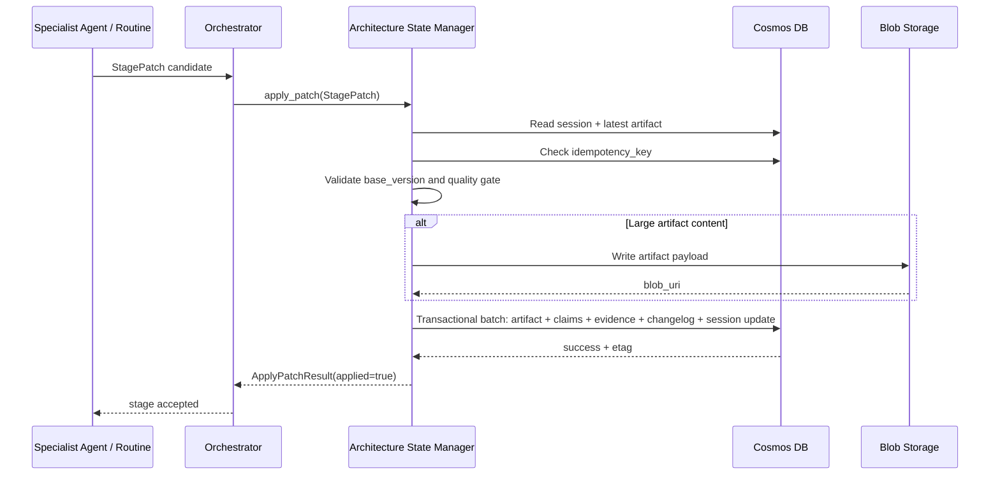
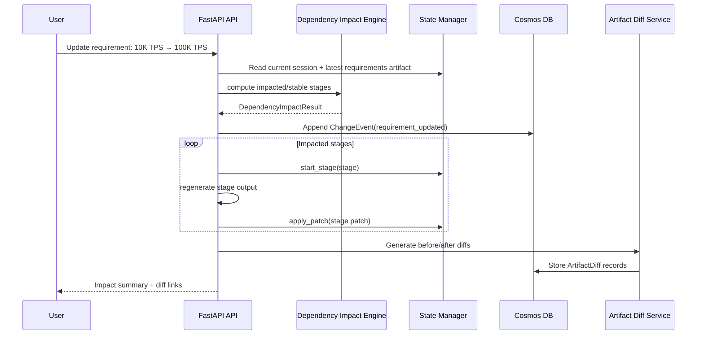

# Archimedes Database Design

**Document ID:** `04-database-design.md`  
**Solution:** Archimedes — AI Architecture Workbench  
**Version:** v2.2  
**Status:** Implementation-ready baseline  
**Last updated:** 2026-06-09  
**Related documents:** `01-archimedes-hld.md`, `02-domain-models.md`, `03-pydantic-schemas.md`

---

## 1. Purpose

This document defines the physical database design for Archimedes.

It translates the domain model and Pydantic schemas into an Azure Cosmos DB design, including containers, partition keys, document identifiers, indexing policies, versioning strategy, concurrency control, idempotency handling, query patterns, retention, and Blob Storage usage for large artifacts.

The design follows the v2.2 architecture decision that the original large Decision Object is split into smaller, purpose-specific persisted documents:

```text
ArchitectureSession     → current session summary and lifecycle state
VersionedArtifact       → per-stage versioned outputs
ClaimRecord             → statements asserted by agents or tools
EvidenceSource          → source material supporting claims
ChangeEvent             → append-only audit trail of changes and re-reasoning
Large artifact payloads → Blob Storage references where content exceeds practical document size
```

---

## 2. Scope

This document covers:

- Cosmos DB database and container layout.
- Partition key strategy.
- Document ID conventions.
- Indexing policy per container.
- Optimistic concurrency and idempotency.
- Versioning strategy for stage artifacts.
- Append-only evidence, claims, and change history.
- Blob Storage path conventions for large artifacts.
- Query patterns required by APIs, orchestrator, agents, and frontend.
- Data retention and cleanup strategy.
- Repository/service implementation guidance.

This document does not cover:

- Pydantic model definitions. See `03-pydantic-schemas.md`.
- FastAPI route contracts. See `05-api-contracts.md`.
- Stage transition implementation. See `06-stage-pipeline.md`.
- Agent prompts and reasoning logic. See `07-agent-specifications.md`.
- Function tool implementation details. See `09-tool-specifications.md`.
- Azure provisioning scripts. See `13-infrastructure-and-deployment.md`.

---

## 3. Design Goals

The database design should support the following goals:

1. **Session-centric access**: most reads and writes happen within one architecture session.
2. **Versioned artifacts**: every stage output can have multiple versions.
3. **Selective re-reasoning**: changed requirements should regenerate only impacted stages.
4. **Auditability**: changes, claims, and evidence should be preserved.
5. **Grounded decision traceability**: final recommendations should link back to claims and evidence.
6. **Safe agent output handling**: agents never write directly to the database.
7. **Idempotent stage execution**: retries must not duplicate artifacts or corrupt state.
8. **Optimistic concurrency**: stale writes must be rejected.
9. **MVP simplicity**: use a small number of containers and a simple partitioning strategy.
10. **Future extensibility**: support multi-user, tenant isolation, long-running sessions, and analytics later.

---

## 4. Database Technology

### 4.1 Primary Store

Use **Azure Cosmos DB for NoSQL** as the primary operational store.

Cosmos DB is suitable because Archimedes stores JSON-like domain documents, needs low-latency session reads, and benefits from flexible schemas during MVP development.

### 4.2 Large Artifact Store

Use **Azure Blob Storage** for large or rarely queried artifact payloads.

Examples:

- Full HLD Markdown.
- Full ADR package.
- Full Mermaid source if long.
- Rendered diagram images.
- Full WAF reports.
- Full evidence audit reports.
- Exported session package.

Cosmos DB stores metadata and Blob URI references.

---

## 5. Database and Container Summary

Recommended Cosmos DB database name:

```text
archimedes-db
```

Recommended containers:

| Container | Primary model | Partition key | Mutability | Purpose |
|---|---|---|---|---|
| `sessions` | `ArchitectureSession` | `/session_id` | Mutable | Current session summary and lifecycle state. |
| `artifacts` | `VersionedArtifact` | `/session_id` | Mostly immutable | Versioned output for each pipeline stage. |
| `claims` | `ClaimRecord` | `/session_id` | Append-only | Claims produced by agents/tools. |
| `evidence` | `EvidenceSource` | `/session_id` | Append-only | Sources retrieved through Foundry IQ, web search, tools, or user input. |
| `changelog` | `ChangeEvent` | `/session_id` | Append-only | Requirement changes, patch applications, re-runs, and audit events. |
| `diffs` | `ArtifactDiff` | `/session_id` | Recomputable / optional | Stored before/after comparisons for demo and UI speed. |

### 5.1 MVP Container Decision

For MVP, create all six containers.

`diffs` is optional because diffs can be computed on demand, but storing generated diffs improves frontend responsiveness during the demo. If implementation time is short, skip the physical `diffs` container and store only generated diff summaries as `VersionedArtifact` records under the `rereasoning` stage.

### 5.2 Why `/session_id` as the Partition Key

Most Archimedes operations are scoped to a single session:

- Load session state.
- Read all artifacts for a session.
- Apply a stage patch.
- Append claims and evidence.
- Generate a before/after diff.
- Show session timeline.
- Re-run impacted stages.

Using `/session_id` keeps these operations within a single logical partition, enabling efficient session-scoped queries and transactional batch writes across documents in the same partition.

### 5.3 Future Tenant Partitioning

For enterprise multi-tenant usage, revisit partitioning.

Possible future strategies:

| Strategy | Description | When to use |
|---|---|---|
| `/session_id` | Simple MVP partitioning. | MVP, hackathon, portfolio demo. |
| `/tenant_id` | Group all tenant documents together. | Small number of tenants, large cross-session queries. |
| `/tenant_session_key` | Synthetic key such as `tenant_id:session_id`. | Enterprise scale with tenant isolation and session locality. |
| hierarchical partition key | Tenant + session hierarchy. | Later, if using a Cosmos account/config that supports it and cross-session tenant queries matter. |

For v2.2, use `/session_id`.

---

## 6. Document ID Conventions

Use deterministic, human-debuggable IDs where possible.

| Entity | ID format | Example |
|---|---|---|
| `ArchitectureSession` | `{session_id}` | `session_01hxyz` |
| `VersionedArtifact` | `artifact_{session_id}_{stage}_v{version}` | `artifact_session_01hxyz_hld_generation_v2` |
| `ClaimRecord` | `claim_{session_id}_{stage}_{short_id}` | `claim_session_01hxyz_options_generation_ab12` |
| `EvidenceSource` | `evidence_{session_id}_{short_id}` | `evidence_session_01hxyz_cd34` |
| `ChangeEvent` | `change_{session_id}_{timestamp_or_short_id}` | `change_session_01hxyz_20260609T101530Z` |
| `ArtifactDiff` | `diff_{session_id}_{stage}_v{before}_v{after}` | `diff_session_01hxyz_hld_generation_v1_v2` |

### 6.1 ID Field vs Cosmos `id`

Every persisted document must include:

```json
{
  "id": "cosmos_document_id",
  "session_id": "session_...",
  "entity_type": "versioned_artifact"
}
```

The `id` field is the Cosmos DB document identifier.

Domain-specific IDs may either reuse `id` or be stored separately, for example:

```json
{
  "id": "artifact_session_01hxyz_hld_generation_v2",
  "artifact_id": "artifact_session_01hxyz_hld_generation_v2"
}
```

For MVP, keep `id` and domain ID the same to reduce confusion.

---

## 7. Container Design: `sessions`

### 7.1 Purpose

The `sessions` container stores the current session-level state. It is the first document read by the orchestrator and frontend.

It should remain small and should not embed large generated artifacts.

### 7.2 Partition Key

```text
/session_id
```

### 7.3 Document Shape

```json
{
  "id": "session_01hxyz",
  "entity_type": "architecture_session",
  "session_id": "session_01hxyz",
  "title": "Real-time fraud detection platform",
  "business_need": "Design a real-time fraud detection platform on Azure...",
  "status": "active",
  "current_stage": "hld_generation",
  "last_successful_stage": "adr_generation",
  "active_version": 2,
  "selected_option_id": "OPT-A",
  "detected_patterns": [
    "real_time_streaming",
    "event_driven_integration"
  ],
  "stage_executions": {
    "requirements_extraction": {
      "stage": "requirements_extraction",
      "stage_run_id": "stage_run_req_001",
      "status": "completed",
      "started_at": "2026-06-09T10:00:00Z",
      "completed_at": "2026-06-09T10:01:15Z",
      "retry_count": 0,
      "failure_reason": null
    },
    "hld_generation": {
      "stage": "hld_generation",
      "stage_run_id": "stage_run_hld_002",
      "status": "running",
      "started_at": "2026-06-09T10:12:30Z",
      "completed_at": null,
      "retry_count": 0,
      "failure_reason": null
    }
  },
  "quality_gates": {
    "requirements_extraction": {
      "status": "passed_with_warnings",
      "blocking_failures": [],
      "warnings": [
        "Data residency requirements not checked"
      ],
      "user_override_allowed": true
    }
  },
  "dependency_map_summary": {
    "scale": [
      "options_generation",
      "socratic_review",
      "hld_generation",
      "mini_waf_review"
    ],
    "compliance": [
      "options_generation",
      "mini_waf_review",
      "final_evidence_audit"
    ]
  },
  "created_at": "2026-06-09T10:00:00Z",
  "updated_at": "2026-06-09T10:12:30Z",
  "created_by": "user",
  "updated_by": "orchestrator"
}
```

### 7.4 Mutability

This document is mutable.

It is updated when:

- A new session is created.
- A stage starts.
- A stage completes.
- A stage fails or pauses.
- A quality gate result changes.
- The active version changes.
- A requirement change impacts the stage state.

### 7.5 Indexing Policy

The `sessions` container is queried by session status, current stage, and timestamps.

Recommended indexing:

```json
{
  "indexingMode": "consistent",
  "automatic": true,
  "includedPaths": [
    { "path": "/session_id/?" },
    { "path": "/status/?" },
    { "path": "/current_stage/?" },
    { "path": "/updated_at/?" },
    { "path": "/created_at/?" },
    { "path": "/selected_option_id/?" }
  ],
  "excludedPaths": [
    { "path": "/*" }
  ]
}
```

If the SDK or portal setup makes this cumbersome for MVP, use the default indexing policy first and optimize later.

### 7.6 Common Queries

Load a session:

```sql
SELECT * FROM c
WHERE c.session_id = @session_id
AND c.entity_type = 'architecture_session'
```

List recent sessions:

```sql
SELECT c.id, c.title, c.status, c.current_stage, c.updated_at
FROM c
WHERE c.entity_type = 'architecture_session'
ORDER BY c.updated_at DESC
```

Find active/running sessions:

```sql
SELECT c.id, c.title, c.current_stage, c.updated_at
FROM c
WHERE c.status IN ('active', 'running')
ORDER BY c.updated_at DESC
```

---

## 8. Container Design: `artifacts`

### 8.1 Purpose

The `artifacts` container stores one document per stage output per version.

Examples:

- Requirements extraction v1.
- Pattern detection v1.
- Options generation v1.
- Socratic review v1.
- ADR generation v1.
- HLD generation v1.
- HLD generation v2 after requirement change.
- Mini WAF review v2.
- Evidence audit checkpoint v1.
- Final evidence audit v1.

### 8.2 Partition Key

```text
/session_id
```

### 8.3 Document Shape

```json
{
  "id": "artifact_session_01hxyz_hld_generation_v2",
  "entity_type": "versioned_artifact",
  "artifact_id": "artifact_session_01hxyz_hld_generation_v2",
  "session_id": "session_01hxyz",
  "stage": "hld_generation",
  "version": 2,
  "stage_run_id": "stage_run_hld_002",
  "base_version": 1,
  "target_version": 2,
  "idempotency_key": "session_01hxyz:hld_generation:stage_run_hld_002:patchhash",
  "patch_hash": "sha256:...",
  "change_trigger": {
    "change_event_id": "change_session_01hxyz_20260609T101530Z",
    "reason": "scale changed from 10K TPS to 100K TPS"
  },
  "content_summary": "Updated HLD with multi-region active-active design.",
  "content": {
    "diagrams": {
      "system_context": "graph TD ...",
      "container": "graph TD ..."
    },
    "components": [
      {
        "name": "Azure Event Hubs Premium",
        "role": "Streaming ingestion"
      }
    ],
    "narrative": "..."
  },
  "blob_uri": null,
  "quality_gate": {
    "status": "passed",
    "blocking_failures": [],
    "warnings": [],
    "user_override_allowed": true
  },
  "claim_ids": [
    "claim_session_01hxyz_hld_generation_ab12"
  ],
  "evidence_ids": [
    "evidence_session_01hxyz_cd34"
  ],
  "created_at": "2026-06-09T10:15:00Z",
  "created_by": "hld_designer"
}
```

### 8.4 Mutability

Artifact documents should be treated as immutable after creation.

If a stage is regenerated, create a new artifact version instead of updating the old artifact.

Permitted post-create updates:

- Add `blob_uri` if large content is externalized after creation.
- Add rendering metadata, such as `render_status` or `rendered_image_uri`.
- Add audit metadata if generated asynchronously.

Do not overwrite `content` for an existing version.

### 8.5 Versioning Rules

Versioning is per stage within a session.

Example:

```text
requirements_extraction v1
pattern_detection v1
options_generation v1
socratic_review v1
adr_generation v1
hld_generation v1

Requirement change: scale 10K TPS → 100K TPS

options_generation v2
socratic_review v2
adr_generation v2
hld_generation v2
mini_waf_review v2
```

A stage version must only be generated from a known `base_version`.

If the latest stage version has changed since the patch was produced, the State Manager must reject the write with `version_conflict`.

### 8.6 Indexing Policy

The `artifacts` container is queried by session, stage, version, stage run, idempotency key, and change trigger.

Recommended indexing:

```json
{
  "indexingMode": "consistent",
  "automatic": true,
  "includedPaths": [
    { "path": "/session_id/?" },
    { "path": "/stage/?" },
    { "path": "/version/?" },
    { "path": "/stage_run_id/?" },
    { "path": "/idempotency_key/?" },
    { "path": "/created_at/?" },
    { "path": "/change_trigger/change_event_id/?" },
    { "path": "/quality_gate/status/?" }
  ],
  "excludedPaths": [
    { "path": "/content/*" },
    { "path": "/diagrams/*" },
    { "path": "/blob_payload/*" }
  ]
}
```

For MVP, excluding `/content/*` is recommended because artifact content can be large and highly variable.

### 8.7 Common Queries

Read latest artifact for a stage:

```sql
SELECT TOP 1 * FROM c
WHERE c.session_id = @session_id
AND c.entity_type = 'versioned_artifact'
AND c.stage = @stage
ORDER BY c.version DESC
```

Read specific artifact version:

```sql
SELECT * FROM c
WHERE c.session_id = @session_id
AND c.entity_type = 'versioned_artifact'
AND c.stage = @stage
AND c.version = @version
```

List artifact timeline:

```sql
SELECT c.stage, c.version, c.content_summary, c.quality_gate.status, c.created_at
FROM c
WHERE c.session_id = @session_id
AND c.entity_type = 'versioned_artifact'
ORDER BY c.created_at ASC
```

Check idempotency key:

```sql
SELECT c.id, c.stage, c.version
FROM c
WHERE c.session_id = @session_id
AND c.idempotency_key = @idempotency_key
```

---

## 9. Container Design: `claims`

### 9.1 Purpose

The `claims` container stores statements asserted by agents, routines, or tools.

Claims are intentionally separate from evidence.

A claim answers: **What did the system assert?**  
Evidence answers: **Where did the supporting information come from?**

### 9.2 Partition Key

```text
/session_id
```

### 9.3 Document Shape

```json
{
  "id": "claim_session_01hxyz_options_generation_ab12",
  "entity_type": "claim_record",
  "claim_id": "claim_session_01hxyz_options_generation_ab12",
  "session_id": "session_01hxyz",
  "stage": "options_generation",
  "stage_run_id": "stage_run_options_001",
  "artifact_id": "artifact_session_01hxyz_options_generation_v1",
  "claim": "Azure Event Hubs is a suitable managed ingestion option for high-throughput streaming workloads.",
  "type": "recommendation",
  "confidence": 0.82,
  "evidence_ids": [
    "evidence_session_01hxyz_cd34"
  ],
  "requires_user_validation": false,
  "validation_status": "not_required",
  "created_at": "2026-06-09T10:05:00Z",
  "created_by": "options_generator"
}
```

### 9.4 Mutability

Claims should be append-only.

If a claim is later found unsupported, contradictory, or stale, do not overwrite it. Instead:

- Create an audit finding in the evidence audit artifact.
- Optionally add a correction claim.
- Record the event in `changelog`.

### 9.5 Indexing Policy

Recommended indexing:

```json
{
  "indexingMode": "consistent",
  "automatic": true,
  "includedPaths": [
    { "path": "/session_id/?" },
    { "path": "/stage/?" },
    { "path": "/artifact_id/?" },
    { "path": "/type/?" },
    { "path": "/confidence/?" },
    { "path": "/requires_user_validation/?" },
    { "path": "/validation_status/?" },
    { "path": "/created_at/?" }
  ],
  "excludedPaths": [
    { "path": "/claim/?" }
  ]
}
```

`claim` text does not need to be indexed for MVP unless full-text search is required later.

### 9.6 Common Queries

List claims for a stage:

```sql
SELECT * FROM c
WHERE c.session_id = @session_id
AND c.stage = @stage
ORDER BY c.created_at ASC
```

List assumptions requiring validation:

```sql
SELECT * FROM c
WHERE c.session_id = @session_id
AND c.type = 'assumption'
AND c.requires_user_validation = true
```

List low-confidence recommendations:

```sql
SELECT * FROM c
WHERE c.session_id = @session_id
AND c.type = 'recommendation'
AND c.confidence < 0.6
```

---

## 10. Container Design: `evidence`

### 10.1 Purpose

The `evidence` container stores source material used to support claims.

Evidence can come from:

- Foundry IQ knowledge base retrieval.
- Foundry Web Search / Bing grounding.
- Function tools.
- User input.
- System defaults.

### 10.2 Partition Key

```text
/session_id
```

### 10.3 Document Shape

```json
{
  "id": "evidence_session_01hxyz_cd34",
  "entity_type": "evidence_source",
  "evidence_id": "evidence_session_01hxyz_cd34",
  "session_id": "session_01hxyz",
  "source": "Azure Architecture Center",
  "source_url": "https://learn.microsoft.com/azure/architecture/...",
  "retrieved_via": "foundry_iq",
  "retrieved_at": "2026-06-09T10:04:30Z",
  "excerpt": "Short retrieved chunk or summarized excerpt...",
  "chunk_id": "kb_chunk_abc123",
  "kb_name": "azure-architecture-kb",
  "kb_version": "2026-06-09",
  "source_document_version": "2026-06-01",
  "source_freshness": "current",
  "trust_level": "high",
  "used_in_stages": [
    "options_generation",
    "socratic_review"
  ],
  "metadata": {
    "retrieval_query": "Azure real-time streaming reference architecture fraud detection",
    "retrieval_rank": 1,
    "retrieval_score": 0.91
  },
  "created_at": "2026-06-09T10:04:30Z",
  "created_by": "foundry_iq_retriever"
}
```

### 10.4 Mutability

EvidenceSource records are append-only.

Do not modify original evidence if it becomes stale. Instead:

- Create a new EvidenceSource record with the newer source/version.
- Let the Evidence Auditor flag the older source as stale.
- Link new claims to the newer evidence.

### 10.5 Indexing Policy

Recommended indexing:

```json
{
  "indexingMode": "consistent",
  "automatic": true,
  "includedPaths": [
    { "path": "/session_id/?" },
    { "path": "/retrieved_via/?" },
    { "path": "/retrieved_at/?" },
    { "path": "/kb_name/?" },
    { "path": "/kb_version/?" },
    { "path": "/source_freshness/?" },
    { "path": "/trust_level/?" },
    { "path": "/used_in_stages/[]/?" }
  ],
  "excludedPaths": [
    { "path": "/excerpt/?" },
    { "path": "/metadata/*" }
  ]
}
```

### 10.6 Common Queries

List evidence for a session:

```sql
SELECT * FROM c
WHERE c.session_id = @session_id
ORDER BY c.retrieved_at ASC
```

List stale or low-trust evidence:

```sql
SELECT * FROM c
WHERE c.session_id = @session_id
AND (c.source_freshness = 'stale' OR c.trust_level = 'low')
```

List Foundry IQ evidence from a KB version:

```sql
SELECT * FROM c
WHERE c.session_id = @session_id
AND c.retrieved_via = 'foundry_iq'
AND c.kb_name = @kb_name
AND c.kb_version = @kb_version
```

---

## 11. Container Design: `changelog`

### 11.1 Purpose

The `changelog` container stores append-only events for auditability and replay.

Examples:

- Session created.
- Stage started.
- Stage completed.
- Quality gate failed.
- User overrode warning.
- Requirement changed.
- Dependency impact computed.
- Selective re-run triggered.
- Artifact version generated.
- Evidence audit found unsupported claims.

### 11.2 Partition Key

```text
/session_id
```

### 11.3 Document Shape

```json
{
  "id": "change_session_01hxyz_20260609T101530Z",
  "entity_type": "change_event",
  "change_event_id": "change_session_01hxyz_20260609T101530Z",
  "session_id": "session_01hxyz",
  "change_type": "requirement_updated",
  "changed_field": "requirements.non_functional.scale",
  "old_value_summary": "10K TPS",
  "new_value_summary": "100K TPS and multi-region active-active",
  "impacted_stages": [
    "options_generation",
    "socratic_review",
    "adr_generation",
    "hld_generation",
    "mini_waf_review"
  ],
  "stable_stages": [
    "intake",
    "requirements_extraction",
    "pattern_detection"
  ],
  "rerun_strategy": "selective",
  "created_artifact_versions": {
    "options_generation": 2,
    "socratic_review": 2,
    "hld_generation": 2
  },
  "created_at": "2026-06-09T10:15:30Z",
  "created_by": "dependency_impact_engine"
}
```

### 11.4 Mutability

Change events are immutable and append-only.

If an event needs correction, create a compensating event.

### 11.5 Indexing Policy

Recommended indexing:

```json
{
  "indexingMode": "consistent",
  "automatic": true,
  "includedPaths": [
    { "path": "/session_id/?" },
    { "path": "/change_type/?" },
    { "path": "/changed_field/?" },
    { "path": "/created_at/?" },
    { "path": "/impacted_stages/[]/?" }
  ],
  "excludedPaths": [
    { "path": "/old_value_summary/?" },
    { "path": "/new_value_summary/?" }
  ]
}
```

### 11.6 Common Queries

Read timeline:

```sql
SELECT * FROM c
WHERE c.session_id = @session_id
ORDER BY c.created_at ASC
```

Read requirement changes:

```sql
SELECT * FROM c
WHERE c.session_id = @session_id
AND c.change_type = 'requirement_updated'
ORDER BY c.created_at DESC
```

Read changes affecting a stage:

```sql
SELECT * FROM c
WHERE c.session_id = @session_id
AND ARRAY_CONTAINS(c.impacted_stages, @stage)
ORDER BY c.created_at DESC
```

---

## 12. Container Design: `diffs`

### 12.1 Purpose

The `diffs` container stores generated before/after comparisons between artifact versions.

This supports the demo scenario where a requirement change triggers selective re-reasoning and the UI shows exactly what changed.

### 12.2 Partition Key

```text
/session_id
```

### 12.3 Document Shape

```json
{
  "id": "diff_session_01hxyz_hld_generation_v1_v2",
  "entity_type": "artifact_diff",
  "diff_id": "diff_session_01hxyz_hld_generation_v1_v2",
  "session_id": "session_01hxyz",
  "stage": "hld_generation",
  "before_version": 1,
  "after_version": 2,
  "change_event_id": "change_session_01hxyz_20260609T101530Z",
  "summary": "HLD changed from single-region to multi-region active-active design.",
  "added_components": [
    "Secondary region ingestion path",
    "Traffic Manager / Front Door global routing"
  ],
  "removed_components": [],
  "modified_components": [
    {
      "component": "Event Hubs",
      "before": "Single namespace",
      "after": "Partitioned, multi-region namespace strategy"
    }
  ],
  "unchanged_sections": [
    "PCI-DSS compliance requirement",
    "Core fraud detection business flow"
  ],
  "created_at": "2026-06-09T10:20:00Z",
  "created_by": "artifact_diff_service"
}
```

### 12.4 Mutability

Diffs are recomputable. They may be overwritten if generated incorrectly, but for auditability prefer versioning or adding a replacement diff.

For MVP, allow upsert by deterministic `diff_id`.

### 12.5 Indexing Policy

Recommended indexing:

```json
{
  "indexingMode": "consistent",
  "automatic": true,
  "includedPaths": [
    { "path": "/session_id/?" },
    { "path": "/stage/?" },
    { "path": "/before_version/?" },
    { "path": "/after_version/?" },
    { "path": "/change_event_id/?" },
    { "path": "/created_at/?" }
  ],
  "excludedPaths": [
    { "path": "/summary/?" },
    { "path": "/added_components/*" },
    { "path": "/modified_components/*" }
  ]
}
```

---

## 13. Blob Storage Design

### 13.1 Storage Account and Container

Recommended Blob container:

```text
archimedes-artifacts
```

### 13.2 Path Convention

```text
sessions/{session_id}/artifacts/{stage}/v{version}/
```

Examples:

```text
sessions/session_01hxyz/artifacts/hld_generation/v2/hld.md
sessions/session_01hxyz/artifacts/hld_generation/v2/system-context.mmd
sessions/session_01hxyz/artifacts/hld_generation/v2/system-context.svg
sessions/session_01hxyz/artifacts/adr_generation/v1/adr.md
sessions/session_01hxyz/artifacts/final_evidence_audit/v1/audit-report.json
sessions/session_01hxyz/exports/architecture-package-v2.zip
```

### 13.3 When to Store Content in Blob

Store content in Blob Storage when:

- Artifact content is large.
- Artifact contains rendered images or export files.
- Artifact is rarely queried structurally.
- Artifact should be downloadable.
- Artifact exceeds a practical inline threshold.

Recommended threshold:

```text
If serialized content > 128 KB, store full content in Blob and keep summary + URI in Cosmos DB.
```

### 13.4 Blob Metadata

Apply metadata where useful:

```text
session_id=session_01hxyz
stage=hld_generation
version=2
stage_run_id=stage_run_hld_002
content_type=text/markdown
created_by=hld_designer
```

---

## 14. Transaction and Write Strategy

### 14.1 StagePatch Application

A stage patch application should be treated as a single logical transaction.

The State Manager should apply a patch in this order:

```text
1. Read current session and latest artifact version.
2. Check idempotency key.
3. Check base_version against latest stage version.
4. Check quality gate status.
5. Create VersionedArtifact.
6. Append ClaimRecord documents.
7. Append EvidenceSource documents.
8. Append ChangeEvent.
9. Update ArchitectureSession state.
```

### 14.2 Transactional Batch

Because all documents use the same `/session_id` partition key, the State Manager can use a transactional batch for the patch write path.

Recommended batch contents:

```text
Create artifact
Create claims
Create evidence records
Create change event
Patch session summary
```

If Blob Storage must be written as part of the patch:

```text
1. Write Blob first with temporary path or metadata status=pending.
2. Apply Cosmos transactional batch referencing Blob URI.
3. Mark Blob metadata status=committed.
4. If Cosmos write fails, delete or mark Blob as orphaned.
```

### 14.3 Idempotency

Every StagePatch includes:

```text
stage_run_id
base_version
target_version
idempotency_key
patch_hash
```

Before writing, query `artifacts` for the `idempotency_key` within the session partition.

If found, return the existing artifact version and do not write duplicates.

### 14.4 Optimistic Concurrency

Use Cosmos DB `_etag` on the mutable `sessions` document.

Pattern:

```text
1. Read session document with etag.
2. Compute update.
3. Patch/replace session using If-Match etag.
4. If etag mismatch, reload session and retry or fail with version_conflict.
```

For immutable documents such as artifacts, claims, evidence, and changelog entries, use deterministic IDs to prevent accidental duplicates.

---

## 15. Stage Execution State

Stage execution state is stored inside the `ArchitectureSession` document under `stage_executions`.

This supports pause/resume and failure recovery without creating a separate stage-runs container for MVP.

Example:

```json
{
  "stage_executions": {
    "socratic_review": {
      "stage": "socratic_review",
      "stage_run_id": "stage_run_socrates_001",
      "status": "failed",
      "started_at": "2026-06-09T10:07:00Z",
      "completed_at": null,
      "retry_count": 1,
      "failure_reason": "Security Architect persona timed out"
    }
  }
}
```

### 15.1 When to Add a Separate `stage_runs` Container

Add a separate container later if:

- You need detailed execution logs per persona or tool call.
- You need long-term analytics on stage run duration.
- You need to query stage runs across sessions.
- Stage execution history becomes too large for the session document.

For MVP, embed current/recent status in `sessions` and write detailed events to `changelog`.

---

## 16. Query Patterns by Component

### 16.1 Frontend

| UI Need | Containers | Query Pattern |
|---|---|---|
| Load session dashboard | `sessions` | Read by `session_id`. |
| Show stage timeline | `sessions`, `artifacts` | Read session stage state + artifact timeline. |
| Show artifact panel | `artifacts` | Latest artifact by stage. |
| Show version history | `artifacts` | All artifacts for stage ordered by version. |
| Show evidence audit | `artifacts`, `claims`, `evidence` | Latest audit artifact + related claims/evidence. |
| Show before/after diff | `diffs` or `artifacts` | Diff by stage and versions. |
| Show changelog | `changelog` | Events ordered by timestamp. |

### 16.2 Orchestrator

| Need | Containers | Query Pattern |
|---|---|---|
| Decide next stage | `sessions` | Read session state. |
| Build context summary | `artifacts`, `claims` | Read latest artifacts and claims for relevant stages. |
| Apply stage patch | all session-scoped containers | Transactional batch. |
| Recover failed stage | `sessions`, `changelog` | Read stage state and recent failure events. |
| Identify impacted stages | `sessions`, `artifacts`, `changelog` | Read dependency map and latest artifacts. |

### 16.3 Evidence Auditor

| Need | Containers | Query Pattern |
|---|---|---|
| Audit claims | `claims` | Claims by session/stage. |
| Resolve evidence | `evidence` | Evidence by IDs linked to claims. |
| Find unsupported claims | `claims` | Claims where `evidence_ids` empty and type is fact/recommendation. |
| Find stale sources | `evidence` | `source_freshness = stale`. |
| Find low trust sources | `evidence` | `trust_level = low`. |

### 16.4 Dependency and Re-Reasoning Engine

| Need | Containers | Query Pattern |
|---|---|---|
| Compare requirement change | `artifacts` | Read latest requirements artifact. |
| Determine impacted stages | `sessions` | Read dependency map. |
| Create re-run plan | `changelog` | Append impact event. |
| Generate before/after | `artifacts`, `diffs` | Read v1/v2, write diff. |

---

## 17. Indexing Strategy Summary

### 17.1 General Rule

Index fields used for filtering, ordering, and status lookup. Exclude large generated content.

### 17.2 Fields to Index Across Containers

Common indexed fields:

```text
/session_id
/entity_type
/created_at
/updated_at
/stage
/version
/stage_run_id
/status
/quality_gate/status
```

### 17.3 Fields to Exclude

Common excluded fields:

```text
/content/*
/excerpt/?
/metadata/*
/large_payload/*
/diagrams/*
/narrative/?
/full_text/?
```

### 17.4 Composite Indexes

For MVP, avoid complex composite indexes unless required by query errors.

Potential composite indexes later:

```json
[
  [
    { "path": "/session_id", "order": "ascending" },
    { "path": "/stage", "order": "ascending" },
    { "path": "/version", "order": "descending" }
  ],
  [
    { "path": "/session_id", "order": "ascending" },
    { "path": "/created_at", "order": "descending" }
  ]
]
```

---

## 18. Retention and Cleanup

### 18.1 MVP Retention

For MVP/demo:

- Keep all sessions, artifacts, claims, evidence, changelog, and diffs indefinitely.
- Manual cleanup is acceptable.

### 18.2 Post-MVP Retention

Recommended future retention:

| Data | Retention |
|---|---|
| Active sessions | Until manually archived/deleted. |
| Archived sessions | 180–365 days. |
| Artifacts | Same as session. |
| Claims/evidence | Same as session, because they support auditability. |
| Changelog | Same as session or longer if governance requires. |
| Temporary blobs | 7–30 days. |
| Failed stage partial outputs | 7–30 days. |

### 18.3 TTL Usage

Do not enable TTL on core audit containers for MVP.

TTL may be enabled later for:

- Temporary stage outputs.
- Debug traces.
- Abandoned sessions.
- Orphaned Blob references.

---

## 19. Consistency and Conflict Handling

### 19.1 Consistency Level

For MVP, use the Cosmos DB account default consistency. Session-scoped operations do not require cross-region strong consistency.

### 19.2 Conflict Types

| Conflict | Detection | Resolution |
|---|---|---|
| Duplicate stage patch | Existing `idempotency_key` | Return existing artifact version. |
| Stale stage patch | `base_version` != latest version | Reject and ask orchestrator to regenerate. |
| Concurrent session update | `_etag` mismatch | Reload and retry or fail with `version_conflict`. |
| Duplicate artifact ID | Deterministic `id` conflict | Treat as duplicate/idempotent if hash matches; otherwise error. |
| Blob written but DB failed | Orphan metadata or cleanup job | Delete or mark blob as orphaned. |

### 19.3 Idempotency Conflict Rule

If an artifact exists for the same `idempotency_key`:

- If `patch_hash` matches, return existing success.
- If `patch_hash` differs, raise `idempotency_key_conflict`.

This catches accidental key reuse with different content.

---

## 20. Security Design

### 20.1 Authentication

Backend services should access Cosmos DB and Blob Storage using Managed Identity where possible.

Local development may use developer credentials or connection strings stored in local environment variables.

### 20.2 Authorization

For MVP:

- The backend API is the only application component with direct database access.
- Agents and tools do not receive database credentials.
- Agents return patches to the orchestrator; the State Manager writes to storage.

Post-MVP:

- Add user/session ownership metadata.
- Enforce per-user or per-tenant access in API layer.
- Add Microsoft Entra ID authentication.
- Add RBAC for admin/auditor/user roles.

### 20.3 Sensitive Data

Architecture sessions may contain business-sensitive information.

Guidelines:

- Do not log full business needs or artifacts in plain application logs.
- Store only necessary source excerpts in `evidence`.
- Avoid storing secrets, credentials, or real customer PII in session content.
- Redact sensitive values before sending context to LLMs where possible.

### 20.4 Network Security

MVP can use public Azure endpoints with restricted credentials.

Production should consider:

- Private endpoints for Cosmos DB and Storage.
- VNet integration for Container Apps.
- Firewall restrictions.
- Key Vault for secrets if any are required.

---

## 21. Repository Layer Design

Implement a repository layer rather than calling Cosmos SDK directly from agents or route handlers.

Recommended package structure:

```text
src/archimedes/storage/
├── __init__.py
├── cosmos_client.py
├── blob_client.py
├── sessions_repository.py
├── artifacts_repository.py
├── claims_repository.py
├── evidence_repository.py
├── changelog_repository.py
├── diffs_repository.py
├── unit_of_work.py
└── errors.py
```

### 21.1 Repository Responsibilities

| Repository | Responsibility |
|---|---|
| `SessionsRepository` | Create/read/update session state, etag-safe updates. |
| `ArtifactsRepository` | Create/read versioned artifacts, latest version lookup, idempotency lookup. |
| `ClaimsRepository` | Append/read claims by stage, type, validation status. |
| `EvidenceRepository` | Append/read evidence sources, resolve evidence IDs. |
| `ChangeLogRepository` | Append/read change events. |
| `DiffsRepository` | Store/read artifact diffs. |
| `UnitOfWork` | Coordinate transactional batch writes. |

### 21.2 State Manager API

The State Manager should expose a narrow interface:

```python
class ArchitectureStateManager:
    async def create_session(self, business_need: str, created_by: str) -> ArchitectureSession: ...

    async def get_session(self, session_id: str) -> ArchitectureSession: ...

    async def start_stage(self, session_id: str, stage: StageName) -> StageExecution: ...

    async def apply_patch(self, patch: StagePatch) -> ApplyPatchResult: ...

    async def mark_stage_failed(
        self,
        session_id: str,
        stage: StageName,
        stage_run_id: str,
        reason: str,
    ) -> None: ...

    async def get_latest_artifact(
        self,
        session_id: str,
        stage: StageName,
    ) -> VersionedArtifact | None: ...
```

Agents should not call this directly. The orchestrator calls it.

---

## 22. Apply Patch Write Flow



---

## 23. Requirement Change and Re-Reasoning Write Flow



---

## 24. Operational Considerations

### 24.1 RU and Cost Control

For MVP:

- Use serverless Cosmos DB if available and suitable for the environment.
- Keep artifacts compact.
- Exclude large content from indexing.
- Avoid cross-partition queries.
- Use `/session_id` in all queries.

### 24.2 Performance Expectations

Typical session operations should be small:

| Operation | Expected data access |
|---|---|
| Load session dashboard | 1 session doc + latest artifacts. |
| Complete stage | 1 transactional batch within one partition. |
| Run evidence audit | Claims + evidence for one session. |
| Generate diff | Two artifact docs + optional Blob reads. |
| Re-run impacted stages | Read/write only impacted stage artifacts. |

### 24.3 Monitoring

Log the following metrics:

```text
cosmos_read_latency_ms
cosmos_write_latency_ms
cosmos_ru_consumed
stage_patch_apply_duration_ms
stage_patch_conflict_count
idempotency_hit_count
version_conflict_count
artifact_blob_offload_count
```

Use Application Insights for backend metrics and traces.

---

## 25. Local Development Strategy

For local development:

1. Use Azure Cosmos DB Emulator if convenient.
2. Alternatively, use a dev Cosmos DB account.
3. Use Azurite or a dev Storage Account for Blob Storage.
4. Keep database names environment-specific.

Example environment variables:

```text
ARCHIMEDES_COSMOS_ENDPOINT=
ARCHIMEDES_COSMOS_DATABASE=archimedes-db-dev
ARCHIMEDES_COSMOS_AUTH_MODE=managed_identity_or_key
ARCHIMEDES_STORAGE_ACCOUNT=
ARCHIMEDES_STORAGE_CONTAINER=archimedes-artifacts-dev
```

---

## 26. Migration and Schema Evolution

### 26.1 Schema Version Field

Every persisted document should include:

```json
{
  "schema_version": "1.0"
}
```

For MVP, this can be added after initial implementation, but it is recommended from the start.

### 26.2 Backward Compatibility

When schemas evolve:

- Avoid deleting fields immediately.
- Add new optional fields first.
- Update readers to handle old and new shapes.
- Write new documents using the latest schema.
- Add migration scripts only when necessary.

### 26.3 Migration Scripts

Recommended location:

```text
scripts/migrations/
├── 001_create_database_and_containers.py
├── 002_add_schema_version.py
└── README.md
```

---

## 27. Container Provisioning Specification

The provisioning script should create:

```text
Database: archimedes-db
Containers:
- sessions     pk: /session_id
- artifacts    pk: /session_id
- claims       pk: /session_id
- evidence     pk: /session_id
- changelog    pk: /session_id
- diffs        pk: /session_id
```

For MVP, all containers can use serverless account-level throughput if the Cosmos account is serverless.

For provisioned throughput mode, start small and tune later.

### 27.1 Provisioning Script Inputs

```text
resource_group
cosmos_account_name
database_name
containers[]
location
throughput_mode
```

### 27.2 Provisioning Script Outputs

```text
cosmos_endpoint
database_name
container_names
storage_account_name
artifact_container_name
```

Full provisioning belongs in `13-infrastructure-and-deployment.md`.

---

## 28. Validation Checklist

Before implementation starts, confirm:

| Check | Status |
|---|---|
| All persisted entities have a container. | Required |
| Every container has `/session_id` partition key. | Required |
| Agents never write directly to Cosmos DB. | Required |
| StagePatch includes idempotency and concurrency fields. | Required |
| Artifacts are immutable and versioned. | Required |
| Claims and evidence are separated. | Required |
| Evidence includes KB/source versioning. | Required |
| Changelog is append-only. | Required |
| Large artifacts use Blob Storage. | Required |
| State Manager uses etag for session updates. | Required |
| Transactional batch is used for patch application where possible. | Strongly recommended |
| Indexing excludes large generated content. | Strongly recommended |
| Diff storage is optional but useful for demo. | Recommended |

---

## 29. Open Decisions

| Decision | Current recommendation | Notes |
|---|---|---|
| Store diffs or compute on demand? | Store for MVP demo responsiveness. | Can remove later if unnecessary. |
| Embed stage execution or separate container? | Embed in `sessions` for MVP. | Add `stage_runs` later if analytics are needed. |
| Store full artifact content in Cosmos? | Store only compact content; offload >128 KB to Blob. | Threshold can be tuned. |
| Use default indexing or custom indexing initially? | Use custom indexing if time permits; default indexing acceptable for first build. | Optimize after demo. |
| Use serverless or provisioned Cosmos? | Serverless for MVP. | Revisit for sustained usage. |
| Use `/session_id` or tenant-aware partition key? | `/session_id` for v2.2. | Revisit for enterprise multi-tenant version. |

---

## 30. Implementation Notes for Next Documents

The following documents should build on this database design:

| Document | Dependency on this design |
|---|---|
| `05-api-contracts.md` | API endpoints should use these containers through repository/state manager services. |
| `06-stage-pipeline.md` | Stage transitions should call State Manager rather than repositories directly. |
| `09-tool-specifications.md` | Tools should return structured data, not write to storage. |
| `11-evidence-and-claims.md` | Claim/evidence audit logic should use `claims` and `evidence` containers. |
| `12-dependency-and-rereasoning.md` | Change events and diffs should use `changelog`, `artifacts`, and `diffs`. |
| `13-infrastructure-and-deployment.md` | Provisioning scripts should implement the database/container layout described here. |

---

## 31. Final Recommendation

Use the six-container Cosmos DB design for v2.2:

```text
sessions
artifacts
claims
evidence
changelog
diffs
```

Keep `/session_id` as the partition key across all containers for MVP. This gives the system simple session-scoped access, enables transactional patch application within a logical partition, and supports the core Archimedes capabilities: stage lifecycle, artifact versioning, grounded evidence, quality gates, change events, and before/after re-reasoning diffs.

Do not allow agents, Socrates personas, or tools to write directly to Cosmos DB. All persisted changes must pass through the Architecture State Manager using validated `StagePatch` objects.
