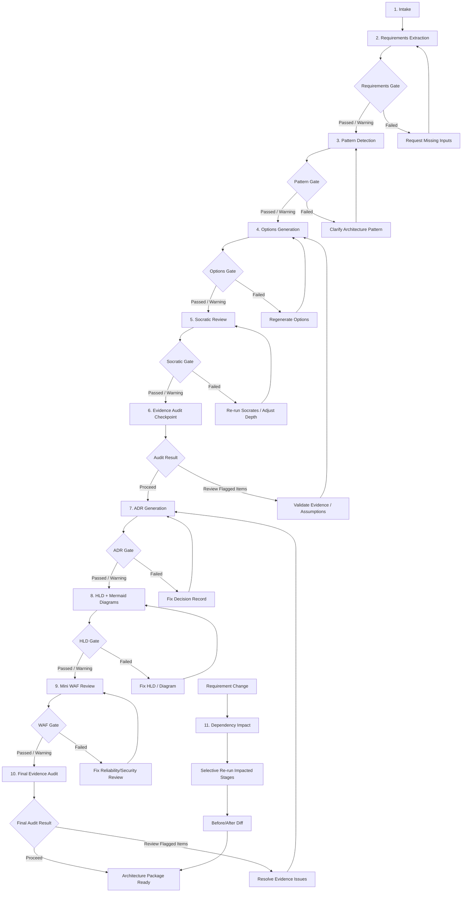

# Archimedes Stage Pipeline

**Document ID:** `06-stage-pipeline.md`  
**Solution:** Archimedes — AI Architecture Workbench  
**Version:** v2.2  
**Status:** Implementation-ready baseline  
**Last updated:** 2026-06-09  
**Related documents:** `01-archimedes-hld.md`, `02-domain-models.md`, `03-pydantic-schemas.md`, `04-database-design.md`

---

## 1. Purpose

This document defines the Archimedes stage pipeline.

The pipeline controls how a raw business need is progressively transformed into evidence-backed architecture outputs. It defines the stage sequence, transition rules, quality gates, pause/resume behavior, error handling, artifact versioning, and requirement-change re-reasoning flow.

This document is implementation-facing. It should guide the orchestrator, state manager, agent routines, quality gate service, and frontend stage timeline.

---

## 2. Scope

This document covers:

- The 11-step lifecycle pipeline.
- Stage ownership and responsibilities.
- Inputs and outputs per stage.
- Stage transition rules.
- Quality gate handling.
- User override behavior.
- Stage execution status tracking.
- Pause, resume, retry, and failure recovery.
- Evidence audit checkpoints.
- Requirement-change impact analysis and selective re-run.
- Artifact versioning and before/after diff behavior.
- Observability events for pipeline execution.

This document does not cover:

- Full Pydantic model code. See `03-pydantic-schemas.md`.
- Cosmos DB physical design. See `04-database-design.md`.
- Full agent prompts. See `07-agent-specifications.md`.
- Socrates internals. See `08-socrates-engine.md`.
- Function tool signatures. See `09-tool-specifications.md`.
- API contracts. See `05-api-contracts.md`.

---

## 3. Pipeline Design Principles

The pipeline follows these principles:

1. **Stage-driven execution**  
   The system advances through explicit lifecycle stages instead of free-form chat.

2. **Validated state changes only**  
   Agent outputs are converted to `StagePatch` objects and applied only through the Architecture State Manager.

3. **Quality gates before advancement**  
   Each critical stage produces a `QualityGateResult`. Blocking failures prevent automatic progression.

4. **Evidence-first outputs**  
   Architecture outputs must distinguish facts, assumptions, and recommendations.

5. **Version every meaningful artifact**  
   ADRs, HLDs, WAF reviews, Socrates outputs, and options matrices are versioned.

6. **Selective re-reasoning**  
   Requirement changes should regenerate only impacted stages, not the whole session.

7. **Pause and resume by design**  
   Every stage has execution status, retry metadata, and failure reason.

8. **Human override is controlled**  
   Users can proceed past warnings but not unresolved blocking failures unless a later explicit override mode is implemented.

9. **Observable pipeline**  
   Every stage transition, quality gate result, evidence audit result, retry, and re-run should be traceable.

---

## 4. Stage Pipeline Overview

Archimedes uses an 11-step lifecycle.

```text
1.  Intake
2.  Requirements Extraction  → Quality Gate
3.  Pattern Detection         → Quality Gate
4.  Options Generation        → Quality Gate
5.  Socratic Review           → Quality Gate
6.  Evidence Audit Checkpoint
7.  ADR Generation            → Quality Gate
8.  HLD + Mermaid Diagrams    → Quality Gate
9.  Mini WAF Review           → Quality Gate
10. Final Evidence Audit
11. Requirement Change → Dependency Impact → Selective Re-run → Before/After Diff
```

Stages 1 through 10 represent the normal forward pipeline. Stage 11 is an event-driven flow that can be triggered after any material requirement or decision change.

---

## 5. Pipeline Diagram



---

## 6. Stage Identity and Naming

Use stable stage identifiers in code, database records, API responses, and frontend status rendering.

| Step | Display Name | Stage ID | Primary Output |
|---:|---|---|---|
| 1 | Intake | `intake` | Business need summary |
| 2 | Requirements Extraction | `requirements` | Structured requirements artifact |
| 3 | Pattern Detection | `pattern_detection` | Architecture pattern artifact |
| 4 | Options Generation | `options_generation` | Architecture options matrix |
| 5 | Socratic Review | `socratic_review` | Socrates synthesis artifact |
| 6 | Evidence Audit Checkpoint | `evidence_audit_checkpoint` | Interim evidence audit report |
| 7 | ADR Generation | `adr_generation` | Architecture Decision Record |
| 8 | HLD + Mermaid Diagrams | `hld_generation` | HLD artifact + diagrams |
| 9 | Mini WAF Review | `mini_waf_review` | WAF review artifact |
| 10 | Final Evidence Audit | `final_evidence_audit` | Final audit report |
| 11 | Requirement Change and Re-reasoning | `rereasoning` | Change impact + regenerated artifacts + diff |

The stage IDs should be treated as controlled vocabulary. They should not be changed casually after implementation starts because they are used in storage, API responses, traces, and frontend state.

---

## 7. Stage Execution Lifecycle

Each stage execution follows the same high-level lifecycle.

```text
pending → running → completed
                  ↘ failed
                  ↘ skipped
```

### 7.1 Stage Status Values

| Status | Meaning |
|---|---|
| `pending` | Stage is known but has not started. |
| `running` | Stage is currently executing. |
| `completed` | Stage finished and its patch was applied. |
| `failed` | Stage failed due to tool error, validation error, quality gate failure, or unexpected exception. |
| `skipped` | Stage was intentionally skipped, usually during selective re-run when it is not impacted. |

### 7.2 StageExecution Fields

Each stage should have a `StageExecution` record embedded in `ArchitectureSession.stage_executions`.

```text
stage
stage_run_id
status
started_at
completed_at
retry_count
failure_reason
```

### 7.3 Stage Run ID

Each execution attempt gets a new `stage_run_id`.

Suggested format:

```text
{session_id}-{stage_id}-{timestamp_or_short_uuid}
```

Example:

```text
arch-2026-06-09-fraud-001-options_generation-9f3a2c
```

The `stage_run_id` is used for:

- Idempotency.
- Trace correlation.
- Artifact version creation.
- Retry tracking.
- Debugging failed runs.

---

## 8. Common Stage Execution Algorithm

Each normal stage follows this sequence:

```text
1. Read ArchitectureSession.
2. Determine current stage and expected next stage.
3. Mark stage execution as running.
4. Build stage input context from latest approved artifacts.
5. Invoke agent routine or deterministic tool.
6. Receive structured stage output.
7. Convert output to StagePatch.
8. Validate StagePatch schema.
9. Evaluate quality gate.
10. Apply patch through Architecture State Manager.
11. Store artifact, claims, evidence sources, and changelog event.
12. Mark stage execution as completed.
13. Advance current_stage if allowed.
14. Emit telemetry events.
```

No agent or tool writes directly to Cosmos DB.

---

## 9. StagePatch Contract in Pipeline Context

Every stage that produces persisted output must return a `StagePatch`.

Minimum required patch metadata:

```text
session_id
stage
stage_run_id
base_version
target_version
idempotency_key
patch_hash
patch
claims
evidence_sources
quality_gate_result
requires_user_input
```

### 9.1 Base Version

`base_version` represents the latest artifact version used as the input context for the stage.

For first-time stage execution:

```text
base_version = 0
target_version = 1
```

For re-reasoning after requirement change:

```text
base_version = latest_current_version
target_version = latest_current_version + 1
```

### 9.2 Idempotency Key

The idempotency key should be deterministic for a given stage run and patch content.

Suggested format:

```text
hash(session_id + stage + stage_run_id + patch_hash)
```

If the same idempotency key already exists, the State Manager should return the previous result instead of applying a duplicate write.

### 9.3 Patch Hash

`patch_hash` is a hash of the normalized patch payload.

It is used for:

- Duplicate detection.
- Audit trails.
- Diff generation.
- Debugging non-deterministic agent behavior.

---

## 10. Quality Gate Model

Quality gates use a three-state model.

```text
passed
passed_with_warnings
failed
```

### 10.1 Quality Gate Result

```text
status
blocking_failures[]
warnings[]
user_override_allowed
```

### 10.2 Status Semantics

| Status | Advancement Behavior |
|---|---|
| `passed` | Pipeline advances automatically. |
| `passed_with_warnings` | Pipeline may advance. UI should show warnings. User override is allowed. |
| `failed` | Pipeline does not advance automatically. Blocking failures must be resolved. |

### 10.3 User Override Policy

For MVP:

- User may proceed past warnings.
- User may not proceed past blocking failures.
- Failed stages must be retried or corrected.

Future enhancement:

- Add explicit admin override for blocking failures with required justification.

---

## 11. Quality Gate Definitions

### 11.1 Requirements Gate

**Stage:** `requirements`

Blocking checks:

| Check ID | Description |
|---|---|
| `scale_defined` | Scale target must be defined, such as TPS, users, data volume, or request rate. |
| `security_defined` | Security requirements must be identified. |

Warning checks:

| Check ID | Description |
|---|---|
| `latency_defined` | Latency SLA is not defined. System may use assumptions. |
| `availability_defined` | Availability target is not defined. System may use default assumption. |
| `compliance_defined` | Compliance frameworks are not specified. |
| `data_residency_defined` | Data residency is not checked. |
| `integration_context_defined` | Upstream/downstream systems are unclear. |
| `operational_constraints_defined` | Operational constraints are missing. |

### 11.2 Pattern Detection Gate

**Stage:** `pattern_detection`

Blocking checks:

| Check ID | Description |
|---|---|
| `primary_pattern_identified` | At least one primary architecture pattern must be identified. |

Warning checks:

| Check ID | Description |
|---|---|
| `multiple_patterns_detected` | Multiple patterns may broaden options. |
| `pattern_confidence_low` | Pattern confidence is below threshold. |
| `pattern_specific_nfrs_inferred` | Implied NFRs need user validation. |

### 11.3 Options Generation Gate

**Stage:** `options_generation`

Blocking checks:

| Check ID | Description |
|---|---|
| `min_viable_options` | At least two viable options must be generated. |
| `rejected_option` | At least one option must be explicitly rejected with reason. |

Warning checks:

| Check ID | Description |
|---|---|
| `tradeoffs_scored` | Trade-off scoring is incomplete. |
| `cost_assumptions_present` | Cost assumptions are missing or weak. |
| `risk_summary_present` | Risk summary is missing. |
| `evidence_links_present` | Some option claims lack evidence links. |

### 11.4 Socratic Review Gate

**Stage:** `socratic_review`

Blocking checks:

| Check ID | Description |
|---|---|
| `blind_spots_generated` | Blind spots must be identified. |
| `premortem_generated` | Pre-mortem scenarios must be generated. |

Warning checks:

| Check ID | Description |
|---|---|
| `min_personas_responded` | Fewer than expected personas responded. |
| `confidence_scored` | Confidence score is missing. |
| `low_confidence` | Confidence score is below threshold. |
| `assumptions_listed` | Key assumptions are missing. |
| `recommended_option_identified` | Synthesizer did not clearly identify preferred option. |

### 11.5 Evidence Audit Checkpoint Gate

**Stage:** `evidence_audit_checkpoint`

This is an audit stage, not a traditional quality gate. It determines whether the pipeline should proceed to ADR generation.

Possible recommendations:

| Recommendation | Behavior |
|---|---|
| `proceed` | Continue to ADR generation. |
| `review_flagged_items` | Show warnings and allow user review. |
| `pause_and_validate` | Pause pipeline until unsupported or contradictory claims are resolved. |

Blocking audit issues:

| Issue | Description |
|---|---|
| `critical_unsupported_claim` | Major factual claim has no source. |
| `critical_irrelevant_citation` | Source does not support the claim. |
| `critical_contradiction` | Two important sources or claims contradict each other. |

### 11.6 ADR Gate

**Stage:** `adr_generation`

Blocking checks:

| Check ID | Description |
|---|---|
| `decision_captured` | Decision must be clearly stated. |
| `selected_option_valid` | Selected option must reference an existing option. |

Warning checks:

| Check ID | Description |
|---|---|
| `alternatives_listed` | Rejected alternatives are incomplete. |
| `consequences_documented` | Consequences are incomplete. |
| `assumptions_documented` | Assumptions are not captured. |
| `socrates_findings_reflected` | Socrates concerns are not reflected. |

### 11.7 HLD Gate

**Stage:** `hld_generation`

Blocking checks:

| Check ID | Description |
|---|---|
| `components_shown` | All major components must appear in the HLD. |
| `data_flow_shown` | Data flow paths must be documented. |

Warning checks:

| Check ID | Description |
|---|---|
| `trust_boundaries_shown` | Trust boundaries are not marked. |
| `mermaid_render_check_passed` | Mermaid rendering failed or produced warnings. |
| `network_zones_defined` | Network zones are missing. |
| `identity_flow_defined` | Identity flow is missing. |
| `observability_flow_defined` | Logging/tracing/metrics flow is unclear. |

### 11.8 Mini WAF Review Gate

**Stage:** `mini_waf_review`

Blocking checks:

| Check ID | Description |
|---|---|
| `reliability_reviewed` | Reliability pillar must be reviewed. |
| `security_reviewed` | Security pillar must be reviewed. |

Warning checks:

| Check ID | Description |
|---|---|
| `cost_reviewed` | Cost optimization pillar is missing. |
| `ops_reviewed` | Operational excellence pillar is missing. |
| `performance_reviewed` | Performance efficiency pillar is missing. |
| `critical_findings_prioritized` | Findings are not prioritized. |
| `mitigations_present` | Mitigations are missing. |

### 11.9 Final Evidence Audit Gate

**Stage:** `final_evidence_audit`

Possible recommendations:

| Recommendation | Behavior |
|---|---|
| `proceed` | Mark architecture package ready. |
| `review_flagged_items` | Package can be shown with warnings. |
| `pause_and_validate` | Do not finalize until issues are resolved. |

The final audit should review all major artifacts:

- Requirements.
- Pattern detection output.
- Options matrix.
- Socrates synthesis.
- ADR.
- HLD.
- Mini WAF review.
- Cost assumptions if present.

---

## 12. Stage Details

## 12.1 Stage 1 — Intake

**Stage ID:** `intake`

### Purpose

Capture the raw business need and create the initial architecture session.

### Owner

- Orchestrator.
- Intake routine if separate from orchestrator.

### Inputs

- User's raw business need.
- Optional domain context.
- Optional constraints already provided by user.

### Outputs

- `ArchitectureSession` created.
- Initial `business_need` summary.
- Initial `stage_executions` map.
- Initial `current_stage = intake`.

### Processing Steps

1. Accept raw user input.
2. Normalize into a concise business need statement.
3. Create `ArchitectureSession`.
4. Initialize all known stages as `pending`.
5. Mark `intake` as `completed`.
6. Advance to `requirements`.

### Claims and Evidence

This stage may produce assumptions but typically does not require external evidence.

### Quality Gate

No formal quality gate in MVP. However, business need must not be empty.

### Failure Modes

| Failure | Handling |
|---|---|
| Empty business need | Ask user to provide a meaningful problem statement. |
| Ambiguous domain | Continue but mark domain as unknown. |

---

## 12.2 Stage 2 — Requirements Extraction

**Stage ID:** `requirements`

### Purpose

Convert the business need into structured functional requirements, non-functional requirements, constraints, assumptions, and open questions.

### Owner

- Requirements Engineer routine.
- Quality Gate Service.

### Inputs

- Business need.
- Prior user clarifications.
- Optional domain assumptions.
- Foundry IQ retrieval results for architecture requirement patterns, if useful.

### Outputs

- Requirements artifact.
- Requirements quality gate result.
- Claims and evidence sources.
- Open questions.
- Assumptions requiring validation.

### Processing Steps

1. Read current `ArchitectureSession`.
2. Extract functional requirements.
3. Extract NFRs: scale, latency, availability, security, compliance, data residency, observability, operations, cost, timeline.
4. Identify constraints.
5. Identify assumptions.
6. Identify open questions.
7. Classify requirements by priority.
8. Evaluate requirements quality gate.
9. Emit `StagePatch`.
10. Apply patch through State Manager.

### Quality Gate

See [11.1 Requirements Gate](#111-requirements-gate).

### User Interaction

If blocking data is missing, the pipeline should ask targeted questions.

Example:

```text
I can proceed, but I need at least a scale target and security context.
What is the expected request rate or transaction volume?
Are there any compliance requirements such as PCI-DSS, HIPAA, GDPR, or SOC2?
```

### Failure Modes

| Failure | Handling |
|---|---|
| Missing scale | Block advancement. |
| Missing security context | Block advancement. |
| Missing latency | Warning; use assumptions if user allows. |
| Agent returns malformed structure | Retry once with schema correction prompt. |

---

## 12.3 Stage 3 — Pattern Detection

**Stage ID:** `pattern_detection`

### Purpose

Identify the dominant architecture pattern and secondary patterns so options generation is focused.

### Owner

- Pattern Detector routine.
- Hybrid deterministic keyword detector.
- Optional LLM confirmation.

### Inputs

- Requirements artifact.
- Business need.
- Known pattern library.

### Outputs

- Primary pattern.
- Secondary patterns.
- Typical pipeline.
- Azure services to explore.
- Pattern-specific NFRs.
- Pattern confidence score.

### Processing Steps

1. Run deterministic keyword/signals matching.
2. Produce candidate patterns.
3. Ask LLM to confirm/refine pattern selection.
4. Identify implied NFRs.
5. Evaluate pattern gate.
6. Emit `StagePatch`.
7. Apply patch.

### Example Output

```text
Primary pattern: real_time_streaming
Secondary patterns: event_driven_integration, transactional_system
Typical pipeline: Ingestion → Feature enrichment → Real-time scoring → Alert/Action pipeline
Implied NFRs: ordering, replayability, backpressure handling, event retention, p99 latency
```

### Quality Gate

See [11.2 Pattern Detection Gate](#112-pattern-detection-gate).

### Failure Modes

| Failure | Handling |
|---|---|
| No pattern detected | Ask clarifying question or route to generic architecture flow. |
| Multiple high-confidence patterns | Continue with warning and include both in options context. |
| Low-confidence pattern | Continue with warning if requirements are otherwise sufficient. |

---

## 12.4 Stage 4 — Options Generation

**Stage ID:** `options_generation`

### Purpose

Generate multiple viable architecture options and at least one rejected option.

### Owner

- Options Generator routine.
- Foundry IQ retrieval.
- Optional web search for current service updates.

### Inputs

- Requirements artifact.
- Pattern detection artifact.
- Foundry IQ retrieval from curated Azure architecture knowledge base.
- Optional web search results for current service capabilities.

### Outputs

- Architecture options matrix.
- Option trade-off scores.
- Risks and mitigations.
- Explicit rejected option.
- Cost assumptions at high level.
- Claims and evidence sources.

### Processing Steps

1. Read requirements and detected patterns.
2. Retrieve relevant Azure reference architectures and service guidance.
3. Generate 2 to 4 viable options.
4. Generate at least 1 rejected option.
5. Score each option across criteria.
6. Identify risks and assumptions.
7. Attach evidence where available.
8. Evaluate options gate.
9. Emit `StagePatch`.
10. Apply patch.

### Recommended Option Structure

```text
option_id
name
summary
azure_services
component_roles
fit_to_requirements
tradeoff_scores
risks
mitigations
cost_assumptions
operational_complexity
security_considerations
status: candidate | recommended | rejected
```

### Quality Gate

See [11.3 Options Generation Gate](#113-options-generation-gate).

### Failure Modes

| Failure | Handling |
|---|---|
| Fewer than two viable options | Regenerate options with broader search. |
| No rejected option | Ask generator to add explicit rejected option. |
| Weak evidence | Continue to evidence audit checkpoint but mark warning. |
| Options do not map to requirements | Regenerate with stricter requirement matching. |

---

## 12.5 Stage 5 — Socratic Review

**Stage ID:** `socratic_review`

### Purpose

Stress-test the architecture options using adversarial reasoning personas and produce a synthesized decision brief.

### Owner

- Socrates Engine.
- Microsoft Agent Framework WorkflowBuilder fan-out/fan-in workflow.

### Inputs

- Requirements artifact.
- Pattern detection artifact.
- Options generation artifact.
- Evaluation criteria.
- Socrates depth setting: `light`, `standard`, or `deep`.

### Outputs

- Persona findings.
- Synthesized decision brief.
- Blind spots.
- Pre-mortem.
- Confidence score.
- Recommended option or hybrid option.
- Key assumptions requiring validation.

### Processing Steps

1. Build Socrates context from requirements and options.
2. Select Socrates depth.
3. Dispatch context to personas.
4. Run persona analysis in parallel where supported.
5. Aggregate persona outputs.
6. Run synthesizer.
7. Evaluate Socratic gate.
8. Emit `StagePatch`.
9. Apply patch.

### Standard Mode Personas

For MVP, use standard depth:

```text
Devil's Advocate
SRE / Ops Lead
Security Architect
FinOps Lead
Delivery Lead
Synthesizer
```

### Quality Gate

See [11.4 Socratic Review Gate](#114-socratic-review-gate).

### Failure Modes

| Failure | Handling |
|---|---|
| Persona call fails | Retry failed persona once. If still failing, proceed with warning if minimum personas responded. |
| Synthesizer fails | Retry synthesizer. If still failing, mark stage failed. |
| No blind spots | Re-run synthesizer with explicit instruction. |
| Low confidence | Continue with warning or allow user to run deep mode. |

---

## 12.6 Stage 6 — Evidence Audit Checkpoint

**Stage ID:** `evidence_audit_checkpoint`

### Purpose

Audit whether options and Socratic review outputs are adequately grounded before generating ADR and HLD artifacts.

### Owner

- Evidence Auditor routine.
- Evidence Store query service.

### Inputs

- Claims and evidence from requirements, pattern detection, options, and Socrates.
- Current artifacts.

### Outputs

- Evidence audit report.
- Unsupported claims.
- Irrelevant citations.
- Stale sources.
- Low-trust sources.
- Contradictions.
- Requires-user-validation list.
- Recommendation: `proceed`, `review_flagged_items`, or `pause_and_validate`.

### Processing Steps

1. Read claims for stages 2 through 5.
2. Read linked evidence sources.
3. Check citation presence.
4. Check citation relevance.
5. Check source trust.
6. Check freshness.
7. Check claim classification.
8. Check contradictions.
9. Produce audit recommendation.
10. Emit `StagePatch`.
11. Apply patch.

### Gate Behavior

- `proceed`: advance to ADR generation.
- `review_flagged_items`: show warnings; user can proceed.
- `pause_and_validate`: do not proceed until issues are resolved.

### Failure Modes

| Failure | Handling |
|---|---|
| Evidence store unavailable | Retry. If still unavailable, pause. |
| Many unsupported claims | Pause and regenerate affected stage. |
| Contradictory evidence | Pause and ask user or rerun retrieval. |

---

## 12.7 Stage 7 — ADR Generation

**Stage ID:** `adr_generation`

### Purpose

Generate an Architecture Decision Record based on the recommended option and Socrates findings.

### Owner

- ADR Writer routine.
- ADR formatter tool.

### Inputs

- Requirements artifact.
- Options matrix.
- Socrates synthesis.
- Evidence audit checkpoint.

### Outputs

- MADR-style ADR.
- Decision rationale.
- Selected option.
- Rejected alternatives.
- Consequences.
- Assumptions.
- Links to claims/evidence.

### Processing Steps

1. Read recommended option from Socrates synthesis.
2. Validate selected option exists.
3. Generate ADR content.
4. Format ADR using deterministic tool.
5. Evaluate ADR gate.
6. Emit `StagePatch`.
7. Apply patch.

### Recommended ADR Sections

```text
Title
Status
Context
Decision
Options Considered
Selected Option
Rejected Options
Consequences
Risks and Mitigations
Assumptions
Evidence References
Socrates Findings Reflected
```

### Quality Gate

See [11.6 ADR Gate](#116-adr-gate).

### Failure Modes

| Failure | Handling |
|---|---|
| No recommended option | Return to Socratic review. |
| ADR misses rejected alternatives | Regenerate ADR. |
| ADR contradicts Socrates synthesis | Regenerate ADR with stricter context. |

---

## 12.8 Stage 8 — HLD + Mermaid Diagrams

**Stage ID:** `hld_generation`

### Purpose

Generate the high-level architecture design and diagrams.

### Owner

- HLD Designer routine.
- Mermaid render check tool.

### Inputs

- Requirements.
- Selected option.
- ADR.
- Socrates findings.
- Foundry IQ retrieval from Azure architecture references.

### Outputs

- HLD narrative.
- System context diagram.
- Container/component diagram.
- Data flow diagram.
- Optional network/security zones diagram.
- Mermaid source.
- Mermaid render check result.

### Processing Steps

1. Read ADR and selected option.
2. Generate HLD narrative.
3. Generate Mermaid diagrams.
4. Run Mermaid render check.
5. If rendering fails, retry diagram generation once.
6. Evaluate HLD gate.
7. Emit `StagePatch`.
8. Apply patch.

### HLD Sections

```text
Solution Overview
Context
Functional Architecture
Logical Components
Data Flow
Identity and Access Flow
Trust Boundaries
Operational View
Observability View
Deployment View
Known Risks and Assumptions
```

### Quality Gate

See [11.7 HLD Gate](#117-hld-gate).

### Failure Modes

| Failure | Handling |
|---|---|
| Mermaid fails render check | Retry diagram generation once. |
| Components missing | Regenerate HLD with component checklist. |
| No trust boundaries | Proceed with warning unless security requirements demand blocking. |

---

## 12.9 Stage 9 — Mini WAF Review

**Stage ID:** `mini_waf_review`

### Purpose

Evaluate the proposed architecture against the Azure Well-Architected Framework at a practical demo depth.

### Owner

- WAF Reviewer routine.
- Foundry IQ retrieval.

### Inputs

- HLD artifact.
- ADR.
- Requirements.
- Claims/evidence from previous stages.
- WAF documentation from Foundry IQ.

### Outputs

- Mini WAF review covering five pillars.
- Findings.
- Severity.
- Recommendations.
- Mitigations.
- Open risks.

### Processing Steps

1. Read HLD and ADR.
2. Retrieve WAF guidance.
3. Evaluate each pillar.
4. Prioritize findings.
5. Identify mitigations.
6. Evaluate WAF gate.
7. Emit `StagePatch`.
8. Apply patch.

### Five WAF Pillars

```text
Reliability
Security
Cost Optimization
Operational Excellence
Performance Efficiency
```

### Quality Gate

See [11.8 Mini WAF Review Gate](#118-mini-waf-review-gate).

### Failure Modes

| Failure | Handling |
|---|---|
| Reliability not reviewed | Block advancement. |
| Security not reviewed | Block advancement. |
| Other pillars shallow | Warning for MVP. |
| Findings lack mitigation | Warning or regenerate. |

---

## 12.10 Stage 10 — Final Evidence Audit

**Stage ID:** `final_evidence_audit`

### Purpose

Run a final evidence quality check before marking the architecture package as ready.

### Owner

- Evidence Auditor routine.

### Inputs

- All stage artifacts.
- All claims.
- All evidence sources.
- Current ArchitectureSession.

### Outputs

- Final evidence audit report.
- Overall evidence quality.
- List of unresolved unsupported claims.
- List of assumptions requiring validation.
- Final recommendation.

### Processing Steps

1. Read all claims and evidence for the session.
2. Review major artifacts.
3. Check claim-evidence alignment.
4. Check freshness and trust.
5. Check contradictions.
6. Produce final recommendation.
7. Emit `StagePatch`.
8. Apply patch.
9. If recommendation is `proceed`, mark architecture package ready.

### Gate Behavior

See [11.9 Final Evidence Audit Gate](#119-final-evidence-audit-gate).

### Failure Modes

| Failure | Handling |
|---|---|
| Critical unsupported claims | Pause and route to affected stage. |
| Low evidence quality | Allow user to review, but do not mark ready automatically. |
| Audit tool failure | Retry once; if still failing, pause. |

---

## 12.11 Stage 11 — Requirement Change and Re-reasoning

**Stage ID:** `rereasoning`

### Purpose

Detect material changes, compute impacted stages, selectively re-run affected stages, and generate before/after diffs.

### Owner

- Orchestrator.
- Dependency Impact Engine.
- Architecture State Manager.
- Artifact Diff Service.

### Trigger

This stage is triggered when the user changes a requirement, constraint, assumption, option, or decision.

Examples:

```text
Actually make it 100K TPS instead of 10K TPS.
Make it multi-region active-active.
Assume the team cannot operate Kafka.
We now need PCI-DSS and GDPR.
Reduce the monthly budget by 40%.
```

### Inputs

- Existing ArchitectureSession.
- Current artifacts.
- Change request.
- Dependency map.
- Stable-stage rules.

### Outputs

- ChangeEvent.
- Impacted stages.
- Stable stages.
- Re-run plan.
- New artifact versions for impacted stages.
- Before/after diff.

### Processing Steps

1. Parse change request.
2. Classify changed field: scale, latency, availability, compliance, region, budget, timeline, team skill, selected decision, etc.
3. Compute impacted stages using dependency rules.
4. Compute stable stages.
5. Append `ChangeEvent`.
6. Set impacted stage executions to `pending`.
7. Re-run impacted stages in dependency order.
8. Version each regenerated artifact.
9. Generate before/after diff.
10. Show changed vs unchanged areas in frontend.
11. Run evidence audit if impacted artifacts include options, Socrates, ADR, HLD, or WAF.

### Example Impact Result

```text
Requirement changed: Scale 10K TPS → 100K TPS

Impacted stages:
- options_generation
- socratic_review
- evidence_audit_checkpoint
- adr_generation
- hld_generation
- mini_waf_review
- final_evidence_audit

Stable stages:
- intake
- functional requirements
- compliance framework selection, if unchanged
```

### Re-run Order

Re-run impacted stages in the original pipeline order.

```text
requirements → pattern_detection → options_generation → socratic_review → evidence_audit_checkpoint → adr_generation → hld_generation → mini_waf_review → final_evidence_audit
```

Skip any stage not in the impacted set.

### Failure Modes

| Failure | Handling |
|---|---|
| Change cannot be classified | Ask user a targeted clarification or mark broad impact. |
| Dependency map missing | Fall back to conservative downstream re-run. |
| Version conflict | Re-read latest artifacts and regenerate patch. |
| Re-run stage fails | Pause at failed stage and preserve previous accepted version. |

---

## 13. Transition Rules

### 13.1 Forward Progression

The orchestrator may advance from stage `N` to stage `N+1` when:

```text
current stage status = completed
quality gate status = passed OR passed_with_warnings
no blocking failure exists
State Manager applied the StagePatch successfully
```

### 13.2 Warning Progression

If a stage returns `passed_with_warnings`:

1. Store the artifact.
2. Store the warnings.
3. Show the warnings in the UI.
4. Allow the user to continue.
5. Include warnings in later context summaries.

### 13.3 Failed Stage

If a stage returns `failed`:

1. Do not advance stage.
2. Store failure reason in `StageExecution.failure_reason`.
3. Preserve previous valid artifact version.
4. Surface the blocking failures.
5. Allow retry after corrective action.

### 13.4 Manual Retry

A retry should:

1. Increment `retry_count`.
2. Create a new `stage_run_id`.
3. Use the same `base_version` unless input context changed.
4. Generate a new `idempotency_key`.
5. Record retry event in changelog.

### 13.5 Automatic Retry

Automatic retry is allowed for:

- Temporary tool failure.
- Transient LLM failure.
- Mermaid render failure.
- Schema formatting error that can be corrected by a retry prompt.

Automatic retry should be limited to one retry per stage by default.

---

## 14. Pause and Resume Behavior

### 14.1 Pause Conditions

The pipeline should pause when:

- A blocking quality gate failure occurs.
- Evidence audit recommends `pause_and_validate`.
- A tool repeatedly fails.
- A version conflict occurs.
- User input is required.
- User explicitly pauses the session.

### 14.2 Resume Conditions

The pipeline can resume when:

- Required user input is provided.
- Blocking quality issue is resolved.
- Failed tool becomes available.
- Version conflict is resolved by re-reading latest state.
- User requests retry.

### 14.3 Resume Algorithm

```text
1. Read ArchitectureSession.
2. Identify last_successful_stage.
3. Identify current failed or pending stage.
4. Rebuild input context from latest accepted artifacts.
5. Create new stage_run_id.
6. Retry stage.
```

---

## 15. Versioning Behavior

### 15.1 First Execution

For first execution of a stage:

```text
base_version = 0
target_version = 1
```

### 15.2 Re-run Execution

For re-run of a stage:

```text
base_version = latest accepted artifact version
target_version = base_version + 1
```

### 15.3 Artifact Acceptance

A generated artifact becomes the active artifact only when:

- Patch validation passes.
- Quality gate does not fail with blocking failures.
- State Manager applies patch successfully.

### 15.4 Preserving Previous Versions

If a re-run fails:

- Previous active artifact remains active.
- Failed output is either discarded or stored as diagnostic data, depending on implementation setting.
- Changelog records failed regeneration attempt.

---

## 16. Diff Behavior

Before/after diff is central to the demo and requirement-change flow.

Diff should be generated for:

- Options matrix.
- Socrates synthesis.
- ADR.
- HLD.
- Mini WAF review.
- Cost assumptions, if present.

### 16.1 Diff Summary

The UI should show:

```text
Requirement changed
Impacted stages
Stable stages
New artifact versions
Major changes by artifact
Risks introduced
Risks reduced
Cost/complexity impact, if available
```

### 16.2 Diff Granularity

| Artifact | Diff Type |
|---|---|
| Options | Added, removed, modified, recommended option changed |
| Socrates | New blind spots, changed confidence, new pre-mortem items |
| ADR | Decision changed, consequences changed, rejected options changed |
| HLD | Components added/removed, diagram changed, data flow changed |
| WAF Review | New findings, severity changes, mitigation changes |
| Cost | Range changed, cost drivers changed, sensitivity changed |

---

## 17. Evidence Audit Placement

Evidence audit runs twice in the MVP pipeline.

### 17.1 Checkpoint Audit

Runs after Socratic Review.

Purpose:

```text
Are the architecture options and debate grounded enough to create ADR/HLD artifacts?
```

This prevents weak or unsupported recommendations from becoming formal decisions.

### 17.2 Final Audit

Runs after Mini WAF Review.

Purpose:

```text
Is the full architecture package evidence-backed and safe to present?
```

This final step ensures the demo output feels credible and professional.

---

## 18. Context Management Between Stages

The orchestrator should not pass full artifacts blindly into every stage.

Use context packs.

### 18.1 Context Pack Types

| Context Pack | Used By | Contents |
|---|---|---|
| `requirements_context` | Pattern, options, Socrates, HLD, WAF | Business need, functional requirements, NFRs, constraints, assumptions |
| `pattern_context` | Options | Primary pattern, secondary patterns, implied NFRs, services to explore |
| `options_context` | Socrates, ADR | Options matrix, tradeoffs, rejected options, risks |
| `decision_context` | ADR, HLD, WAF | Selected option, rationale, Socrates findings |
| `design_context` | WAF, final audit | HLD summary, components, data flows, trust boundaries |
| `evidence_context` | Evidence audits | Claims, evidence sources, trust/freshness metadata |

### 18.2 Context Summarization

If artifacts are large:

1. Store full content in Blob or Cosmos artifact document.
2. Generate a stage summary.
3. Pass summary plus references to next stage.
4. Retrieve full artifact only if required.

---

## 19. Observability Events

Emit structured telemetry for all major pipeline events.

### 19.1 Required Events

```text
session.created
stage.started
stage.completed
stage.failed
stage.retry.started
stage.retry.completed
quality_gate.evaluated
patch.validation.started
patch.validation.failed
patch.applied
patch.conflict
artifact.version.created
evidence.audit.started
evidence.audit.completed
rereasoning.change_detected
rereasoning.impact_computed
rereasoning.stage_rerun_started
rereasoning.stage_rerun_completed
diff.generated
```

### 19.2 Common Event Fields

```text
session_id
stage
stage_run_id
base_version
target_version
status
duration_ms
trace_id
user_id, if available
error_code, if failed
```

---

## 20. Error Handling Strategy

| Error Category | Example | Handling |
|---|---|---|
| Schema validation error | Agent output missing field | Retry once with schema correction prompt. |
| Quality gate failure | Scale missing | Pause and request user input. |
| Evidence failure | Unsupported critical claim | Pause or route to affected stage. |
| Tool failure | Mermaid render check failure | Retry once, then continue with warning or fail based on stage. |
| Version conflict | Artifact changed during run | Re-read current version and regenerate patch. |
| LLM timeout | Persona call timeout | Retry persona once; proceed with warning if minimum personas responded. |
| Storage failure | Cosmos write failure | Retry with backoff; do not mark stage completed. |

---

## 21. Frontend Stage Timeline Behavior

The frontend should render each stage with:

```text
stage number
stage name
status badge
quality gate badge
artifact version
warnings count
blocking failure count
last updated timestamp
```

### 21.1 Suggested Badges

| State | Badge |
|---|---|
| Pending | `Pending` |
| Running | `Running` |
| Completed + passed | `Passed` |
| Completed + warnings | `Warnings` |
| Failed | `Failed` |
| Skipped during re-run | `Skipped` |

### 21.2 Requirement Change View

When Stage 11 runs, frontend should show:

```text
Changed requirement
Impacted stages
Stable stages
Regeneration progress
Before/after diff
Accept new versions
Keep previous versions, future enhancement
```

For MVP, regenerated versions become active automatically if their quality gates pass.

---

## 22. MVP Execution Rules

For the first implementation:

1. Use standard Socrates depth by default.
2. Allow warnings to proceed automatically after showing them.
3. Block only on hard failures.
4. Run one automatic retry for transient failures.
5. Use simplified but visible evidence audit output.
6. Use deterministic quality gate checks where possible.
7. Generate before/after diff for options, ADR, and HLD at minimum.
8. Keep cost modeling as assumption-first and optional within options/WAF context.

---

## 23. Future Enhancements

Future improvements can include:

- Admin override for blocking quality gate failures with justification.
- Human approval workflow between stages.
- Async background execution with notifications.
- Full per-pillar WAF deep review.
- Full STRIDE and compliance pipeline.
- Multiple architecture packages per session.
- Branching alternatives and compare-mode.
- Long-running workflow checkpoint persistence.
- Role-based stage visibility.
- Enterprise architecture review board workflow.

---

## 24. Implementation Checklist

Minimum implementation checklist for this pipeline:

```text
[ ] Stage IDs defined as enum.
[ ] Stage transition map implemented.
[ ] StageExecution status tracking implemented.
[ ] StagePatch validation integrated.
[ ] Quality Gate Service implemented.
[ ] State Manager applies patches only after validation.
[ ] Idempotency check implemented.
[ ] Optimistic concurrency implemented.
[ ] Claims and evidence persistence integrated.
[ ] Evidence audit checkpoint wired after Socrates.
[ ] Final evidence audit wired after Mini WAF.
[ ] Requirement-change classifier implemented.
[ ] Dependency impact engine implemented.
[ ] Selective re-run order implemented.
[ ] Diff service integrated.
[ ] Frontend stage timeline consumes stage status API.
[ ] Telemetry events emitted.
```

---

## 25. Summary

The Archimedes stage pipeline is the control backbone of the solution.

It ensures that architecture outputs are not generated as one-off chat responses, but as a structured, auditable, evidence-backed lifecycle. The key implementation patterns are:

- Explicit 11-step pipeline.
- Stage status tracking.
- Quality gates.
- Validated StagePatch application.
- Evidence audit checkpoints.
- Artifact versioning.
- Dependency-based re-reasoning.
- Before/after diff generation.

This document should be used as the primary reference for implementing the orchestrator, stage controller, quality gate service, state manager integration, and frontend stage timeline.
