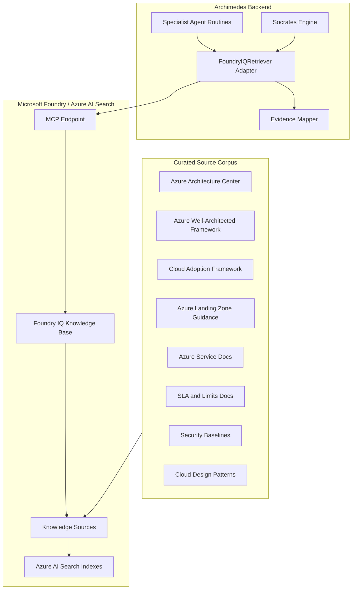
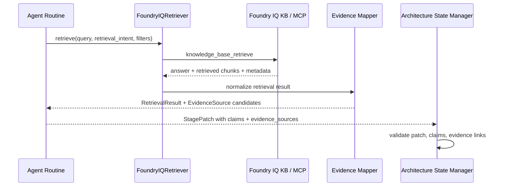

# Archimedes Foundry IQ Knowledge Base Design

**Document ID:** `10-foundry-iq-knowledge-base.md`  
**Solution:** Archimedes — AI Architecture Workbench  
**Version:** v2.2  
**Status:** Implementation-ready baseline  
**Last updated:** 2026-06-09  
**Related documents:** `01-archimedes-hld.md`, `03-pydantic-schemas.md`, `04-database-design.md`, `06-stage-pipeline.md`, `07-agent-specifications.md`, `09-tool-specifications.md`, `11-evidence-and-claims.md`, `12-dependency-and-rereasoning.md`

---

## 1. Purpose

This document defines the Foundry IQ knowledge base design for Archimedes.

Archimedes depends on high-quality grounding. Its architecture outputs must not be generic LLM responses. They must be supported by curated Microsoft/Azure documentation, clearly separated claims and evidence, freshness metadata, and source-aware reasoning.

The Foundry IQ knowledge base provides the trusted architecture knowledge layer used by specialist routines such as Requirements Engineer, Pattern Detector, Options Generator, HLD Designer, WAF Reviewer, Evidence Auditor, and parts of the Socrates engine.

This document covers:

- Knowledge base goals and non-goals.
- Source curation plan.
- Knowledge source grouping.
- Document ingestion and metadata strategy.
- Azure AI Search and Foundry IQ setup expectations.
- MCP integration pattern.
- Retrieval contract used by Archimedes agents.
- Evidence metadata mapping.
- Evaluation queries and quality gates.
- Refresh and versioning strategy.
- Security, permissions, and operational considerations.

This document does not contain:

- Full agent prompts. See `07-agent-specifications.md`.
- Function tool definitions. See `09-tool-specifications.md`.
- Claims/evidence audit logic in full detail. See `11-evidence-and-claims.md`.
- Azure provisioning scripts. See `13-infrastructure-and-deployment.md`.

---

## 2. Design Positioning

Foundry IQ is the grounding layer for Microsoft/Azure architecture knowledge.

For Archimedes v2.2, the knowledge base should be treated as a reusable architecture intelligence asset, not as a generic document dump.

The core principle is:

```text
Curated knowledge base first, agent reasoning second.
```

The quality of Archimedes depends heavily on the quality, freshness, source metadata, and structure of this knowledge base.

---

## 3. Foundry IQ Role in Archimedes

### 3.1 What Foundry IQ Provides

Foundry IQ / Azure AI Search knowledge bases are used to:

- Ground claims in trusted Microsoft/Azure documentation.
- Retrieve architecture patterns, service capabilities, limits, and best practices.
- Support cited reasoning for options generation and WAF review.
- Provide source metadata that can be stored as `EvidenceSource` records.
- Reduce hallucination risk by requiring retrieval before factual architecture claims.
- Support future reuse across multiple Archimedes sessions and agents.

### 3.2 What Foundry IQ Does Not Provide

Foundry IQ should not be used for deterministic business logic.

The following remain app-local tools or services:

- Cost estimation.
- Mermaid render checks.
- STRIDE mapping.
- ADR formatting.
- Quality gate evaluation.
- Dependency impact analysis.
- Artifact diff generation.
- StagePatch validation.
- State mutation.

Foundry IQ retrieves and synthesizes knowledge. Archimedes decides how to validate, apply, persist, and audit that knowledge.

---

## 4. Current Integration Assumptions

As of 2026-06-09, Archimedes assumes the following integration model:

1. A knowledge base is created in Foundry IQ / Azure AI Search.
2. The knowledge base is exposed through an MCP endpoint.
3. Foundry Agent Service or an MCP-compatible client invokes the `knowledge_base_retrieve` tool.
4. The knowledge base performs query planning, decomposition, retrieval, ranking, and response generation depending on configuration.
5. Archimedes converts retrieval outputs into `EvidenceSource` records and links them to `ClaimRecord` objects.

Important implementation note:

```text
For the Foundry Agent Service integration, Azure AI Search knowledge bases expose the knowledge_base_retrieve MCP tool. Custom Archimedes tools must remain outside the knowledge base.
```

Because some SDKs, REST APIs, source types, and Foundry IQ capabilities are evolving, implementation should isolate Foundry IQ access behind a small adapter layer.

Recommended adapter name:

```text
FoundryIQRetriever
```

---

## 5. Knowledge Base Architecture

### 5.1 Logical View



### 5.2 Runtime Query Flow



---

## 6. Knowledge Base Scope

### 6.1 MVP Scope

For MVP, the knowledge base should prioritize Microsoft/Azure architecture guidance needed for the fraud detection demo and similar cloud architecture scenarios.

MVP source groups:

| Source Group | Priority | Used By | Purpose |
|---|---:|---|---|
| Azure Architecture Center | P0 | Pattern Detector, Options Generator, HLD Designer | Reference architectures and design patterns |
| Azure Well-Architected Framework | P0 | WAF Reviewer, Socrates | Pillar-based review and design principles |
| Azure Service Documentation | P0 | Options Generator, HLD Designer | Service capabilities and usage guidance |
| Azure Service Limits / Quotas / SLA Docs | P0 | Options Generator, WAF Reviewer, Cost Estimator context | Limits, availability, regional caveats |
| Azure Security Baselines | P1 | Security Architect persona, WAF Reviewer | Security controls and baseline recommendations |
| Cloud Adoption Framework / Landing Zones | P1 | HLD Designer, WAF Reviewer | Governance, landing zone, operating model guidance |
| Cloud Design Patterns | P1 | Pattern Detector, Options Generator | Common design patterns and anti-patterns |
| Pricing Documents | Excluded from KB for MVP | Cost Estimator | Use deterministic pricing data/tool instead |

### 6.2 Deferred Sources

The following can be added later:

| Source | Reason to Defer |
|---|---|
| Internal enterprise architecture standards | Not needed for public demo; useful for enterprise story |
| PCI-DSS official docs | Good for deep compliance stage, but out of MVP scope |
| SOC 2 / ISO 27001 controls | Useful later for compliance mapping |
| Product-specific benchmark reports | Need freshness and trust governance |
| GitHub reference implementations | Useful for implementation planning, not core HLD reasoning |
| Third-party blog posts | Higher risk of stale or unsupported claims |

---

## 7. Source Curation Strategy

### 7.1 Curation Principles

The knowledge base should be curated using these rules:

1. **Prefer official Microsoft sources**  
   Microsoft Learn, Azure Architecture Center, Azure Well-Architected Framework, Azure Service SLA pages, and Azure security baselines should be preferred over blogs.

2. **Separate stable guidance from volatile facts**  
   Architecture patterns are relatively stable. Pricing, limits, preview status, and regional availability change frequently and require freshness checks.

3. **Do not index too broadly for MVP**  
   A smaller, well-curated corpus is better than a large noisy corpus.

4. **Attach metadata during ingestion**  
   Source group, service name, document type, version, retrieval purpose, and freshness category should be captured wherever possible.

5. **Avoid unsupported source mixing**  
   If a source type is preview or not yet supported in the target environment, use Blob-based curated exports or AI Search indexes instead.

6. **Retain source URLs**  
   Every retrieved evidence item should preserve source URL or document identifier for audit.

---

## 8. Recommended Knowledge Source Inventory

### 8.1 Azure Architecture Center

**Purpose:** Reference architectures, architectural patterns, design guidance.

**Use cases:**

- Pattern detection.
- Options generation.
- HLD generation.
- Architecture trade-off reasoning.

**Suggested metadata:**

```json
{
  "source_group": "azure_architecture_center",
  "trust_level": "high",
  "freshness_category": "stable_guidance",
  "document_type": "reference_architecture",
  "service_area": "architecture"
}
```

### 8.2 Azure Well-Architected Framework

**Purpose:** WAF pillars and design review guidance.

**Use cases:**

- Mini WAF review.
- Socrates SRE / Security / FinOps persona reasoning.
- Quality gate warnings.

**Suggested metadata:**

```json
{
  "source_group": "azure_waf",
  "trust_level": "high",
  "freshness_category": "semi_stable_guidance",
  "document_type": "well_architected_guidance",
  "waf_pillar": "reliability|security|cost|operations|performance"
}
```

### 8.3 Azure Service Documentation

**Purpose:** Service capabilities, architectural roles, integration guidance.

**Use cases:**

- Azure service selection.
- Options comparison.
- HLD component descriptions.
- Fit/gap reasoning.

**Suggested metadata:**

```json
{
  "source_group": "azure_service_docs",
  "trust_level": "high",
  "freshness_category": "current_required",
  "document_type": "service_documentation",
  "service_name": "Azure Event Hubs"
}
```

### 8.4 Limits, Quotas, and SLA Documents

**Purpose:** Time-sensitive factual grounding for scale, availability, and performance claims.

**Use cases:**

- Scale feasibility.
- Reliability review.
- Performance review.
- Evidence audit freshness checks.

**Suggested metadata:**

```json
{
  "source_group": "azure_limits_sla",
  "trust_level": "high",
  "freshness_category": "current_required",
  "document_type": "limits_or_sla",
  "service_name": "Azure Event Hubs"
}
```

### 8.5 Security Baselines

**Purpose:** Service-specific security recommendations.

**Use cases:**

- Security Architect persona.
- WAF Security review.
- Future compliance mapping.

**Suggested metadata:**

```json
{
  "source_group": "azure_security_baselines",
  "trust_level": "high",
  "freshness_category": "semi_stable_guidance",
  "document_type": "security_baseline",
  "service_name": "Azure Cosmos DB"
}
```

### 8.6 Cloud Adoption Framework and Landing Zones

**Purpose:** Governance, operating model, identity, networking, management groups, subscriptions, policies.

**Use cases:**

- HLD governance section.
- WAF operational excellence.
- Enterprise architecture readiness.

**Suggested metadata:**

```json
{
  "source_group": "caf_landing_zone",
  "trust_level": "high",
  "freshness_category": "semi_stable_guidance",
  "document_type": "governance_guidance",
  "topic": "landing_zone|identity|networking|policy|management"
}
```

### 8.7 Cloud Design Patterns

**Purpose:** Pattern and anti-pattern reasoning.

**Use cases:**

- Pattern Detector.
- Options Generator.
- ADR consequences.

**Suggested metadata:**

```json
{
  "source_group": "cloud_design_patterns",
  "trust_level": "high",
  "freshness_category": "stable_guidance",
  "document_type": "design_pattern",
  "pattern_name": "competing_consumers|circuit_breaker|cqrs|event_sourcing"
}
```

---

## 9. Source Collection Plan

### 9.1 MVP Source Collection Approach

For MVP, use one of two practical approaches.

#### Option A — Portal-first Curation

Use the Microsoft Foundry portal / Azure AI Search portal to create a knowledge base and add sources manually.

Best for:

- Fast hackathon/demo setup.
- Minimal automation.
- Manual inspection of retrieval behavior.

Limitations:

- Harder to reproduce.
- Source versioning must be documented manually.
- Less suitable for CI/CD.

#### Option B — Curated Blob Corpus

Create a curated Blob Storage corpus containing downloaded or exported markdown/html/text versions of selected official docs, then index those into Azure AI Search / Foundry IQ.

Best for:

- Reproducibility.
- Versioning.
- Controlled corpus quality.
- Evidence freshness tracking.

Limitations:

- Requires more setup.
- Must respect source licensing and update frequency.
- Needs ingestion scripts.

### 9.2 Recommendation for Archimedes MVP

Use a hybrid approach:

```text
MVP Day 1–2:
- Start portal-first with a small number of curated official Microsoft sources.
- Validate retrieval quality quickly.

After MVP baseline:
- Move to curated Blob corpus with manifest-based source versioning.
```

---

## 10. Source Manifest

A source manifest should track the content loaded into the knowledge base.

Recommended file:

```text
kb/source-manifest.yaml
```

Example:

```yaml
kb_name: azure-architecture-kb
kb_version: "2026-06-09"
created_at: "2026-06-09T00:00:00Z"
curation_owner: "archimedes-team"

sources:
  - source_id: azure_arch_center_event_driven
    source_group: azure_architecture_center
    title: "Event-driven architecture style"
    source_url: "https://learn.microsoft.com/..."
    document_type: reference_architecture
    service_area: architecture
    trust_level: high
    freshness_category: stable_guidance
    source_document_version: "2026-06-09"
    included_for:
      - pattern_detection
      - options_generation
      - hld_generation

  - source_id: azure_waf_reliability
    source_group: azure_waf
    title: "Reliability pillar overview"
    source_url: "https://learn.microsoft.com/..."
    document_type: well_architected_guidance
    waf_pillar: reliability
    trust_level: high
    freshness_category: semi_stable_guidance
    source_document_version: "2026-06-09"
    included_for:
      - waf_review
      - socrates_sre_persona

  - source_id: event_hubs_limits
    source_group: azure_limits_sla
    title: "Azure Event Hubs quotas and limits"
    source_url: "https://learn.microsoft.com/..."
    document_type: limits_or_sla
    service_name: "Azure Event Hubs"
    trust_level: high
    freshness_category: current_required
    source_document_version: "2026-06-09"
    included_for:
      - options_generation
      - evidence_audit
```

The `kb_version` and `source_document_version` values must be copied into generated `EvidenceSource` records where available.

---

## 11. Knowledge Base Metadata Model

Every ingested document or chunk should carry metadata whenever the ingestion method supports it.

### 11.1 Required Metadata

| Field | Description | Example |
|---|---|---|
| `source_id` | Stable identifier for source document | `event_hubs_limits` |
| `source_group` | Source group | `azure_limits_sla` |
| `source_url` | Original official source URL | `https://learn.microsoft.com/...` |
| `title` | Document title | `Azure Event Hubs quotas and limits` |
| `document_type` | Type of source | `limits_or_sla` |
| `trust_level` | Trust classification | `high` |
| `freshness_category` | Freshness expectation | `current_required` |
| `source_document_version` | Curation date or source version | `2026-06-09` |
| `kb_name` | Knowledge base name | `azure-architecture-kb` |
| `kb_version` | Corpus version | `2026-06-09` |

### 11.2 Optional Metadata

| Field | Description | Example |
|---|---|---|
| `service_name` | Azure service name | `Azure Event Hubs` |
| `waf_pillar` | WAF pillar | `reliability` |
| `pattern_name` | Pattern name | `event_driven_architecture` |
| `region_sensitive` | Whether content may vary by region | `true` |
| `pricing_sensitive` | Whether content contains pricing info | `true` |
| `preview_sensitive` | Whether content references preview status | `true` |
| `compliance_sensitive` | Whether content supports compliance claims | `true` |

---

## 12. Foundry IQ / Azure AI Search Setup

### 12.1 Required Azure Resources

| Resource | Purpose |
|---|---|
| Microsoft Foundry Project | Hosts model deployment and agent tooling |
| Azure OpenAI / Foundry Models deployment | LLM used by agents and optionally retrieval synthesis |
| Azure AI Search service | Provides knowledge base and retrieval infrastructure |
| Foundry IQ knowledge base | Top-level domain knowledge object |
| Storage account / Blob container | Optional curated source corpus |
| Managed identity | Secure connection between Foundry project and AI Search |

### 12.2 Recommended Naming

```text
Resource group:        rg-archimedes-dev
Foundry project:       foundry-archimedes-dev
Azure AI Search:       srch-archimedes-dev
Knowledge base:        azure-architecture-kb
Blob container:        kb-source-corpus
MCP connection name:   archimedes-kb-connection
Model deployment:      gpt-4.1-mini or equivalent approved deployment
```

### 12.3 Knowledge Base Creation Flow

At a high level:

```text
1. Create Azure AI Search service.
2. Create or connect source indexes / knowledge sources.
3. Create Foundry IQ knowledge base backed by Azure AI Search.
4. Configure knowledge sources and retrieval behavior.
5. Test retrieval directly using the knowledge base retrieve action.
6. Create Foundry project RemoteTool connection to the KB MCP endpoint.
7. Add MCP tool to agent/tool adapter with allowed tool knowledge_base_retrieve.
8. Run Archimedes retrieval test pack.
```

---

## 13. MCP Integration Design

### 13.1 RemoteTool Connection

Archimedes should create a RemoteTool connection from the Foundry project to the knowledge base MCP endpoint.

Conceptual connection fields:

```json
{
  "connection_name": "archimedes-kb-connection",
  "category": "RemoteTool",
  "authType": "ProjectManagedIdentity",
  "target": "https://<search-service>.search.windows.net/knowledgebases/<kb-name>/mcp?api-version=2026-05-01-preview",
  "audience": "https://search.azure.com/"
}
```

### 13.2 MCP Tool Configuration

The tool configuration should allow only the supported knowledge base retrieval tool.

Conceptual configuration:

```python
mcp_kb_tool = MCPTool(
    server_label="knowledge-base",
    server_url="https://<search-service>.search.windows.net/knowledgebases/<kb-name>/mcp?api-version=2026-05-01-preview",
    require_approval="never",
    allowed_tools=["knowledge_base_retrieve"],
    project_connection_id="archimedes-kb-connection",
)
```

### 13.3 Adapter Boundary

All agent routines should access Foundry IQ through an internal adapter rather than calling SDK objects directly.

Recommended interface:

```python
class FoundryIQRetriever:
    async def retrieve(
        self,
        query: str,
        retrieval_intent: str,
        stage: str,
        source_filters: list[str] | None = None,
        freshness_required: bool = False,
        top_k: int = 5,
    ) -> RetrievalResult:
        ...
```

Why use an adapter:

- Shields agent code from API version changes.
- Normalizes MCP/direct retrieve responses.
- Enforces metadata extraction.
- Captures telemetry.
- Converts retrieved items into `EvidenceSource` candidates.
- Allows fallback to direct Search API retrieval if MCP agent integration changes.

---

## 14. Retrieval Contract

### 14.1 Retrieval Request

Every Archimedes retrieval request should include:

| Field | Purpose |
|---|---|
| `query` | The natural-language query sent to the knowledge base |
| `stage` | Pipeline stage requesting retrieval |
| `retrieval_intent` | Why retrieval is being performed |
| `source_filters` | Optional source groups to target |
| `freshness_required` | Whether current docs are needed |
| `expected_claim_type` | Fact, assumption support, or recommendation evidence |
| `session_id` | For telemetry and traceability |
| `stage_run_id` | For idempotency and audit |

Example:

```json
{
  "query": "Azure services and reference architecture for real-time fraud detection with 10K transactions per second and PCI-DSS constraints",
  "stage": "options_generation",
  "retrieval_intent": "service_selection",
  "source_filters": ["azure_architecture_center", "azure_service_docs", "azure_waf"],
  "freshness_required": true,
  "expected_claim_type": "fact",
  "session_id": "arch-session-001",
  "stage_run_id": "options-run-001"
}
```

### 14.2 Retrieval Response

The adapter should normalize Foundry IQ output into the following structure:

```json
{
  "query": "...",
  "stage": "options_generation",
  "retrieval_intent": "service_selection",
  "answer": "...",
  "items": [
    {
      "title": "...",
      "source": "Microsoft Learn",
      "source_url": "https://learn.microsoft.com/...",
      "excerpt": "...",
      "score": 0.87,
      "source_group": "azure_service_docs",
      "document_type": "service_documentation",
      "trust_level": "high",
      "freshness_category": "current_required",
      "kb_name": "azure-architecture-kb",
      "kb_version": "2026-06-09",
      "source_document_version": "2026-06-09",
      "retrieved_at": "2026-06-09T10:30:00Z"
    }
  ],
  "warnings": []
}
```

### 14.3 EvidenceSource Mapping

Each retrieved item may become an `EvidenceSource` record.

Mapping:

| Retrieval field | EvidenceSource field |
|---|---|
| `title` | `source` or `title` |
| `source_url` | `source_url` |
| `excerpt` | `excerpt` |
| `retrieval_intent` | `retrieval_context` |
| `retrieved_at` | `retrieved_at` |
| `source_group` | metadata |
| `trust_level` | `trust_level` |
| `freshness_category` | `source_freshness` derivation |
| `kb_name` | `kb_name` |
| `kb_version` | `kb_version` |
| `source_document_version` | `source_document_version` |

---

## 15. Retrieval Usage by Pipeline Stage

### 15.1 Stage 2 — Requirements Extraction

Foundry IQ should be used to identify implied NFRs and common requirements for the detected domain.

Example queries:

```text
What non-functional requirements should be considered for real-time fraud detection architecture on Azure?
```

```text
Azure architecture guidance for fintech transaction processing security availability latency compliance requirements
```

Expected output:

- Suggested missing NFRs.
- Security and compliance considerations.
- Availability and performance considerations.
- Assumptions requiring user validation.

### 15.2 Stage 3 — Pattern Detection

Foundry IQ should support pattern matching by retrieving architecture styles and design patterns.

Example queries:

```text
Azure architecture pattern for real-time transaction fraud detection event streaming scoring pipeline
```

```text
Event-driven architecture and stream processing reference architecture Azure
```

Expected output:

- Primary and secondary architecture patterns.
- Standard pipeline shape.
- Candidate Azure services.
- Pattern-specific NFRs.

### 15.3 Stage 4 — Options Generation

This is the most important retrieval stage.

Example queries:

```text
Azure options for real-time streaming ingestion and fraud detection at 10K TPS with low latency
```

```text
Compare Azure Event Hubs Stream Analytics Azure Functions AKS Kafka Flink for real-time processing architecture
```

Expected output:

- Candidate services.
- Reference architecture support.
- Service-fit evidence.
- Limits and caveats.
- Evidence for rejected options.

### 15.4 Stage 5 — Socratic Review

Socrates personas may call retrieval selectively.

| Persona | Retrieval Focus |
|---|---|
| Devil's Advocate | Known limits, caveats, anti-patterns |
| SRE / Ops Lead | Reliability, monitoring, incident handling |
| Security Architect | Identity, network security, data protection |
| FinOps Lead | Cost drivers, SKU sensitivity, hidden costs |
| Delivery Lead | Operational complexity, managed vs self-managed trade-offs |

Socrates should not over-retrieve for every persona. For MVP, retrieve once for each persona only when the persona needs factual grounding.

### 15.5 Stage 7 — ADR Generation

ADR Writer uses previously retrieved evidence and only performs additional retrieval if:

- An option lacks source support.
- A rejected option needs stronger justification.
- The decision rationale includes a new factual claim.

### 15.6 Stage 8 — HLD Generation

HLD Designer retrieves for:

- Component responsibilities.
- Recommended service integration patterns.
- Networking/security placement.
- Azure reference architecture alignment.

### 15.7 Stage 9 — Mini WAF Review

WAF Reviewer retrieves pillar-specific guidance.

Example queries:

```text
Azure Well-Architected Framework reliability considerations for event-driven streaming architecture
```

```text
Azure Well-Architected Framework security considerations for fintech transaction processing architecture
```

### 15.8 Stage 6 and Stage 10 — Evidence Audit

Evidence Auditor should not blindly retrieve more data. It should primarily evaluate existing claims and evidence. It may retrieve additional sources only when:

- A claim is unsupported.
- A citation appears irrelevant.
- A contradiction needs adjudication.
- A freshness-sensitive claim needs validation.

---

## 16. Prompting Rules for Agents Using Foundry IQ

All agents that use Foundry IQ should follow these instruction rules:

```text
Use Foundry IQ retrieval before making factual claims about Azure services, limits, patterns, WAF recommendations, security baselines, or service capabilities.
```

```text
If retrieval does not provide evidence for a factual claim, do not present it as a fact. Mark it as an assumption, recommendation, or unknown.
```

```text
Separate FACT, ASSUMPTION, and RECOMMENDATION in output.
```

```text
Preserve source references and excerpts so the State Manager can create EvidenceSource records.
```

```text
For pricing, use the Archimedes cost estimator tool instead of Foundry IQ unless the query is only about pricing documentation or cost model methodology.
```

```text
For preview/GA status, regional availability, limits, and quotas, mark claims freshness-sensitive.
```

---

## 17. Source Trust Model

### 17.1 Trust Levels

| Trust Level | Source Type | Usage |
|---|---|---|
| High | Microsoft Learn, Azure Architecture Center, Azure WAF, Azure SLA docs, official service docs | Can support factual claims |
| Medium | Microsoft DevBlogs, official GitHub samples, Microsoft TechCommunity | Can support context, announcements, or examples; Evidence Auditor may require corroboration |
| Low | Third-party blogs, Q&A, Stack Overflow, vendor benchmarks | Do not use for final factual claims without corroboration |

### 17.2 Source Selection Rules

1. Prefer high-trust sources for factual claims.
2. Use medium-trust sources for announcements, examples, or supplemental context.
3. Avoid low-trust sources in MVP unless explicitly marked as non-authoritative.
4. For contradictory information, prefer newer official Microsoft Learn content over blogs.
5. For preview/GA status, verify against official docs or release notes.

---

## 18. Freshness Model

### 18.1 Freshness Categories

| Category | Typical Sources | Refresh Frequency | Evidence Audit Behavior |
|---|---|---:|---|
| Stable guidance | Architecture patterns, design principles | Quarterly | Usually acceptable unless outdated by major product change |
| Semi-stable guidance | WAF, CAF, security baselines | Monthly/quarterly | Warning if older than 6–12 months |
| Current required | Service limits, quotas, SLA, preview/GA status | Weekly/monthly | Warning if older than 30–90 days |
| Highly volatile | Pricing, regional availability, preview flags | Daily/weekly | Prefer tool/live lookup; warn strongly if from KB only |

### 18.2 MVP Freshness Policy

For MVP:

| Claim Type | Policy |
|---|---|
| Architecture pattern guidance | OK if source version within 12 months |
| WAF guidance | OK if source version within 12 months |
| Security baseline | Warn if older than 6 months |
| Service limits / quotas | Warn if older than 90 days |
| Pricing | Do not rely on KB; use cost estimator tool |
| Preview/GA status | Must be verified against current official source |

---

## 19. Knowledge Base Versioning

### 19.1 Versioning Rules

Every Archimedes session must record which knowledge base version was used.

Version fields:

```json
{
  "kb_name": "azure-architecture-kb",
  "kb_version": "2026-06-09",
  "source_document_version": "2026-06-09",
  "retrieved_at": "2026-06-09T10:30:00Z"
}
```

### 19.2 When to Increment KB Version

Increment `kb_version` when:

- New source group is added.
- Significant documents are refreshed.
- Chunking strategy changes.
- Retrieval configuration changes materially.
- Metadata schema changes.
- Source trust/freshness classification changes.

Do not increment `kb_version` for:

- Minor typo fixes in internal manifest comments.
- Test-only documents not used by retrieval.

### 19.3 KB Version Storage

The active KB version should be stored in:

- `ArchitectureSession.kb_version` or session metadata.
- Every `EvidenceSource` generated from Foundry IQ.
- Source manifest.
- Deployment release notes.

---

## 20. Retrieval Evaluation Plan

### 20.1 Evaluation Goals

The knowledge base is acceptable for MVP only if it can answer the key questions needed by the demo scenario.

Evaluation dimensions:

| Dimension | Description |
|---|---|
| Relevance | Retrieved chunks directly support the query |
| Source quality | Sources are trusted official Microsoft/Azure sources |
| Citation quality | Source URL/title/excerpt are preserved |
| Coverage | Key architecture areas are represented |
| Freshness | Time-sensitive claims are current enough |
| Contradiction rate | Conflicting sources are rare or surfaced |
| Latency | Retrieval is fast enough for interactive demo |

### 20.2 MVP Test Query Pack

Use these queries to validate the KB.

#### Pattern Detection Queries

```text
What Azure architecture pattern applies to real-time fraud detection for transaction streams?
```

```text
What are common event-driven architecture patterns on Azure?
```

#### Options Generation Queries

```text
What Azure services are suitable for high-throughput event ingestion and stream processing?
```

```text
Compare Azure Event Hubs, Azure Stream Analytics, Azure Functions, and AKS-based Kafka/Flink for real-time processing architecture.
```

#### Reliability Queries

```text
What reliability considerations apply to event-driven systems in Azure Well-Architected Framework?
```

```text
How should an Azure streaming architecture be designed for high availability and failure isolation?
```

#### Security Queries

```text
What security controls should be considered for Azure event streaming and transaction processing systems?
```

```text
What Azure Well-Architected security guidance applies to fintech transaction processing?
```

#### Evidence Auditor Queries

```text
Find official documentation supporting Azure Event Hubs as a high-throughput event ingestion service.
```

```text
Find official Azure guidance that supports or challenges using serverless functions for low-latency high-throughput processing.
```

### 20.3 Acceptance Criteria

The KB is acceptable for MVP if:

| Criterion | Target |
|---|---|
| Relevant results for pattern detection | At least 4/5 test queries pass |
| Relevant results for options generation | At least 4/5 test queries pass |
| WAF guidance retrieval | At least one useful source per pillar |
| Citation metadata present | At least title + URL/excerpt for most retrieved items |
| Unsupported factual claims after retrieval | Less than 20% in dry run |
| Latency | Good enough for demo; target under 10 seconds per retrieval call where feasible |

---

## 21. Retrieval Failure Handling

### 21.1 Failure Types

| Failure | Behavior |
|---|---|
| No relevant results | Agent must say evidence not found and mark claim as unknown or assumption |
| Low-trust results only | Agent may use as context but cannot create high-confidence fact |
| Stale results | Agent may proceed with warning if non-blocking; otherwise ask for validation |
| Contradictory results | Evidence Auditor flags contradiction |
| MCP authentication failure | Pipeline stage fails with recoverable error |
| KB unavailable | Use cached previous evidence only if explicitly marked as cached/stale |

### 21.2 Agent Behavior on Retrieval Failure

Agents must not invent evidence.

Required behavior:

```text
I could not find reliable evidence for this claim in the configured knowledge base. I will mark it as an assumption / unknown and continue only if the quality gate allows it.
```

### 21.3 Quality Gate Interaction

Retrieval failure can cause:

- Warning for non-critical guidance.
- Failure for core factual claims needed to compare options.
- Evidence Auditor recommendation to pause and validate.

---

## 22. Security and Permissions

### 22.1 Authentication Model

Preferred model:

```text
Managed identity + RBAC
```

Recommended roles:

| Identity | Scope | Role |
|---|---|---|
| Foundry project managed identity | Azure AI Search service | Search Index Data Reader |
| Ingestion pipeline identity | Azure AI Search service | Search Index Data Contributor |
| Backend API managed identity | Cosmos DB / Blob | Appropriate data contributor roles |
| Developer/admin identity | Resource group | Contributor or scoped deployment roles |

### 22.2 Avoid Admin Keys for Runtime

Admin keys should not be used by runtime agents. If API keys are required during early development, they must be stored in Key Vault and replaced with managed identity before production-style demos.

### 22.3 Per-user Authorization Caveat

For MVP, Archimedes uses a shared curated public/official Microsoft documentation corpus. Per-user document authorization is out of scope.

If future enterprise private sources are added, the design must account for:

- User-specific access tokens.
- Document-level ACLs.
- Tenant isolation.
- Per-request authorization constraints.
- Evidence redaction rules.

---

## 23. Operational Refresh Strategy

### 23.1 Refresh Types

| Refresh Type | Description | Frequency |
|---|---|---:|
| Manual MVP refresh | Rebuild corpus when important docs change | As needed |
| Scheduled source refresh | Re-pull official docs and update manifest | Monthly |
| Hotfix refresh | Update a small set of volatile docs | As needed |
| Full corpus rebuild | Recreate KB/index and run evaluation pack | Quarterly or major release |

### 23.2 Refresh Workflow

```text
1. Update source manifest.
2. Pull or export updated documents.
3. Normalize content.
4. Attach metadata.
5. Re-index or update knowledge sources.
6. Increment kb_version if needed.
7. Run retrieval evaluation pack.
8. Store evaluation report.
9. Promote KB version to active.
```

### 23.3 KB Evaluation Report

Recommended file:

```text
kb/evaluation-reports/kb-eval-2026-06-09.md
```

Should include:

- KB version.
- Test queries.
- Expected vs actual retrieved sources.
- Relevance score.
- Latency observations.
- Missing coverage.
- Go/no-go decision.

---

## 24. Telemetry and Observability

The `FoundryIQRetriever` adapter should emit telemetry for every retrieval call.

Recommended telemetry fields:

| Field | Description |
|---|---|
| `session_id` | Architecture session |
| `stage_run_id` | Stage execution run |
| `stage` | Pipeline stage |
| `retrieval_intent` | Purpose of query |
| `query_hash` | Hash of query text |
| `source_filters` | Requested source groups |
| `result_count` | Number of returned items |
| `latency_ms` | Retrieval latency |
| `kb_name` | Knowledge base name |
| `kb_version` | Knowledge base version |
| `error_code` | Failure code if any |
| `fallback_used` | Whether fallback retrieval was used |

Telemetry should go to Application Insights through the backend service.

---

## 25. Implementation Interfaces

### 25.1 RetrievalResult

Conceptual model:

```python
class RetrievalItem(BaseModel):
    title: str | None = None
    source: str | None = None
    source_url: str | None = None
    excerpt: str | None = None
    score: float | None = None
    source_group: str | None = None
    document_type: str | None = None
    trust_level: str = "medium"
    freshness_category: str = "unknown"
    kb_name: str | None = None
    kb_version: str | None = None
    source_document_version: str | None = None
    retrieved_at: datetime

class RetrievalResult(BaseModel):
    query: str
    stage: str
    retrieval_intent: str
    answer: str | None = None
    items: list[RetrievalItem] = []
    warnings: list[str] = []
```

### 25.2 Evidence Conversion Function

```python
def retrieval_item_to_evidence_source(
    item: RetrievalItem,
    session_id: str,
    stage: str,
    stage_run_id: str,
) -> EvidenceSource:
    ...
```

This function belongs in the evidence mapping module, not inside agent prompts.

### 25.3 Suggested Module Placement

```text
src/archimedes/
├── integrations/
│   └── foundry_iq.py              # FoundryIQRetriever
├── evidence/
│   ├── mapper.py                  # RetrievalItem -> EvidenceSource
│   └── audit.py                   # Evidence Auditor support logic
├── config/
│   └── kb_config.py               # KB names, versions, source groups
└── telemetry/
    └── retrieval_telemetry.py
```

---

## 26. MVP Setup Checklist

### 26.1 Resource Setup

- [ ] Create Microsoft Foundry project.
- [ ] Deploy selected LLM model.
- [ ] Create Azure AI Search service.
- [ ] Create Foundry IQ / Azure AI Search knowledge base.
- [ ] Add curated source set.
- [ ] Create RemoteTool connection to KB MCP endpoint.
- [ ] Configure managed identity / RBAC.
- [ ] Test `knowledge_base_retrieve` manually.

### 26.2 Corpus Setup

- [ ] Define `kb_version`.
- [ ] Create source manifest.
- [ ] Add Azure Architecture Center sources.
- [ ] Add WAF sources.
- [ ] Add core service docs for MVP scenario.
- [ ] Add limits/SLA docs for relevant services.
- [ ] Add metadata tags.
- [ ] Run ingestion/indexing.

### 26.3 Retrieval Testing

- [ ] Run pattern detection query pack.
- [ ] Run options generation query pack.
- [ ] Run WAF query pack.
- [ ] Run Evidence Auditor query pack.
- [ ] Record evaluation report.
- [ ] Fix missing or noisy sources.

### 26.4 Application Integration

- [ ] Implement `FoundryIQRetriever` adapter.
- [ ] Implement retrieval telemetry.
- [ ] Implement evidence mapping.
- [ ] Add retrieval call wrappers for agent routines.
- [ ] Ensure StagePatch includes claims and evidence sources.
- [ ] Validate evidence persistence in Cosmos DB.

---

## 27. MVP Risks and Mitigations

| Risk | Impact | Mitigation |
|---|---|---|
| KB too broad and noisy | Generic or irrelevant agent outputs | Start with small curated corpus |
| Source metadata missing | Evidence audit weak | Use source manifest and mapping defaults |
| Preview API / SDK drift | Integration breakage | Use adapter boundary and isolate SDK calls |
| MCP auth misconfiguration | Retrieval fails | Test direct retrieve and MCP separately |
| Latency during demo | Poor UX | Cache retrieval results per stage run; show progress UI |
| Stale limits/pricing claims | Incorrect recommendations | Use freshness flags; use cost tool for pricing |
| Citation irrelevant to claim | False confidence | Evidence Auditor relevance check |
| Per-user private sources unsupported in MVP | Enterprise limitations | Keep MVP corpus public/official docs only |

---

## 28. Recommended MVP Knowledge Source Set

For the first demo, keep the corpus focused on these areas:

### 28.1 Architecture Patterns

- Event-driven architecture.
- Stream processing.
- Competing consumers.
- Queue-based load leveling.
- Retry pattern.
- Circuit breaker pattern.
- CQRS / materialized view where relevant.

### 28.2 Azure Services

- Azure Event Hubs.
- Azure Stream Analytics.
- Azure Functions.
- Azure Cosmos DB.
- Azure SQL Database if transactional store appears in options.
- Azure Container Apps.
- Azure Kubernetes Service / Kafka on AKS only for comparison.
- Azure Monitor / Application Insights.
- Microsoft Entra ID.
- Key Vault.

### 28.3 WAF Pillars

- Reliability.
- Security.
- Cost optimization.
- Operational excellence.
- Performance efficiency.

### 28.4 Security / Governance

- Azure security baseline docs for relevant services.
- Identity and access management guidance.
- Network isolation / private endpoint guidance where relevant.
- Logging and monitoring guidance.

---

## 29. Out-of-Scope for MVP

The following should not block MVP implementation:

- Fully automated crawling of all Microsoft Learn docs.
- Full compliance framework ingestion.
- Multi-tenant private enterprise knowledge sources.
- Per-user ACL propagation.
- Deep pricing integration inside Foundry IQ.
- Full source freshness automation.
- Automatic contradiction resolution.
- Multi-KB routing across domains.

---

## 30. Final Recommendation

For Archimedes MVP, the Foundry IQ knowledge base should be small, curated, versioned, and heavily evaluated.

The minimum viable configuration is:

```text
Knowledge base: azure-architecture-kb
Corpus: Azure Architecture Center + WAF + key service docs + limits/SLA docs
Integration: MCP knowledge_base_retrieve through FoundryIQRetriever adapter
Evidence: normalized into EvidenceSource records with kb/source version metadata
Audit: Evidence Auditor verifies relevance, trust, freshness, and contradictions
```

The quality of this knowledge base is a first-class product feature. Treat KB curation and retrieval testing as part of implementation, not as a one-time setup task.

