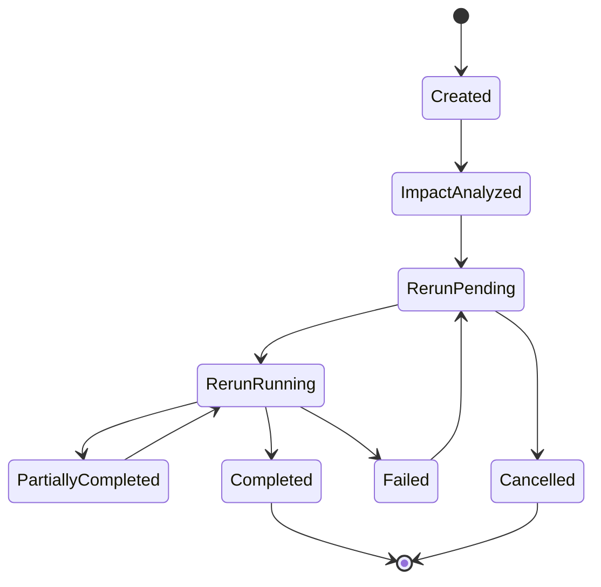

# Archimedes Dependency and Re-Reasoning Design

**Document ID:** `12-dependency-and-rereasoning.md`  
**Solution:** Archimedes — AI Architecture Workbench  
**Version:** v2.2  
**Status:** Implementation-ready baseline  
**Last updated:** 2026-06-09  
**Related documents:** `01-archimedes-hld.md`, `02-domain-models.md`, `03-pydantic-schemas.md`, `04-database-design.md`, `06-stage-pipeline.md`, `11-evidence-and-claims.md`

---

## 1. Purpose

This document defines how Archimedes detects changes, determines which architecture stages are impacted, selectively re-runs only the affected stages, versions regenerated artifacts, and presents before/after differences to the user.

This capability is one of the core differentiators of Archimedes. The system should not behave like a static document generator. It should behave like an architecture workbench that understands that architecture decisions are interconnected. When a requirement changes, Archimedes must identify downstream impacts, preserve unaffected work, re-run affected reasoning paths, and clearly show what changed and why.

Example:

```text
Original requirement:
Design a real-time fraud detection platform on Azure for 10K TPS.

Changed requirement:
Actually, make it 100K TPS and multi-region active-active.

Expected behavior:
- Preserve business need, domain, and PCI-DSS context.
- Re-run architecture options, Socratic review, ADR, HLD, WAF review, and cost estimate.
- Generate new artifact versions.
- Show before/after differences.
- Record a ChangeEvent with impacted and stable stages.
```

---

## 2. Scope

This document covers:

- Dependency and re-reasoning design principles.
- Change detection and classification.
- Dependency rule model.
- Stage impact matrix.
- Impact analysis algorithm.
- Selective re-run planning.
- Artifact versioning during re-runs.
- Before/after diff generation.
- ChangeEvent storage.
- State Manager integration.
- Idempotency, optimistic concurrency, and retry behavior.
- Frontend behavior for requirement-change scenarios.
- Test scenarios and acceptance criteria.

This document does not cover:

- Full Pydantic implementation. See `03-pydantic-schemas.md`.
- Cosmos DB physical indexing and partitioning. See `04-database-design.md`.
- General stage pipeline behavior. See `06-stage-pipeline.md`.
- Evidence and claim audit rules. See `11-evidence-and-claims.md`.
- Agent prompts. See `07-agent-specifications.md`.
- API contracts. See `05-api-contracts.md`.

---

## 3. Design Principles

The dependency and re-reasoning subsystem follows these principles:

1. **Selective regeneration over full restart**  
   A change should only regenerate the stages that are materially impacted.

2. **Preserve valid prior work**  
   Artifacts that are unaffected by the change should remain valid and visible.

3. **Make impact explicit**  
   Users should see which stages are impacted, which are stable, and why.

4. **Version every regenerated artifact**  
   A re-run should never overwrite previous artifacts. It should create new versions.

5. **Record the reason for every re-run**  
   Every regenerated artifact must reference the change that triggered it.

6. **Use deterministic impact rules first**  
   Known dependency rules should drive impact analysis. LLM judgment may supplement, but not replace, deterministic rules.

7. **Keep user trust high**  
   Re-reasoning should not silently mutate the architecture. The UI must show a change summary and diff.

8. **Support safe retries**  
   Re-run operations must use `stage_run_id`, `base_version`, `target_version`, `idempotency_key`, and optimistic concurrency.

9. **Audit evidence after material changes**  
   If a change causes new recommendations, claims, or artifacts, evidence audit must be refreshed for impacted artifacts.

---

## 4. Role in the Archimedes Pipeline

The normal Archimedes pipeline contains 11 steps.

```text
1.  Intake
2.  Requirements Extraction
3.  Pattern Detection
4.  Options Generation
5.  Socratic Review
6.  Evidence Audit Checkpoint
7.  ADR Generation
8.  HLD + Mermaid Diagrams
9.  Mini WAF Review
10. Final Evidence Audit
11. Requirement Change → Dependency Impact → Selective Re-run → Before/After Diff
```

Stage 11 is event-driven. It may be triggered after any material user update, including:

- Requirement change.
- Constraint change.
- Assumption validation or invalidation.
- Architecture option override.
- Decision override.
- Compliance requirement addition.
- Budget or timeline change.
- Region or deployment model change.
- Evidence contradiction or stale source discovery.

---

## 5. Core Concepts

### 5.1 ArchitectureSession

The `ArchitectureSession` stores current session state, current stage, active version, dependency map, and stage execution status.

Important fields for re-reasoning:

```text
session_id
current_stage
last_successful_stage
active_version
stage_executions
dependency_map
quality_gates
detected_patterns
```

### 5.2 VersionedArtifact

Each stage output is stored as a versioned artifact.

Important fields:

```text
session_id
stage
version
stage_run_id
content
quality_gate
created_at
change_event_id
supersedes_version
```

The field `change_event_id` should be added during implementation if it is not already present in the base schema. It enables direct traceability from artifact version to triggering change.

### 5.3 ChangeEvent

A `ChangeEvent` represents a material change that may trigger re-reasoning.

Typical fields:

```text
change_event_id
session_id
timestamp
change_type
changed_entity_type
changed_entity_id
changed_field
old_value_summary
new_value_summary
change_source
impact_analysis_status
impacted_stages
stable_stages
rerun_plan
rerun_status
created_artifact_versions
```

### 5.4 DependencyRule

A `DependencyRule` maps a change type or field to impacted stages.

Example:

```text
Change category: scale
Impacted stages: pattern_detection, options, socratic_review, adr, hld, waf_review, cost_model, final_evidence_audit
Stable stages: intake, business_need, compliance_framework_selection
```

### 5.5 ReRunPlan

A `ReRunPlan` is the ordered execution plan generated after impact analysis.

It answers:

- Which stages must be regenerated?
- In what order?
- Which previous artifact version is the base version?
- Which target version will be created?
- Which stages are skipped as stable?
- Which evidence audits must be repeated?

### 5.6 ArtifactDiff

An `ArtifactDiff` captures before/after differences between artifact versions.

It should support:

- Added/removed/modified options.
- ADR decision changes.
- Mermaid/HLD component changes.
- WAF finding changes.
- Cost estimate changes.
- Evidence quality changes.

---

## 6. Change Taxonomy

Archimedes should classify changes before computing impact.

| Change Category | Examples | Typical Impact |
|---|---|---|
| `business_need` | Change from fraud detection to AML monitoring | Broad impact; may require restarting from requirements |
| `functional_requirement` | Add real-time alerting, add case management | Requirements, options, Socrates, ADR, HLD, WAF |
| `scale` | 10K TPS to 100K TPS, 1M users to 10M users | Options, Socrates, HLD, WAF performance/reliability, cost |
| `latency` | p99 500 ms to p99 50 ms | Options, Socrates, HLD, WAF performance, cost |
| `availability` | 99.9% to 99.99%, active-passive to active-active | Options, Socrates, ADR, HLD, WAF reliability, cost |
| `security` | Add private endpoints, zero-trust, customer-managed keys | Options, HLD, WAF security, evidence audit |
| `compliance` | Add PCI-DSS, HIPAA, GDPR, data residency | Requirements, options, Socrates, ADR, HLD, WAF security, evidence audit |
| `region` | Add India region, EU-only, multi-region active-active | Options, HLD, WAF reliability/security, cost |
| `budget` | Reduce monthly budget, prefer consumption-based | Options, Socrates, ADR, cost, implementation plan |
| `timeline` | MVP in 4 weeks instead of 12 weeks | Options, Socrates, ADR, implementation plan |
| `team_skill` | Team lacks Kafka or Kubernetes skills | Socrates, ADR, implementation plan, options if severe |
| `selected_option` | User overrides recommended option | ADR, HLD, WAF, cost, evidence audit |
| `assumption_validation` | Assumption confirmed or rejected | Stages depending on the assumption |
| `evidence_update` | Source contradiction or stale citation found | Evidence audit and affected claim/artifact |

---

## 7. Dependency Stage Impact Matrix

The following matrix defines default stage impacts for common change categories.

Legend:

```text
R = must re-run
C = conditionally re-run
S = stable / preserve
A = audit only
```

| Change Category | Intake | Requirements | Pattern | Options | Socrates | Evidence Audit Checkpoint | ADR | HLD | WAF | Final Evidence Audit | Cost |
|---|---:|---:|---:|---:|---:|---:|---:|---:|---:|---:|---:|
| `business_need` | C | R | R | R | R | R | R | R | R | R | R |
| `functional_requirement` | S | R | C | R | R | R | R | R | R | R | C |
| `scale` | S | C | C | R | R | R | R | R | R | R | R |
| `latency` | S | C | C | R | R | R | R | R | R | R | R |
| `availability` | S | C | C | R | R | R | R | R | R | R | R |
| `security` | S | C | C | C | R | R | C | R | R | R | C |
| `compliance` | S | R | C | R | R | R | R | R | R | R | C |
| `region` | S | C | C | R | R | R | R | R | R | R | R |
| `budget` | S | C | S | R | R | R | R | C | C | R | R |
| `timeline` | S | C | S | C | R | R | R | C | C | R | C |
| `team_skill` | S | C | S | C | R | R | R | C | C | R | C |
| `selected_option` | S | S | S | C | R | R | R | R | R | R | R |
| `assumption_validation` | S | C | C | C | C | R | C | C | C | R | C |
| `evidence_update` | S | C | C | C | C | R | C | C | C | R | C |

Notes:

- `C` means the Dependency Impact Engine should inspect the changed field, artifact references, and claim dependencies before deciding.
- Cost is shown as a logical stage even if the MVP implements only a basic assumption-first cost estimate.
- Implementation planning is deferred for MVP, but the dependency model should include it for future expansion.

---

## 8. Default Dependency Rules

The Dependency Impact Engine should start with deterministic rules.

```python
DEPENDENCY_RULES = {
    "business_need": {
        "rerun": [
            "requirements",
            "pattern_detection",
            "options",
            "socratic_review",
            "evidence_audit_checkpoint",
            "adr",
            "hld",
            "waf_review",
            "final_evidence_audit",
        ],
        "stable": [],
        "severity": "high",
    },
    "functional_requirement": {
        "rerun": [
            "requirements",
            "options",
            "socratic_review",
            "evidence_audit_checkpoint",
            "adr",
            "hld",
            "waf_review",
            "final_evidence_audit",
        ],
        "conditional": ["pattern_detection", "cost_model"],
        "stable": ["intake"],
        "severity": "high",
    },
    "scale": {
        "rerun": [
            "options",
            "socratic_review",
            "evidence_audit_checkpoint",
            "adr",
            "hld",
            "waf_review",
            "cost_model",
            "final_evidence_audit",
        ],
        "conditional": ["requirements", "pattern_detection"],
        "stable": ["intake", "business_need", "compliance_framework_selection"],
        "severity": "high",
    },
    "latency": {
        "rerun": [
            "options",
            "socratic_review",
            "evidence_audit_checkpoint",
            "adr",
            "hld",
            "waf_review",
            "cost_model",
            "final_evidence_audit",
        ],
        "conditional": ["requirements", "pattern_detection"],
        "stable": ["intake", "business_need"],
        "severity": "high",
    },
    "availability": {
        "rerun": [
            "options",
            "socratic_review",
            "evidence_audit_checkpoint",
            "adr",
            "hld",
            "waf_review",
            "cost_model",
            "final_evidence_audit",
        ],
        "conditional": ["requirements"],
        "stable": ["intake", "business_need"],
        "severity": "high",
    },
    "compliance": {
        "rerun": [
            "requirements",
            "options",
            "socratic_review",
            "evidence_audit_checkpoint",
            "adr",
            "hld",
            "waf_review",
            "final_evidence_audit",
        ],
        "conditional": ["cost_model"],
        "stable": ["intake", "business_need"],
        "severity": "high",
    },
    "region": {
        "rerun": [
            "options",
            "socratic_review",
            "evidence_audit_checkpoint",
            "adr",
            "hld",
            "waf_review",
            "cost_model",
            "final_evidence_audit",
        ],
        "conditional": ["requirements", "pattern_detection"],
        "stable": ["intake", "business_need"],
        "severity": "high",
    },
    "budget": {
        "rerun": [
            "options",
            "socratic_review",
            "evidence_audit_checkpoint",
            "adr",
            "cost_model",
            "final_evidence_audit",
        ],
        "conditional": ["hld", "waf_review"],
        "stable": ["intake", "pattern_detection"],
        "severity": "medium",
    },
    "timeline": {
        "rerun": [
            "socratic_review",
            "evidence_audit_checkpoint",
            "adr",
            "final_evidence_audit",
        ],
        "conditional": ["options", "hld", "waf_review", "cost_model"],
        "stable": ["intake", "pattern_detection"],
        "severity": "medium",
    },
    "selected_option": {
        "rerun": [
            "socratic_review",
            "evidence_audit_checkpoint",
            "adr",
            "hld",
            "waf_review",
            "cost_model",
            "final_evidence_audit",
        ],
        "conditional": ["options"],
        "stable": ["intake", "requirements", "pattern_detection"],
        "severity": "high",
    },
    "assumption_validation": {
        "rerun": [],
        "conditional": [
            "requirements",
            "pattern_detection",
            "options",
            "socratic_review",
            "evidence_audit_checkpoint",
            "adr",
            "hld",
            "waf_review",
            "cost_model",
            "final_evidence_audit",
        ],
        "stable": ["intake"],
        "severity": "medium",
    },
    "evidence_update": {
        "rerun": ["evidence_audit_checkpoint", "final_evidence_audit"],
        "conditional": ["options", "socratic_review", "adr", "hld", "waf_review", "cost_model"],
        "stable": ["intake"],
        "severity": "medium",
    },
}
```

---

## 9. Impact Analysis Flow

Impact analysis should be deterministic first, then optionally augmented by LLM reasoning for ambiguous changes.

```text
User change detected
  ↓
Normalize changed field
  ↓
Classify change category
  ↓
Load ArchitectureSession + latest artifacts
  ↓
Apply deterministic dependency rules
  ↓
Inspect conditional dependencies
  ↓
Generate ReRunPlan
  ↓
Persist ChangeEvent with pending status
  ↓
Show impact summary to user
  ↓
Run impacted stages in dependency order
  ↓
Create new artifact versions
  ↓
Run evidence audit where required
  ↓
Generate before/after diff
  ↓
Mark ChangeEvent complete
```

---

## 10. Change Detection

Changes can be triggered through several paths.

### 10.1 Direct User Change

The user explicitly changes a requirement.

Examples:

```text
Actually, make it 100K TPS.
Add PCI-DSS compliance.
Make it multi-region active-active.
Assume the team does not have Kubernetes skills.
Use Azure-native services only.
```

### 10.2 User Artifact Override

The user modifies or overrides an artifact.

Examples:

```text
Choose Option B instead of Option A.
Remove AKS from the design.
Use Cosmos DB instead of Azure SQL.
Make the design serverless.
```

### 10.3 Assumption Validation

The user confirms or rejects an assumption.

Examples:

```text
Yes, the team has Kafka skills.
No, the team cannot operate Kubernetes.
Data residency must be India-only.
```

### 10.4 Evidence Audit Trigger

The Evidence Auditor identifies unsupported, stale, contradictory, or low-trust evidence.

Examples:

```text
The source used for Event Hubs throughput is stale.
Two sources contradict each other on service limits.
The cost estimate used low-trust pricing information.
```

### 10.5 System Trigger

The system detects a stale session, changed KB version, or missing artifact dependency.

Examples:

```text
Foundry IQ KB version changed.
A required artifact version is missing.
A previous stage failed and needs retry.
```

---

## 11. Change Normalization

The Orchestrator should convert raw user language into a normalized change request.

Example user input:

```text
Actually, make it 100K TPS and multi-region active-active.
```

Normalized change request:

```json
{
  "session_id": "arch-session-001",
  "change_type": "requirement_update",
  "changes": [
    {
      "category": "scale",
      "entity_type": "non_functional_requirement",
      "entity_id": "NFR-SCALE-001",
      "field": "measurable_target",
      "old_value_summary": "10K TPS",
      "new_value_summary": "100K TPS"
    },
    {
      "category": "availability",
      "entity_type": "non_functional_requirement",
      "entity_id": "NFR-AVAILABILITY-001",
      "field": "deployment_resilience",
      "old_value_summary": "single-region or unspecified",
      "new_value_summary": "multi-region active-active"
    }
  ],
  "source": "user_message"
}
```

If the change cannot be mapped confidently, the system should ask a focused clarification or classify it as `uncertain_change` and run a conservative impact plan.

---

## 12. Conservative vs Surgical Impact Plans

Archimedes should support two planning modes.

### 12.1 Surgical Mode

Used when the change category and impacted stages are clear.

Example:

```text
Change: 10K TPS → 100K TPS
Mode: surgical
Re-run: options, Socrates, ADR, HLD, WAF, cost, evidence audits
Preserve: intake, business need, compliance framework
```

### 12.2 Conservative Mode

Used when the change is broad, ambiguous, or potentially invalidates upstream assumptions.

Example:

```text
Change: We are now targeting healthcare instead of fintech.
Mode: conservative
Re-run: requirements onward
Preserve: original raw session history only
```

Default rule:

```text
If confidence in impact classification >= 0.75 → surgical mode.
If confidence < 0.75 → conservative mode or ask clarification.
```

For demo and MVP, prefer deterministic surgical rules for known categories.

---

## 13. ReRunPlan Model

The `ReRunPlan` is generated after impact analysis.

Recommended logical structure:

```json
{
  "rerun_plan_id": "rrp-001",
  "session_id": "arch-session-001",
  "change_event_id": "chg-001",
  "mode": "surgical",
  "reason": "Scale and availability requirements changed.",
  "impacted_stages": [
    "options",
    "socratic_review",
    "evidence_audit_checkpoint",
    "adr",
    "hld",
    "waf_review",
    "cost_model",
    "final_evidence_audit"
  ],
  "stable_stages": [
    "intake",
    "business_need",
    "compliance_framework_selection"
  ],
  "execution_order": [
    "options",
    "socratic_review",
    "evidence_audit_checkpoint",
    "adr",
    "hld",
    "waf_review",
    "cost_model",
    "final_evidence_audit"
  ],
  "base_versions": {
    "options": 1,
    "socratic_review": 1,
    "adr": 1,
    "hld": 1,
    "waf_review": 1,
    "cost_model": 1
  },
  "target_versions": {
    "options": 2,
    "socratic_review": 2,
    "adr": 2,
    "hld": 2,
    "waf_review": 2,
    "cost_model": 2
  },
  "status": "pending"
}
```

---

## 14. Re-Run Execution Order

Impacted stages must run in dependency order, not arbitrary order.

Default order:

```text
requirements
pattern_detection
options
socratic_review
evidence_audit_checkpoint
adr
hld
waf_review
cost_model
final_evidence_audit
```

Rules:

1. If `requirements` is re-run, all downstream stages should be evaluated for impact.
2. If `pattern_detection` changes the primary pattern, `options` and downstream stages must be re-run.
3. If `options` change materially, `socratic_review`, `adr`, `hld`, `waf_review`, and evidence audits must be re-run.
4. If `socratic_review` changes recommendation confidence or the recommended option, `adr`, `hld`, `waf_review`, and final evidence audit must be re-run.
5. If `adr` changes the selected option, `hld`, `waf_review`, cost, and final evidence audit must be re-run.
6. If `hld` changes only diagram formatting but not components, WAF may be skipped.
7. If WAF findings change materially, final evidence audit must be re-run.
8. Final evidence audit always runs after material regenerated architecture artifacts.

---

## 15. Impact Analysis Algorithm

Pseudocode:

```python
async def analyze_change_impact(
    session_id: str,
    normalized_change: dict,
    repository: ArchitectureRepository,
) -> ReRunPlan:
    session = await repository.get_session(session_id)
    latest_artifacts = await repository.get_latest_artifacts(session_id)

    impacted = set()
    conditional = set()
    stable = set()
    severity = "low"

    for change in normalized_change["changes"]:
        category = change["category"]
        rule = DEPENDENCY_RULES.get(category)

        if not rule:
            impacted.update(default_conservative_stages())
            severity = max_severity(severity, "high")
            continue

        impacted.update(rule.get("rerun", []))
        conditional.update(rule.get("conditional", []))
        stable.update(rule.get("stable", []))
        severity = max_severity(severity, rule.get("severity", "medium"))

    conditional_impacts = inspect_conditional_dependencies(
        changes=normalized_change["changes"],
        conditional_stages=conditional,
        latest_artifacts=latest_artifacts,
        session=session,
    )

    impacted.update(conditional_impacts)

    # Remove stable stages only if they are not explicitly impacted.
    stable = stable - impacted

    execution_order = sort_by_pipeline_order(impacted)

    base_versions = {
        stage: latest_artifacts[stage].version
        for stage in execution_order
        if stage in latest_artifacts
    }

    target_versions = {
        stage: base_versions.get(stage, 0) + 1
        for stage in execution_order
    }

    return ReRunPlan(
        session_id=session_id,
        change_event_id=normalized_change["change_event_id"],
        mode="surgical" if severity != "unknown" else "conservative",
        impacted_stages=list(execution_order),
        stable_stages=sorted(stable),
        base_versions=base_versions,
        target_versions=target_versions,
        status="pending",
    )
```

---

## 16. Conditional Dependency Inspection

Some changes require deeper inspection.

### 16.1 Pattern Detection Conditional Impact

Pattern detection should be re-run if:

- Business domain changes.
- Workload type changes.
- The change introduces a new processing style such as batch, streaming, RAG, IoT, migration, or multi-agent workflow.
- Existing detected pattern confidence is low.

Pattern detection can be skipped if:

- Only scale changes within the same architecture pattern.
- Only budget changes without changing workload type.

### 16.2 Requirements Conditional Impact

Requirements should be re-run if:

- User adds or changes functional requirement.
- User changes non-functional target and the requirement object needs updating.
- User validates or invalidates an assumption used in requirements.

Requirements can be skipped if:

- User only changes selected architecture option.
- User asks for a different artifact format.

### 16.3 HLD Conditional Impact

HLD should be re-run if:

- Selected option changes.
- Architecture components change.
- Deployment model changes.
- Region/network/security model changes.
- Scale or availability target changes materially.

HLD can be skipped if:

- Only ADR wording changes.
- Only evidence citation formatting changes.

### 16.4 WAF Conditional Impact

WAF should be re-run if:

- Any major architecture component changes.
- Scale, availability, security, compliance, or region changes.
- Socrates identifies new risks.
- HLD introduces new trust boundaries or failure domains.

WAF can be skipped if:

- Only artifact formatting changes.
- Only non-architectural wording changes.

---

## 17. Materiality Rules

Not every change should trigger re-reasoning. The system should distinguish material and non-material changes.

| Change | Material? | Action |
|---|---:|---|
| Typo correction in business need | No | Update text only, no re-run |
| Renaming an artifact title | No | Create minor artifact revision if needed |
| 10K TPS to 12K TPS | Maybe | Re-run cost and WAF only if thresholds are crossed |
| 10K TPS to 100K TPS | Yes | Re-run options onward |
| Add PCI-DSS | Yes | Re-run requirements onward |
| Add active-active multi-region | Yes | Re-run options onward |
| Change diagram style only | No | Re-render HLD, no architecture re-run |
| Select a rejected option | Yes | Re-run Socrates, ADR, HLD, WAF, evidence audit |

Materiality can be evaluated using thresholds.

Example:

```python
SCALE_CHANGE_THRESHOLDS = {
    "minor_ratio": 1.25,
    "major_ratio": 2.0,
}

# 10K → 12K = minor
# 10K → 100K = major
```

---

## 18. StagePatch Generation During Re-Runs

Every regenerated stage must produce a new `StagePatch`.

Required fields:

```text
session_id
stage
stage_run_id
base_version
target_version
idempotency_key
patch_hash
patch
claims
evidence_sources
quality_gate_result
requires_user_input
```

For re-runs, the `StagePatch` should also include or be associated with:

```text
change_event_id
rerun_plan_id
supersedes_version
reason_for_regeneration
```

If these fields are not added directly to `StagePatch`, they should be carried in stage execution metadata and persisted into `VersionedArtifact` and `ChangeEvent`.

---

## 19. Idempotency and Concurrency

Re-reasoning is vulnerable to duplicate writes, stale versions, and partial failures. The State Manager must enforce safe writes.

### 19.1 Idempotency

Every stage re-run should have an idempotency key.

Recommended format:

```text
{session_id}:{change_event_id}:{stage}:{stage_run_id}:{patch_hash}
```

If the same patch is submitted again, the State Manager should return the existing result instead of creating a duplicate artifact.

### 19.2 Optimistic Concurrency

Every patch must declare its `base_version`.

If current artifact version is different from `base_version`, the patch must not be applied.

Example:

```text
Patch base version: hld v1
Current HLD version: hld v2
Result: reject patch with version_conflict
Action: regenerate from v2
```

### 19.3 Stage Run Isolation

Every re-run stage should have a unique `stage_run_id`.

Example:

```text
options-run-20260609-001
socratic-review-run-20260609-001
hld-run-20260609-001
```

### 19.4 Partial Failure Recovery

If one stage fails, completed prior stages should remain persisted.

Example:

```text
ChangeEvent chg-001
- options v2: completed
- Socrates v2: completed
- ADR v2: completed
- HLD v2: failed
- WAF v2: pending

Resume from HLD v2.
```

---

## 20. ChangeEvent Lifecycle

A ChangeEvent should move through explicit states.

```text
created
impact_analyzed
rerun_pending
rerun_running
partially_completed
completed
failed
cancelled
```

### 20.1 State Transitions



### 20.2 ChangeEvent Example

```json
{
  "change_event_id": "chg-20260609-001",
  "session_id": "arch-session-001",
  "timestamp": "2026-06-09T10:45:00Z",
  "change_type": "requirement_update",
  "changed_entity_type": "non_functional_requirement",
  "changed_entity_id": "NFR-SCALE-001",
  "changed_field": "measurable_target",
  "old_value_summary": "10K TPS",
  "new_value_summary": "100K TPS",
  "change_source": "user_message",
  "impact_analysis_status": "completed",
  "impacted_stages": [
    "options",
    "socratic_review",
    "evidence_audit_checkpoint",
    "adr",
    "hld",
    "waf_review",
    "cost_model",
    "final_evidence_audit"
  ],
  "stable_stages": [
    "intake",
    "business_need",
    "compliance_framework_selection"
  ],
  "rerun_status": "completed",
  "created_artifact_versions": {
    "options": 2,
    "socratic_review": 2,
    "adr": 2,
    "hld": 2,
    "waf_review": 2,
    "cost_model": 2
  }
}
```

---

## 21. Artifact Versioning Rules

### 21.1 Normal Forward Pipeline

The initial run produces version 1 of each major artifact.

```text
requirements v1
pattern_detection v1
options v1
socratic_review v1
adr v1
hld v1
waf_review v1
final_evidence_audit v1
```

### 21.2 Re-Run Pipeline

A change creates new versions only for impacted stages.

Example:

```text
Change: scale 10K TPS → 100K TPS

Preserved:
requirements v1
pattern_detection v1

Regenerated:
options v2
socratic_review v2
adr v2
hld v2
waf_review v2
cost_model v2
final_evidence_audit v2
```

### 21.3 Version Reference Rules

Each regenerated artifact should record:

```text
version
supersedes_version
change_event_id
base_artifact_versions
created_by_stage_run_id
```

Example:

```json
{
  "stage": "hld",
  "version": 2,
  "supersedes_version": 1,
  "change_event_id": "chg-20260609-001",
  "base_artifact_versions": {
    "options": 2,
    "adr": 2,
    "socratic_review": 2
  }
}
```

---

## 22. Diff Generation

The Diff Service produces human-readable and machine-readable differences between artifact versions.

### 22.1 Diff Types

| Artifact | Diff Behavior |
|---|---|
| Requirements | Added/removed/modified FRs, NFRs, constraints, assumptions |
| Pattern Detection | Primary pattern change, secondary pattern changes, service shortlist changes |
| Options | Added/removed/modified options, score changes, recommended option changes |
| Socrates | New persona findings, changed confidence, new blind spots, new pre-mortem risks |
| ADR | Decision changed, rationale changed, consequences changed, rejected options changed |
| HLD | Components added/removed, data flow changed, trust boundaries changed, region topology changed |
| WAF | New findings, severity changes, pillar score changes |
| Cost | Cost range changes, cost driver changes, sensitivity changes |
| Evidence Audit | Unsupported claims, stale citations, contradiction changes |

### 22.2 Generic Diff Output

Recommended structure:

```json
{
  "diff_id": "diff-hld-v1-v2",
  "session_id": "arch-session-001",
  "stage": "hld",
  "before_version": 1,
  "after_version": 2,
  "change_event_id": "chg-20260609-001",
  "summary": "HLD changed from single-region streaming architecture to multi-region active-active architecture.",
  "added": [],
  "removed": [],
  "modified": [],
  "risk_changes": [],
  "evidence_changes": []
}
```

### 22.3 Options Diff Example

```json
{
  "stage": "options",
  "before_version": 1,
  "after_version": 2,
  "summary": "Option A was modified for higher scale; Option D was added for active-active multi-region deployment.",
  "added": [
    {
      "option_id": "OPT-D",
      "name": "Multi-region Event Hubs + partitioned stream processing"
    }
  ],
  "removed": [],
  "modified": [
    {
      "option_id": "OPT-A",
      "changes": [
        {
          "field": "scale_assumption",
          "before": "10K TPS",
          "after": "100K TPS"
        },
        {
          "field": "trade_off_scores.cost",
          "before": 7,
          "after": 5
        }
      ]
    }
  ]
}
```

### 22.4 HLD Diff Example

```json
{
  "stage": "hld",
  "before_version": 1,
  "after_version": 2,
  "summary": "The architecture now includes a second Azure region, cross-region replication, global traffic routing, and explicit failover paths.",
  "added": [
    "Secondary Azure region",
    "Global load balancing",
    "Cross-region replication path",
    "Regional failover control plane"
  ],
  "removed": [],
  "modified": [
    {
      "component": "Event Hubs",
      "before": "single-region ingestion",
      "after": "multi-region ingestion with partitioning and failover"
    }
  ]
}
```

### 22.5 ADR Diff Example

```json
{
  "stage": "adr",
  "before_version": 1,
  "after_version": 2,
  "summary": "Decision changed from a simpler single-region managed streaming design to a multi-region active-active design due to scale and resilience requirements.",
  "modified": [
    {
      "field": "decision",
      "before": "Use Event Hubs + Stream Analytics in a single region.",
      "after": "Use a multi-region active-active streaming architecture with explicit partitioning, failover, and replicated decision stores."
    },
    {
      "field": "consequences",
      "before": "Lower complexity and cost.",
      "after": "Higher resilience and scale, but increased cost and operational complexity."
    }
  ]
}
```

---

## 23. Diff Generation Algorithm

Pseudocode:

```python
async def generate_artifact_diff(
    session_id: str,
    stage: str,
    before_version: int,
    after_version: int,
    repository: ArchitectureRepository,
) -> ArtifactDiff:
    before = await repository.get_artifact(session_id, stage, before_version)
    after = await repository.get_artifact(session_id, stage, after_version)

    if stage == "options":
        return diff_options(before, after)
    if stage == "hld":
        return diff_hld(before, after)
    if stage == "adr":
        return diff_adr(before, after)
    if stage == "waf_review":
        return diff_waf(before, after)
    if stage == "cost_model":
        return diff_cost(before, after)
    if stage in ["evidence_audit_checkpoint", "final_evidence_audit"]:
        return diff_evidence_audit(before, after)

    return diff_generic_json(before.content, after.content)
```

For Mermaid diagrams, the first implementation can compare parsed component labels and edge labels using a simple extraction approach. Full diagram semantic diff can be deferred.

---

## 24. Re-Reasoning Context Construction

When re-running a stage, Archimedes should provide the stage routine with the right context.

### 24.1 Include

- Current business need.
- Updated requirements.
- Relevant stable artifacts.
- Latest impacted upstream artifacts.
- ChangeEvent summary.
- Previous version of the stage artifact.
- Previous evidence audit findings if relevant.
- User preferences and constraints.

### 24.2 Exclude or Summarize

- Full long transcripts unless necessary.
- Full prior artifact text if a summary is enough.
- Low-relevance evidence chunks.
- Superseded artifact versions unless required for diffing.

### 24.3 Context Example for HLD Re-Run

```text
You are regenerating HLD due to ChangeEvent chg-001.

Change summary:
- Scale changed from 10K TPS to 100K TPS.
- Availability changed to multi-region active-active.

Use:
- Requirements v1 with updated NFR values.
- Options v2.
- Socratic Review v2.
- ADR v2.

Previous HLD:
- HLD v1 was single-region.

Task:
- Generate HLD v2.
- Explicitly show multi-region deployment, failover, data flow, and trust boundaries.
- Produce claims/evidence sources.
- Return StagePatch with base_version=1 and target_version=2.
```

---

## 25. Evidence Handling During Re-Runs

Re-reasoning may introduce new claims and evidence.

Rules:

1. New factual claims must be linked to evidence sources.
2. Existing claims may remain valid if unchanged and still supported.
3. Changed recommendations should reference the facts and assumptions that influenced the change.
4. Evidence audits must be regenerated for affected decision-heavy artifacts.
5. If a claim from a previous artifact is invalidated, it should not be deleted. It should be marked as superseded or invalidated by a later ChangeEvent.

Example:

```json
{
  "claim_id": "claim-001",
  "claim": "Single-region deployment is sufficient for the original availability target.",
  "type": "recommendation",
  "status": "superseded",
  "superseded_by_change_event_id": "chg-20260609-001"
}
```

The final evidence audit should include evidence changes caused by the re-run.

---

## 26. Quality Gate Behavior During Re-Runs

Quality gates apply during re-runs just as they do during the initial pipeline.

Rules:

1. A regenerated stage cannot be marked completed unless its quality gate is evaluated.
2. `passed_with_warnings` can proceed, but warnings must be included in the ChangeEvent summary.
3. `failed` blocks downstream re-runs unless the failure is explicitly non-blocking for that flow.
4. If a re-run stage fails, the previous stable version remains active unless the user explicitly accepts partial results.

Example:

```text
HLD v2 generation failed because trust boundaries are missing.

Result:
- HLD v1 remains active.
- ChangeEvent status becomes partially_completed.
- WAF v2 and final evidence audit are not run.
- User sees retry action.
```

---

## 27. Active Version Management

The system must distinguish between:

- Latest generated version.
- Latest successful version.
- Active accepted version.

For MVP, the simplest model is:

```text
If a regenerated artifact passes its quality gate, it becomes the active version automatically.
If it fails, the previous active version remains active.
```

Future enhancement:

```text
Require user acceptance before switching active versions.
```

This future enhancement is useful for enterprise architecture review workflows.

---

## 28. Frontend Behavior

The frontend should make re-reasoning visible and understandable.

### 28.1 Impact Summary Card

When a change is detected, show:

```text
Requirement changed:
Scale: 10K TPS → 100K TPS
Availability: single-region/unspecified → multi-region active-active

Impacted stages:
- Options
- Socratic Review
- ADR
- HLD
- WAF Review
- Cost Estimate
- Final Evidence Audit

Unchanged stages:
- Intake
- Business need
- Compliance framework selection

Actions:
[Run Impacted Stages] [View Details] [Cancel]
```

For MVP, the system may auto-run after showing a short summary.

### 28.2 Re-Run Progress Timeline

Show stage progress:

```text
Options v2              completed
Socratic Review v2      running
ADR v2                  pending
HLD v2                  pending
WAF Review v2           pending
Final Evidence Audit v2 pending
```

### 28.3 Before/After Diff View

Show a tabbed diff:

```text
Tabs:
- Summary
- Options
- ADR
- HLD
- WAF
- Cost
- Evidence
```

### 28.4 Stable Artifact Indicator

Stable artifacts should be shown as preserved, not ignored.

Example:

```text
Preserved from v1:
- Business need
- Domain: fintech
- Compliance: PCI-DSS
- Primary pattern: real-time streaming
```

---

## 29. Demo Scenario Walkthrough

### 29.1 Initial User Input

```text
Design a real-time fraud detection platform on Azure for a fintech processing 10K TPS with PCI-DSS constraints and 99.95% availability.
```

Initial artifacts:

```text
requirements v1
pattern_detection v1
options v1
socratic_review v1
adr v1
hld v1
waf_review v1
final_evidence_audit v1
```

### 29.2 Requirement Change

```text
Actually, make it 100K TPS and multi-region active-active.
```

Normalized changes:

```text
scale: 10K TPS → 100K TPS
availability: 99.95% / unspecified topology → multi-region active-active
```

### 29.3 Impact Plan

```text
Impacted:
- options
- socratic_review
- evidence_audit_checkpoint
- adr
- hld
- waf_review
- cost_model
- final_evidence_audit

Stable:
- intake
- business need
- domain
- PCI-DSS compliance context
```

### 29.4 Expected Diff Summary

```text
Options:
- New multi-region option added.
- Simpler single-region option downgraded or rejected.

Socrates:
- SRE persona raises failover complexity and data consistency risks.
- FinOps persona flags significant cost increase.
- Security persona flags cross-region data residency and key management concerns.

ADR:
- Decision shifts toward multi-region resilient architecture.
- Consequences include higher cost and operational complexity.

HLD:
- Secondary region added.
- Global traffic routing added.
- Cross-region replication and failover flows added.

WAF:
- Reliability findings improve.
- Cost and operational excellence risks increase.

Cost:
- Estimate range increases.
- Cost sensitivity becomes high.
```

This is the intended “killer demo” moment.

---

## 30. API Behavior Preview

Full API contracts belong in `05-api-contracts.md`, but the dependency subsystem requires the following conceptual operations.

### 30.1 Analyze Change

```http
POST /sessions/{session_id}/changes/analyze
```

Input:

```json
{
  "user_message": "Actually, make it 100K TPS and multi-region active-active."
}
```

Output:

```json
{
  "change_event_id": "chg-001",
  "normalized_changes": [],
  "impact_plan": {},
  "requires_confirmation": false
}
```

### 30.2 Execute Re-Run Plan

```http
POST /sessions/{session_id}/changes/{change_event_id}/rerun
```

Output:

```json
{
  "rerun_status": "running",
  "stage_runs": []
}
```

### 30.3 Get Change Status

```http
GET /sessions/{session_id}/changes/{change_event_id}
```

### 30.4 Get Artifact Diff

```http
GET /sessions/{session_id}/diffs?stage=hld&before=1&after=2
```

---

## 31. Observability

The dependency subsystem should emit structured events.

### 31.1 Recommended Events

```text
change.detected
change.normalized
impact.analysis.started
impact.analysis.completed
rerun.plan.created
rerun.stage.started
rerun.stage.completed
rerun.stage.failed
artifact.version.created
artifact.diff.created
change.completed
change.failed
```

### 31.2 Event Fields

Each event should include:

```text
session_id
change_event_id
stage
stage_run_id
base_version
target_version
correlation_id
trace_id
timestamp
status
error_code
```

### 31.3 Metrics

Track:

```text
change_events_total
impact_analysis_duration_ms
rerun_duration_ms
rerun_stage_failures_total
artifact_versions_created_total
diff_generation_duration_ms
reused_stable_artifacts_total
```

---

## 32. Failure Handling

### 32.1 Impact Analysis Failure

If impact analysis fails:

```text
- Do not mutate artifacts.
- Mark ChangeEvent as failed.
- Show error and fallback to conservative re-run option.
```

### 32.2 Stage Re-Run Failure

If a stage fails:

```text
- Preserve previous active artifact version.
- Mark stage execution as failed.
- Mark ChangeEvent as partially_completed or failed.
- Allow retry from failed stage.
```

### 32.3 Version Conflict

If a StagePatch has stale `base_version`:

```text
- Reject patch.
- Mark stage run as version_conflict.
- Rebuild stage context from latest active versions.
- Retry with new base_version.
```

### 32.4 Evidence Audit Failure

If final evidence audit fails:

```text
- Generated artifacts may remain available as draft.
- Do not mark final package as evidence-backed.
- Show unsupported/stale/contradictory claims.
```

---

## 33. Security and Governance Considerations

Re-reasoning affects architecture decisions and should be auditable.

Recommended controls:

1. Store all ChangeEvents append-only.
2. Store previous artifact versions, not just the latest.
3. Record who or what triggered the change.
4. Record whether the change came from user input, system audit, or evidence refresh.
5. Preserve superseded claims and evidence.
6. Prevent unauthorized users from changing accepted architecture decisions in future multi-user mode.
7. Use correlation IDs for traceability across API, orchestrator, agent, and database operations.

---

## 34. Implementation Components

### 34.1 Dependency Impact Engine

Responsibilities:

- Normalize change categories.
- Apply dependency rules.
- Inspect conditional dependencies.
- Generate ReRunPlan.
- Persist impact analysis result.

### 34.2 Re-Reasoning Orchestrator

Responsibilities:

- Execute ReRunPlan in order.
- Construct context for each impacted stage.
- Invoke stage routines.
- Submit StagePatch to Architecture State Manager.
- Handle failures and retries.

### 34.3 Artifact Diff Service

Responsibilities:

- Compare artifact versions.
- Generate stage-specific diffs.
- Store diff artifacts.
- Provide frontend-ready summaries.

### 34.4 Architecture State Manager

Responsibilities:

- Validate StagePatch.
- Enforce idempotency.
- Enforce optimistic concurrency.
- Persist new artifact versions.
- Update ArchitectureSession.
- Append ChangeEvent status updates.

### 34.5 Evidence Auditor

Responsibilities:

- Re-audit changed claims and evidence.
- Mark unsupported or stale claims.
- Identify contradiction risk.
- Produce audit artifacts for changed decision package.

---

## 35. Suggested Package Structure

Recommended implementation structure:

```text
app/
├── rereasoning/
│   ├── __init__.py
│   ├── change_normalizer.py
│   ├── dependency_rules.py
│   ├── impact_engine.py
│   ├── rerun_planner.py
│   ├── rerun_orchestrator.py
│   └── materiality.py
├── diffs/
│   ├── __init__.py
│   ├── diff_service.py
│   ├── options_diff.py
│   ├── adr_diff.py
│   ├── hld_diff.py
│   ├── waf_diff.py
│   └── evidence_diff.py
├── state/
│   ├── state_manager.py
│   └── repositories.py
└── models/
    ├── schemas.py
    └── enums.py
```

---

## 36. MVP Implementation Plan

For MVP, implement the dependency subsystem in this order:

### Step 1 — Static Dependency Rules

- Create `DEPENDENCY_RULES`.
- Create pipeline stage ordering.
- Create `sort_by_pipeline_order()`.

### Step 2 — Change Normalizer

- Detect common phrases for scale, availability, region, budget, timeline, selected option.
- Use LLM only if deterministic extraction fails.

### Step 3 — Impact Engine

- Convert normalized changes into impacted/stable stage lists.
- Generate ReRunPlan.

### Step 4 — ChangeEvent Persistence

- Store ChangeEvent with pending/running/completed status.
- Link ChangeEvent to regenerated artifacts.

### Step 5 — Re-Run Execution

- Re-run impacted stages in pipeline order.
- Use StagePatch with idempotency and base/target version.

### Step 6 — Diff Service

- Implement options, ADR, HLD, and generic JSON diffs.
- Defer complex Mermaid semantic diff.

### Step 7 — Frontend Display

- Show impact summary.
- Show re-run progress.
- Show before/after diff.

---

## 37. Acceptance Criteria

The dependency and re-reasoning subsystem is acceptable for MVP when:

1. A user can change 10K TPS to 100K TPS.
2. The system classifies the change as `scale`.
3. The system identifies impacted and stable stages.
4. The system re-runs only impacted stages.
5. The system creates new artifact versions instead of overwriting old ones.
6. The system records a ChangeEvent.
7. The system generates a before/after diff for options, ADR, and HLD.
8. The system preserves stable artifacts.
9. The system handles duplicate re-run requests idempotently.
10. The system rejects stale StagePatch writes using base version checks.
11. The frontend can show the change summary and diff.
12. Final evidence audit runs after regenerated artifacts.

---

## 38. Test Scenarios

### 38.1 Scale Change

Input:

```text
Change 10K TPS to 100K TPS.
```

Expected:

```text
Category: scale
Re-run: options, Socrates, ADR, HLD, WAF, cost, evidence audits
Stable: intake, business need, compliance framework
```

### 38.2 Availability Change

Input:

```text
Make the system active-active across two regions.
```

Expected:

```text
Category: availability + region
Re-run: options, Socrates, ADR, HLD, WAF, cost, evidence audits
```

### 38.3 Compliance Change

Input:

```text
Add PCI-DSS compliance.
```

Expected:

```text
Category: compliance
Re-run: requirements, options, Socrates, ADR, HLD, WAF, evidence audits
```

### 38.4 Selected Option Override

Input:

```text
Use Option B instead of Option A.
```

Expected:

```text
Category: selected_option
Re-run: Socrates, ADR, HLD, WAF, cost, final evidence audit
Stable: intake, requirements, pattern detection
```

### 38.5 Non-Material Edit

Input:

```text
Rename the architecture title.
```

Expected:

```text
Category: formatting_or_metadata
Re-run: none
Action: update metadata only
```

### 38.6 Version Conflict

Input:

```text
Submit HLD v2 patch based on HLD v1, but HLD v2 already exists.
```

Expected:

```text
Reject patch with version_conflict.
Ask re-run orchestrator to regenerate from current version.
```

### 38.7 Evidence Stale

Input:

```text
Evidence Auditor marks Event Hubs limit citation as stale.
```

Expected:

```text
Category: evidence_update
Re-run: evidence audits
Conditionally re-run: options, ADR, HLD, WAF if stale claim supports a key decision
```

---

## 39. Known Limitations for MVP

1. Conditional dependency inspection will be simple and rule-based.
2. Mermaid semantic diff will be basic.
3. Cost model re-run will be assumption-first, not exact billing-grade estimation.
4. User acceptance of artifact versions will be automatic after quality gates pass.
5. Multi-user approval workflow is out of scope.
6. Deep evidence contradiction resolution is limited to flagged claims and source metadata.
7. LLM-assisted change normalization may occasionally over-classify changes; the UI should show the classification before execution.

---

## 40. Future Enhancements

Potential future enhancements:

1. Graph-based dependency model between individual requirements, claims, decisions, and artifacts.
2. User approval workflow before activating regenerated artifacts.
3. Architecture Review Board mode with reviewer comments and approvals.
4. Semantic diff for Mermaid diagrams using graph parsing.
5. Change impact confidence score with explanation.
6. Integration with GitHub pull requests for architecture docs.
7. Replay mode to reproduce all reasoning from a given session and KB version.
8. Policy-driven impact rules per organization.
9. Cost-aware re-reasoning mode.
10. Compliance-aware re-reasoning mode.

---

## 41. Summary

Dependency-aware re-reasoning is the feature that makes Archimedes feel like an architecture workbench rather than a document generator.

The key implementation rules are:

- Classify changes into known categories.
- Use deterministic dependency rules first.
- Re-run only impacted stages.
- Preserve stable artifacts.
- Version every regenerated artifact.
- Link regenerated artifacts to ChangeEvents.
- Enforce idempotency and optimistic concurrency.
- Re-audit evidence after material changes.
- Show before/after diffs to the user.

For the MVP demo, the most important scenario is:

```text
10K TPS single-region-ish fraud detection design
→ changed to 100K TPS multi-region active-active
→ selective re-run
→ v2 artifacts
→ before/after diff
```

That scenario should be implemented and rehearsed end-to-end before expanding the dependency model further.
