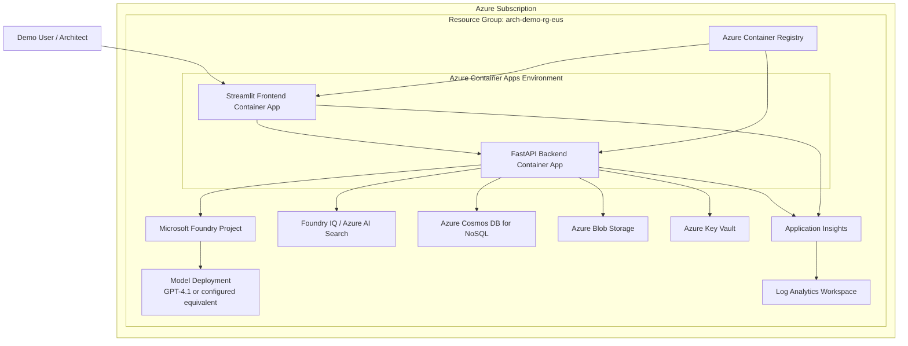

# 13 — Infrastructure and Deployment Specification

**Project:** Archimedes — AI Architecture Workbench  
**Component:** Infrastructure, Deployment, Operations, and Cost Baseline  
**Version:** v2.2  
**Status:** Implementation-ready draft  
**Primary audience:** Cloud architect, backend developer, platform engineer, demo owner  
**Related documents:**

- `01-archimedes-hld.md` — top-level architecture
- `03-pydantic-schemas.md` — schema definitions used by services
- `04-database-design.md` — Cosmos DB and Blob Storage design
- `05-api-contracts.md` — FastAPI contracts and frontend integration APIs
- `06-stage-pipeline.md` — 11-stage lifecycle and quality gates
- `07-agent-specifications.md` — agent/routine specifications
- `08-socrates-engine.md` — Socrates workflow design
- `09-tool-specifications.md` — deterministic tool specifications
- `10-foundry-iq-knowledge-base.md` — Foundry IQ setup and KB curation
- `11-evidence-and-claims.md` — evidence governance model
- `12-dependency-and-rereasoning.md` — selective re-run and diff design
- `14-frontend-specification.md` — Streamlit MVP frontend
- `15-demo-scenario.md` — fraud detection demo walkthrough

---

## 1. Purpose

This document defines the infrastructure and deployment design for the Archimedes v2.2 MVP.

The goal is to provide a practical Azure deployment model that supports:

1. A Streamlit frontend for the demo.
2. A FastAPI backend hosting the Orchestrator, agent routines, State Manager, and tool layer.
3. Microsoft Agent Framework based orchestration.
4. Foundry IQ grounded retrieval through Azure AI Search backed knowledge bases.
5. Azure OpenAI / Foundry model deployment for LLM calls.
6. Cosmos DB based state, artifacts, claims, evidence, changelog, and diff persistence.
7. Blob Storage for larger artifacts and knowledge source files.
8. Managed identity based access to Azure resources where feasible.
9. Application Insights based operational visibility.
10. A simple deployment path suitable for MVP and demo execution.

The first implementation should optimize for **clarity, reliability, and speed of setup**, not enterprise-grade network isolation. Production hardening is listed separately.

---

## 2. Deployment Principles

The infrastructure design follows these principles:

| Principle | Description |
|---|---|
| Azure-native first | Use Microsoft/Azure services wherever they directly support the solution goals. |
| Managed services preferred | Avoid managing VMs, databases, search clusters, or custom orchestration infrastructure for the MVP. |
| Identity over secrets | Use managed identity for Azure resource access wherever supported. |
| Deterministic persistence | All state mutations go through the backend State Manager; agents do not write directly to storage. |
| Demo reliability | Minimize moving pieces and avoid preview-only features for core workflow execution where possible. |
| Observable by default | All API calls, stage runs, LLM calls, tool calls, and state transitions should emit structured telemetry. |
| Cost-aware MVP | Use the smallest service tiers that still support Foundry IQ, Azure AI Search, and the demo workload. |
| Upgrade path | Keep enough structure to evolve later into production-grade RBAC, private networking, CI/CD, and multi-user governance. |

---

## 3. Environment Strategy

### 3.1 MVP environments

For the first version, create two logical environments:

| Environment | Purpose | Deployment style |
|---|---|---|
| `dev` | Local development, schema testing, agent prompt iteration | Local containers + Azure backing services |
| `demo` | Stable demo environment for walkthrough and video recording | Azure Container Apps + Azure managed services |

### 3.2 Deferred environments

For production-style evolution, add:

| Environment | Purpose |
|---|---|
| `test` | Automated integration testing, CI validation |
| `stage` | Pre-production validation and demo rehearsal |
| `prod` | Enterprise deployment, RBAC, private networking, governance |

### 3.3 Naming convention

Use predictable resource names:

```text
arch-{env}-{component}-{regionCode}
```

Examples:

```text
arch-demo-rg-eus
arch-demo-acaenv-eus
arch-demo-api-eus
arch-demo-ui-eus
arch-demo-cosmos-eus
arch-demo-storage-eus
arch-demo-search-eus
arch-demo-appi-eus
arch-demo-kv-eus
```

For globally unique resources, append a short suffix:

```text
archdemostorageeus{uniqueSuffix}
archdemocosmoseus{uniqueSuffix}
```

### 3.4 Recommended region

For MVP, deploy everything into a single Azure region where all required services are available.

Recommended default:

```text
Region: East US
Region code: eus
```

If the required model deployment or Foundry features are not available in the selected region, choose a region where the Foundry project, model deployment, Azure AI Search, and Azure Container Apps can be provisioned together.

---

## 4. High-Level Infrastructure View



---

## 5. Azure Resource Inventory

### 5.1 Required MVP resources

| Resource | Azure service | Purpose | MVP SKU / mode |
|---|---|---|---|
| Resource group | Azure Resource Manager | Logical grouping | Standard |
| Container runtime | Azure Container Apps | Host FastAPI backend and Streamlit UI | Consumption |
| Container registry | Azure Container Registry | Store API/UI images | Basic |
| Foundry project | Microsoft Foundry / Azure AI Foundry | Project, model access, agent integration | Project-level setup |
| Model deployment | Azure OpenAI / Foundry model deployment | LLM calls for agents and Socrates | GPT-4.1 or configured model |
| Search / Foundry IQ | Azure AI Search / Foundry IQ | Knowledge base and agentic retrieval | S1 for MVP if needed |
| Cosmos DB | Azure Cosmos DB for NoSQL | Sessions, artifacts, claims, evidence, changelog, diffs | Serverless or low RU provisioned |
| Storage account | Azure Blob Storage | Large artifacts and KB source files | Standard LRS |
| Key Vault | Azure Key Vault | Secret and config references | Standard |
| App monitoring | Application Insights | Traces, logs, metrics | Workspace-based |
| Log store | Log Analytics Workspace | Central telemetry storage | Pay-as-you-go |

### 5.2 Optional MVP resources

| Resource | Purpose | Recommendation |
|---|---|---|
| Azure Static Web Apps | Alternative frontend hosting if Streamlit is replaced with static UI | Defer for MVP |
| Azure Functions | Host deterministic tools separately | Defer; keep tools inside backend initially |
| Azure API Management | API gateway, rate limiting, auth policies | Defer unless external API exposure is needed |
| Azure Front Door | Global edge, WAF, production routing | Defer |
| Azure Private Endpoints | Private network isolation | Defer for MVP; add for production |
| Managed Grafana | Rich dashboarding | Defer; Application Insights is enough for MVP |

---

## 6. Component-to-Resource Mapping

| Archimedes component | Runtime / storage resource | Notes |
|---|---|---|
| Streamlit UI | Azure Container App `arch-demo-ui-eus` | Public ingress enabled for demo. |
| FastAPI backend | Azure Container App `arch-demo-api-eus` | Public or internal ingress depending on UI topology. |
| Orchestrator | FastAPI backend container | Uses Microsoft Agent Framework. |
| Specialist routines | FastAPI backend container | Prompt-based routines, not separate hosted agents. |
| Socrates Engine | FastAPI backend container | WorkflowBuilder fan-out/fan-in implementation. |
| Deterministic tools | FastAPI backend container | App-local Python functions for MVP. |
| Foundry IQ retrieval adapter | FastAPI backend container + Foundry IQ/Azure AI Search | Calls `knowledge_base_retrieve` through MCP integration. |
| Architecture State Manager | FastAPI backend container | Only component allowed to write state. |
| ArchitectureSession | Cosmos DB `sessions` container | Current session summary and stage status. |
| VersionedArtifact | Cosmos DB `artifacts` container + Blob | Stage outputs and large artifacts. |
| ClaimRecord | Cosmos DB `claims` container | Claims produced by agents/tools. |
| EvidenceSource | Cosmos DB `evidence` container | Retrieved/cited source records. |
| ChangeEvent | Cosmos DB `changelog` container | Append-only state mutation history. |
| Artifact diffs | Cosmos DB `diffs` container | Before/after diff records. |
| KB source files | Blob Storage | Curated Microsoft docs and internal standards. |
| Secrets/config | Key Vault + Container Apps secrets | Managed identity preferred. |
| Telemetry | Application Insights + Log Analytics | Trace stage runs, tools, retrieval, LLM calls. |

---

## 7. Resource Group Layout

For MVP, one resource group is enough:

```text
arch-demo-rg-eus
```

Inside it:

```text
arch-demo-rg-eus/
├── Container Apps Environment
├── Container Apps
│   ├── arch-demo-api-eus
│   └── arch-demo-ui-eus
├── Azure Container Registry
├── Foundry Project / Azure AI resources
├── Azure AI Search service
├── Azure Cosmos DB account
├── Storage account
├── Key Vault
├── Application Insights
└── Log Analytics Workspace
```

For production, split into separate resource groups:

```text
arch-prod-core-rg-eus
arch-prod-app-rg-eus
arch-prod-data-rg-eus
arch-prod-observability-rg-eus
```

The MVP should not overcomplicate this.

---

## 8. Container Apps Design

### 8.1 Container apps

| App | Image | Ingress | Scaling | Notes |
|---|---|---|---|---|
| `arch-demo-api-eus` | `archimedes-api:{tag}` | Public for MVP, internal later | min 1, max 3 | Hosts FastAPI, orchestration, tools |
| `arch-demo-ui-eus` | `archimedes-ui:{tag}` | Public | min 1, max 2 | Hosts Streamlit UI |

### 8.2 API scaling

Recommended MVP settings:

```yaml
min_replicas: 1
max_replicas: 3
cpu: 1.0
memory: 2Gi
```

Reasoning:

- Minimum one replica avoids cold-start issues during demo.
- Socrates standard mode may trigger multiple concurrent LLM calls.
- FastAPI should remain responsive while a stage is running.

### 8.3 UI scaling

Recommended MVP settings:

```yaml
min_replicas: 1
max_replicas: 2
cpu: 0.5
memory: 1Gi
```

### 8.4 Ingress model

MVP:

```text
User browser → Streamlit UI public URL → FastAPI API public URL
```

More secure later:

```text
User browser → Frontend public URL → Backend internal Container App
```

### 8.5 Managed identity

Enable system-assigned managed identity on the FastAPI backend Container App.

The backend identity needs access to:

| Target | Permission |
|---|---|
| Cosmos DB | Data contributor equivalent for NoSQL operations |
| Storage account | Blob Data Contributor |
| Key Vault | Key Vault Secrets User |
| Azure AI Search / Foundry IQ | Access required for retrieval/MCP path |
| Application Insights | Telemetry ingestion through connection string/config |

For the UI Container App, use minimal access. It should only need the backend URL and telemetry settings.

---

## 9. Container Image Design

### 9.1 Backend image

Recommended path:

```text
apps/api/Dockerfile
```

Responsibilities:

- Install Python runtime.
- Install FastAPI/Uvicorn.
- Install Microsoft Agent Framework and Azure SDK dependencies.
- Install Pydantic v2.
- Install Cosmos DB, Storage, identity, logging dependencies.
- Include deterministic tools.
- Start API server.

Example structure:

```dockerfile
FROM python:3.12-slim

WORKDIR /app

COPY apps/api/requirements.txt /app/requirements.txt
RUN pip install --no-cache-dir -r requirements.txt

COPY apps/api /app/apps/api
COPY packages /app/packages

ENV PYTHONPATH=/app

CMD ["uvicorn", "apps.api.main:app", "--host", "0.0.0.0", "--port", "8000"]
```

### 9.2 Frontend image

Recommended path:

```text
apps/ui/Dockerfile
```

Responsibilities:

- Install Streamlit.
- Load UI configuration from environment variables.
- Start Streamlit server.

Example structure:

```dockerfile
FROM python:3.12-slim

WORKDIR /app

COPY apps/ui/requirements.txt /app/requirements.txt
RUN pip install --no-cache-dir -r requirements.txt

COPY apps/ui /app/apps/ui

ENV PYTHONPATH=/app

CMD ["streamlit", "run", "apps/ui/app.py", "--server.port=8501", "--server.address=0.0.0.0"]
```

---

## 10. Configuration Model

### 10.1 Backend environment variables

| Variable | Required | Description |
|---|---:|---|
| `APP_ENV` | Yes | `local`, `dev`, `demo`, `prod` |
| `AZURE_TENANT_ID` | Local only | Used for local auth if needed |
| `AZURE_CLIENT_ID` | Local only | Used for local auth if needed |
| `FOUNDRY_PROJECT_ENDPOINT` | Yes | Foundry project endpoint |
| `FOUNDRY_MODEL_DEPLOYMENT` | Yes | Model deployment name |
| `FOUNDRY_IQ_MCP_ENDPOINT` | Yes | Knowledge base MCP endpoint |
| `FOUNDRY_IQ_CONNECTION_NAME` | Yes | Project connection name |
| `COSMOS_ENDPOINT` | Yes | Cosmos DB endpoint |
| `COSMOS_DATABASE_NAME` | Yes | Database name, e.g. `archimedes` |
| `STORAGE_ACCOUNT_URL` | Yes | Blob service URL |
| `ARTIFACT_CONTAINER_NAME` | Yes | Blob container for large artifacts |
| `KEY_VAULT_URL` | Recommended | Key Vault URL |
| `APPLICATIONINSIGHTS_CONNECTION_STRING` | Yes | App Insights telemetry |
| `LOG_LEVEL` | Yes | `INFO` for demo |
| `SOCRATES_DEFAULT_DEPTH` | Yes | `standard` for demo |
| `ENABLE_DEMO_MODE` | Optional | Enables seeded demo data and deterministic examples |
| `MAX_STAGE_RETRIES` | Yes | Recommended `2` for MVP |

### 10.2 Frontend environment variables

| Variable | Required | Description |
|---|---:|---|
| `API_BASE_URL` | Yes | FastAPI backend URL |
| `APP_ENV` | Yes | Environment label |
| `APPLICATIONINSIGHTS_CONNECTION_STRING` | Optional | Frontend telemetry |
| `ENABLE_DEMO_MODE` | Optional | Enables demo scenario shortcut |

### 10.3 Secrets

Secrets should be minimized. Prefer managed identity.

If secrets are unavoidable, store them in Key Vault and reference them from Container Apps secrets.

Potential secrets:

| Secret | Preferred handling |
|---|---|
| Foundry API key, if key-based auth is used | Key Vault secret |
| Search admin key, if needed during setup | Key Vault secret; not used at runtime if identity works |
| Cosmos key, if not using identity | Key Vault secret |
| Storage connection string, if not using identity | Key Vault secret |

---

## 11. Identity and RBAC

### 11.1 Managed identities

Create or enable these identities:

| Identity | Type | Used by |
|---|---|---|
| `arch-demo-api-mi` | System-assigned or user-assigned | FastAPI backend |
| `arch-demo-ui-mi` | Optional | Streamlit UI |
| `arch-demo-deploy-mi` | Optional | CI/CD deployment |

For MVP, system-assigned identities are simpler.

### 11.2 Backend RBAC assignments

Assign the backend identity:

| Resource | Role / permission intent |
|---|---|
| Cosmos DB account/database | Data read/write for session and artifact containers |
| Storage account/blob container | Read/write large artifacts and KB source files as needed |
| Key Vault | Read secrets |
| Azure AI Search / Foundry IQ | Query/retrieval access |
| Foundry project/model | Invoke model deployment and use project connection |

### 11.3 Human access

For MVP:

| User role | Access |
|---|---|
| Developer | Contributor to resource group, data access to Cosmos/Storage |
| Demo user | UI only |
| Reviewer | UI only |

For production:

- Use Microsoft Entra ID authentication for the frontend.
- Use application roles: `Architect`, `Reviewer`, `Admin`.
- Restrict direct data-plane access to platform operators.

---

## 12. Cosmos DB Deployment

### 12.1 Account

| Setting | MVP value |
|---|---|
| API | NoSQL |
| Capacity mode | Serverless for MVP, provisioned later if needed |
| Region | Same as app region |
| Backup | Periodic backup for MVP |
| Consistency | Session consistency |

### 12.2 Database

```text
Database: archimedes
```

### 12.3 Containers

| Container | Partition key | Purpose |
|---|---|---|
| `sessions` | `/session_id` | ArchitectureSession records |
| `artifacts` | `/session_id` | VersionedArtifact records |
| `claims` | `/session_id` | ClaimRecord records |
| `evidence` | `/session_id` | EvidenceSource records |
| `changelog` | `/session_id` | ChangeEvent records |
| `diffs` | `/session_id` | ArtifactDiff records |
| `stage_runs` | `/session_id` | Optional expanded StageExecution history |

### 12.4 Concurrency requirements

The backend State Manager must use:

- `base_version`
- `target_version`
- `stage_run_id`
- `idempotency_key`
- `patch_hash`
- Cosmos `_etag` checks where applicable

This is required for safe stage retries, selective re-runs, and concurrent UI interactions.

### 12.5 Transaction model

All related writes for a stage patch share the same partition key, `/session_id`.

This allows the implementation to use transactional behavior within the same logical partition when applying a patch and writing related records.

---

## 13. Blob Storage Design

### 13.1 Storage account

| Setting | MVP value |
|---|---|
| Redundancy | LRS |
| Access | Private by default |
| Hierarchical namespace | Not required for MVP |
| Public access | Disabled |

### 13.2 Containers

| Container | Purpose |
|---|---|
| `kb-source` | Curated source documents for Foundry IQ / Azure AI Search indexing |
| `artifacts-full` | Large generated artifacts, Mermaid files, exported reports |
| `demo-assets` | Optional demo seed data and screenshots |

### 13.3 Blob path conventions

```text
kb-source/{kb_version}/{source_group}/{document_name}.md
artifacts-full/{session_id}/{stage}/{version}/{artifact_name}
demo-assets/{scenario_id}/{asset_name}
```

Examples:

```text
kb-source/2026-06-09/azure-waf/reliability.md
artifacts-full/session-001/hld/2/container-diagram.mmd
artifacts-full/session-001/adr/2/adr-real-time-fraud.md
```

---

## 14. Foundry and Model Deployment

### 14.1 Foundry project

The Foundry project is used for:

- Model deployment.
- Agent/model access from the backend.
- Connection to Foundry IQ knowledge base.
- Future agent service experiments.

### 14.2 Model deployment

Recommended initial model:

```text
GPT-4.1 or available equivalent in selected region
```

The backend should not hardcode a model. It should use:

```text
FOUNDRY_MODEL_DEPLOYMENT
```

This keeps the deployment configurable.

### 14.3 Model usage by component

| Component | Model usage |
|---|---|
| Orchestrator | Stage control, user interaction, response synthesis |
| Requirements Engineer | Requirements extraction |
| Pattern Detector | Pattern confirmation/refinement |
| Options Generator | Architecture option generation |
| Socrates personas | Persona-specific analysis |
| Socrates synthesizer | Final debate brief |
| ADR Writer | ADR generation |
| HLD Designer | HLD narrative and Mermaid generation |
| WAF Reviewer | Mini WAF review |
| Evidence Auditor | Evidence quality evaluation |

### 14.4 Model cost controls

Use the following controls:

- Default Socrates depth: `standard`.
- Cap max tokens per stage.
- Summarize previous artifacts before sending to later stages.
- Store full artifacts in Cosmos/Blob; pass summaries to agents.
- Re-run only impacted stages after requirement changes.
- Avoid deep WAF/compliance generation in MVP.

---

## 15. Foundry IQ / Azure AI Search Deployment

### 15.1 Purpose

Foundry IQ provides grounded retrieval over curated architecture knowledge sources.

It should be used for:

- Azure service capabilities.
- Reference architectures.
- Azure Well-Architected Framework guidance.
- Cloud Adoption Framework and landing zone guidance.
- Azure security baseline material.
- Service limits and SLA references.

### 15.2 Search service

Recommended MVP:

```text
Azure AI Search: S1 or equivalent tier that supports required Foundry IQ features
```

The final tier should be validated against current Azure AI Search / Foundry IQ feature availability and pricing in the selected region.

### 15.3 Knowledge base source storage

Curated source documents should first be placed into Blob Storage:

```text
kb-source/{kb_version}/...
```

Then indexed into the Foundry IQ / Azure AI Search knowledge base.

### 15.4 MCP connection

The backend should treat Foundry IQ as an external retrieval tool.

Runtime contract:

```text
Input: retrieval query + retrieval context
Output: normalized EvidenceSource records + optional cited answer text
```

Only the retrieval adapter should know the Foundry IQ/MCP details. Agents and tools consume normalized evidence.

### 15.5 Preview/API caution

Some Foundry IQ / MCP integration APIs may be in preview. For MVP, isolate integration code behind an adapter so API changes do not affect the rest of the application.

Recommended package boundary:

```text
apps/api/integrations/foundry_iq/client.py
apps/api/integrations/foundry_iq/mapper.py
apps/api/integrations/foundry_iq/config.py
```

---

## 16. Application Insights and Observability

### 16.1 Required telemetry

The backend should emit structured telemetry for:

| Event | Description |
|---|---|
| `session.created` | New architecture session created |
| `stage.started` | Stage execution started |
| `stage.completed` | Stage execution completed |
| `stage.failed` | Stage failed |
| `quality_gate.evaluated` | Quality gate result produced |
| `state.patch_applied` | StagePatch successfully applied |
| `state.patch_rejected` | StagePatch rejected due to validation/gate/conflict |
| `llm.call.started` | LLM call started |
| `llm.call.completed` | LLM call completed |
| `tool.call.started` | Deterministic/external tool call started |
| `tool.call.completed` | Tool call completed |
| `foundry_iq.retrieve.started` | KB retrieval started |
| `foundry_iq.retrieve.completed` | KB retrieval completed |
| `evidence.audit.completed` | Evidence audit completed |
| `rereasoning.plan_created` | Dependency impact plan created |
| `artifact.diff_created` | Before/after diff created |

### 16.2 Required dimensions

Every event should include:

```text
session_id
stage
stage_run_id
active_version
request_id
correlation_id
user_id or demo_user
component
status
latency_ms
```

### 16.3 Metrics

Minimum useful metrics:

| Metric | Purpose |
|---|---|
| Stage duration by stage | Identify slow stages |
| LLM call count by stage | Cost control |
| Foundry IQ retrieval count | Grounding/cost analysis |
| Quality gate failure count | Debug pipeline quality |
| Patch rejection count | Detect state conflicts/schema issues |
| Evidence audit warnings | Track trust quality |
| Socrates latency | Demo performance |
| Requirement change re-run duration | Demo feature reliability |

### 16.4 Logs

Log all system events as structured JSON.

Do not log:

- API keys.
- Secrets.
- Raw access tokens.
- Full retrieved documents if they contain restricted content.
- Full user inputs in production unless permitted by policy.

For MVP, logs may contain demo prompts and generated artifacts, but this should be documented.

---

## 17. CI/CD Design

### 17.1 MVP deployment path

For MVP, use a simple scripted deployment:

```text
1. Build backend image
2. Build frontend image
3. Push images to ACR
4. Update Container Apps revisions
5. Run smoke test
```

### 17.2 Recommended repository structure

```text
archimedes/
├── apps/
│   ├── api/
│   │   ├── Dockerfile
│   │   ├── main.py
│   │   └── requirements.txt
│   └── ui/
│       ├── Dockerfile
│       ├── app.py
│       └── requirements.txt
├── packages/
│   ├── domain/
│   ├── schemas/
│   ├── tools/
│   ├── agents/
│   └── integrations/
├── infra/
│   ├── bicep/
│   ├── scripts/
│   └── env/
├── docs/
└── .github/
    └── workflows/
```

### 17.3 GitHub Actions workflow

Recommended workflows:

```text
ci.yml
  - lint
  - type check
  - unit tests
  - schema validation tests
  - build containers

deploy-demo.yml
  - login to Azure
  - build/push images
  - deploy Container Apps
  - run smoke tests
```

### 17.4 Deployment triggers

| Branch | Action |
|---|---|
| feature branch | Run CI only |
| `main` | Build images |
| manual dispatch | Deploy to demo |

For MVP, use manual deployment to avoid breaking a stable demo environment accidentally.

---

## 18. Infrastructure-as-Code Strategy

### 18.1 MVP approach

Use a combination of:

- Azure CLI for fast setup.
- Bicep for repeatable resources.
- Manual Foundry portal steps only where automation is not stable or preview APIs are difficult.

### 18.2 Recommended infra files

```text
infra/
├── bicep/
│   ├── main.bicep
│   ├── container-apps.bicep
│   ├── cosmos.bicep
│   ├── storage.bicep
│   ├── keyvault.bicep
│   ├── monitoring.bicep
│   └── search.bicep
├── env/
│   ├── demo.parameters.json
│   └── dev.parameters.json
└── scripts/
    ├── 00-login.sh
    ├── 01-create-resource-group.sh
    ├── 02-deploy-core.sh
    ├── 03-build-and-push-images.sh
    ├── 04-deploy-container-apps.sh
    ├── 05-seed-cosmos-containers.sh
    ├── 06-upload-kb-sources.sh
    ├── 07-configure-foundry-iq.md
    └── 08-smoke-test.sh
```

### 18.3 Manual steps to document clearly

The following may require portal/manual setup for MVP:

1. Create or validate Foundry project.
2. Deploy selected model.
3. Create/configure Foundry IQ knowledge base.
4. Create MCP/project connection if automation is not stable.
5. Validate retrieval using test queries.

Document manual steps precisely in `10-foundry-iq-knowledge-base.md` and reference them from deployment instructions.

---

## 19. Provisioning Sequence

Recommended provisioning order:

```text
1. Create resource group
2. Create Log Analytics Workspace
3. Create Application Insights
4. Create Storage Account and Blob containers
5. Create Cosmos DB account, database, and containers
6. Create Key Vault
7. Create Azure Container Registry
8. Create Azure Container Apps Environment
9. Create backend Container App with managed identity
10. Create frontend Container App
11. Assign RBAC permissions to backend managed identity
12. Create or configure Foundry project
13. Deploy model
14. Create Azure AI Search / Foundry IQ knowledge base
15. Upload curated KB source files
16. Configure MCP/project connection
17. Set backend environment variables and secrets
18. Build and push images
19. Deploy Container App revisions
20. Run smoke tests
21. Run demo scenario validation
```

---

## 20. Smoke Tests

### 20.1 Infrastructure smoke tests

| Test | Expected result |
|---|---|
| Backend health endpoint | Returns `healthy` |
| Frontend loads | Streamlit UI accessible |
| Cosmos write/read | Test session can be created and read |
| Blob write/read | Test artifact can be uploaded and read |
| Model call | Simple completion succeeds |
| Foundry IQ retrieval | Test query returns at least one evidence source |
| App Insights event | Test telemetry appears |

### 20.2 Application smoke tests

| Test | Expected result |
|---|---|
| Create session | `ArchitectureSession` created |
| Run intake | Stage completes |
| Run requirements | Quality gate result generated |
| Run pattern detection | Primary pattern detected |
| Run options | At least two options generated |
| Run Socrates standard | Persona findings + synthesis generated |
| Run evidence audit | Audit result generated |
| Run HLD | Mermaid artifact generated |
| Run requirement change | Impact plan generated |
| Generate diff | Before/after diff record created |

---

## 21. Cost Baseline

### 21.1 MVP cost assumptions

Assumptions:

```text
Environment: demo
Region: East US or equivalent
Runtime: Container Apps consumption with min replicas enabled
Cosmos DB: serverless or low RU configuration
Storage: Standard LRS
Search: S1 or required tier for Foundry IQ features
Usage: light demo usage, not production traffic
Socrates depth: standard
```

### 21.2 Cost drivers

| Cost driver | Sensitivity | Notes |
|---|---|---|
| Azure AI Search / Foundry IQ | High | Likely largest fixed cost if S1 is required. |
| Model tokens | Medium to high | Socrates can multiply LLM calls. |
| Container Apps | Low to medium | Min replicas add baseline cost. |
| Cosmos DB | Low for MVP | Serverless should be low under demo workload. |
| Storage | Low | KB and artifact files are small. |
| App Insights | Low to medium | Depends on logging verbosity. |

### 21.3 Cost control actions

1. Use `standard` Socrates depth by default; reserve `deep` for special demos.
2. Keep context summaries compact.
3. Re-run only impacted stages after changes.
4. Limit evidence retrieval calls per stage.
5. Disable verbose debug logging outside active testing.
6. Keep only required KB sources in the MVP index.
7. Stop or scale down demo environment if not in use, where supported.

### 21.4 Approximate MVP monthly cost range

This is an assumption-first estimate. Validate actual pricing in the Azure portal before provisioning.

| Resource group | Estimated monthly cost |
|---|---:|
| Azure AI Search / Foundry IQ | Medium/high fixed baseline |
| Model usage | Variable, based on tokens |
| Container Apps | Low/medium |
| Cosmos DB | Low |
| Storage | Very low |
| Monitoring | Low/medium |

For the MVP, the cost estimate should be presented as a **range**, not an exact figure.

---

## 22. Security Design

### 22.1 MVP security

| Area | MVP approach |
|---|---|
| Authentication | Optional simple access protection; full Entra auth deferred |
| Secrets | Key Vault + Container Apps secrets |
| Azure resource access | Managed identity where possible |
| Storage public access | Disabled |
| Backend ingress | Public for MVP; restrict later |
| Logging | Avoid secrets and tokens |
| CORS | Restrict to frontend URL |
| HTTPS | Container Apps managed HTTPS |

### 22.2 Production hardening backlog

For production:

1. Add Microsoft Entra ID authentication.
2. Introduce application roles.
3. Use private endpoints for Cosmos DB, Storage, Key Vault, and Search.
4. Run backend with internal ingress only.
5. Add API Management or Front Door if external API exposure is needed.
6. Add Key Vault rotation policy.
7. Add network egress controls.
8. Add private DNS zones.
9. Add Defender for Cloud recommendations.
10. Add data retention and purge workflows.

---

## 23. Local Development Setup

### 23.1 Local services

For local development, use:

```text
Local FastAPI backend
Local Streamlit frontend
Azure Cosmos DB / or Cosmos emulator where practical
Azure Storage / Azurite for limited blob testing
Remote Foundry project and model deployment
Remote Foundry IQ / Azure AI Search
```

Foundry/model/search should remain remote because they are not easy to emulate locally.

### 23.2 Local environment file

Example `.env.local`:

```env
APP_ENV=local
API_BASE_URL=http://localhost:8000
FOUNDRY_PROJECT_ENDPOINT=https://...
FOUNDRY_MODEL_DEPLOYMENT=gpt-4.1
FOUNDRY_IQ_MCP_ENDPOINT=https://...
COSMOS_ENDPOINT=https://...
COSMOS_DATABASE_NAME=archimedes
STORAGE_ACCOUNT_URL=https://...
ARTIFACT_CONTAINER_NAME=artifacts-full
APPLICATIONINSIGHTS_CONNECTION_STRING=...
SOCRATES_DEFAULT_DEPTH=standard
ENABLE_DEMO_MODE=true
MAX_STAGE_RETRIES=2
```

### 23.3 Local commands

```bash
# Backend
cd apps/api
uvicorn main:app --reload --port 8000

# Frontend
cd apps/ui
streamlit run app.py
```

---

## 24. Deployment Runbook

### 24.1 First deployment

```text
1. Confirm Azure subscription and region.
2. Create resource group.
3. Deploy core infrastructure.
4. Create Foundry project and model deployment.
5. Configure Foundry IQ knowledge base.
6. Upload curated KB sources.
7. Run Foundry IQ retrieval tests.
8. Build backend and frontend container images.
9. Push images to ACR.
10. Deploy Container Apps.
11. Configure environment variables and secrets.
12. Assign RBAC permissions.
13. Run infrastructure smoke tests.
14. Run application smoke tests.
15. Execute full demo scenario.
```

### 24.2 New application release

```text
1. Run CI tests.
2. Build backend/frontend images with version tag.
3. Push to ACR.
4. Deploy new Container App revisions.
5. Run smoke tests.
6. Validate stage pipeline with a short prompt.
7. Promote revision to active if healthy.
8. Roll back if smoke tests fail.
```

### 24.3 Rollback

Container Apps revisions should be used for rollback.

Rollback process:

```text
1. Identify last known good revision.
2. Shift traffic back to previous revision.
3. Confirm health endpoint.
4. Run short session creation test.
5. Record ChangeEvent if rollback affects demo state.
```

---

## 25. Backup, Retention, and Cleanup

### 25.1 MVP retention

| Data | Retention |
|---|---|
| Sessions | Keep until manual cleanup |
| Artifacts | Keep until manual cleanup |
| Claims/evidence | Keep with session |
| Changelog | Keep with session |
| Logs | 30 days for MVP |
| KB source files | Keep by version |

### 25.2 Cleanup scripts

Add scripts later:

```text
scripts/cleanup-demo-sessions.py
scripts/purge-old-artifacts.py
scripts/export-session.py
```

For MVP, manual cleanup is acceptable.

---

## 26. Reliability Considerations

### 26.1 MVP reliability

| Risk | Mitigation |
|---|---|
| LLM call failure | Retry with bounded retry count |
| Foundry IQ retrieval failure | Return warning and continue if stage permits |
| State conflict | Reject patch and re-run from current version |
| Mermaid render failure | Retry diagram generation or show raw Mermaid |
| Long-running Socrates | Emit progress events to frontend |
| Demo environment cold start | Set min replica to 1 |

### 26.2 Stage failure recovery

Each stage run should persist:

```text
stage_run_id
status
started_at
completed_at
retry_count
failure_reason
last_successful_stage
```

This supports pause/resume and demo recovery.

---

## 27. Production Evolution Path

The MVP architecture can evolve into a production-grade architecture as follows:

| Capability | MVP | Production evolution |
|---|---|---|
| Runtime | Container Apps | Container Apps with internal ingress and private networking |
| Auth | Optional/simple | Microsoft Entra ID auth and roles |
| State | Cosmos serverless | Provisioned throughput, backup/restore, alerts |
| Search | S1/demo KB | Curated enterprise KB with access control |
| Secrets | Key Vault | Rotation, policies, private endpoint |
| Observability | App Insights | Dashboards, alerts, SLOs, tracing correlation |
| CI/CD | Manual dispatch | Environment promotion and approvals |
| Networking | Public endpoints | Private endpoints, Front Door/APIM as needed |
| Governance | Manual | RBAC, audit exports, retention policies |

---

## 28. MVP Acceptance Criteria

Infrastructure is ready when:

1. Backend and frontend are deployed and reachable.
2. Backend can invoke the configured model deployment.
3. Backend can query Foundry IQ / Azure AI Search and normalize evidence.
4. Backend can write/read Cosmos DB session, artifact, claim, evidence, changelog, and diff records.
5. Backend can write/read Blob artifacts.
6. StagePatch application supports idempotency and version conflict handling.
7. Application Insights receives structured telemetry.
8. Streamlit UI can run the full demo scenario.
9. Requirement change triggers selective re-run and before/after diff.
10. Demo can be reset or replayed reliably.

---

## 29. Open Questions

| Question | Decision needed |
|---|---|
| Which exact Foundry model deployment will be available in the selected region? | Confirm before coding model client config. |
| Will Foundry IQ MCP setup be fully automated or partially manual for MVP? | Decide after first setup attempt. |
| Will backend ingress be public for demo? | Public is simpler; internal is safer. |
| Will Streamlit and FastAPI be deployed as separate Container Apps or combined? | Separate is cleaner; combined is cheaper/simpler. |
| Will Azure AI Search S1 be required, or can lower/usage-based tier support MVP? | Validate with current Foundry IQ feature requirements. |
| Will Entra authentication be included in MVP? | Recommended to defer unless contest/demo requires it. |

---

## 30. Implementation Checklist

### 30.1 Infra checklist

- [ ] Create resource group.
- [ ] Create Log Analytics Workspace.
- [ ] Create Application Insights.
- [ ] Create Storage Account and containers.
- [ ] Create Cosmos DB account/database/containers.
- [ ] Create Key Vault.
- [ ] Create ACR.
- [ ] Create Container Apps Environment.
- [ ] Create backend Container App.
- [ ] Create frontend Container App.
- [ ] Enable backend managed identity.
- [ ] Assign RBAC permissions.
- [ ] Create/configure Foundry project.
- [ ] Deploy model.
- [ ] Create/configure Foundry IQ KB.
- [ ] Upload KB source files.
- [ ] Configure MCP/project connection.
- [ ] Configure environment variables and secrets.
- [ ] Deploy backend/frontend images.
- [ ] Run smoke tests.

### 30.2 App checklist

- [ ] Backend health endpoint works.
- [ ] Frontend can reach backend.
- [ ] Cosmos repository works.
- [ ] Blob artifact repository works.
- [ ] Foundry model client works.
- [ ] Foundry IQ retrieval adapter works.
- [ ] Application Insights telemetry works.
- [ ] Demo scenario runs end-to-end.

---

## 31. Summary

The MVP infrastructure should be deliberately simple:

```text
Streamlit UI + FastAPI backend on Azure Container Apps
+ Foundry model deployment
+ Foundry IQ / Azure AI Search KB
+ Cosmos DB state store
+ Blob Storage artifact store
+ Key Vault for secrets
+ Application Insights for telemetry
```

The backend remains the control plane. It owns orchestration, state mutation, tool calls, evidence normalization, and selective re-reasoning. Foundry IQ is used as a grounded retrieval capability, not as a place for custom business logic. Cosmos DB is the system of record for session state and versioned outputs. Blob Storage holds larger artifacts and KB source documents. Container Apps provides a lightweight deployment runtime suitable for MVP and demo use.

This design is intentionally modest but extensible. It supports the first demo while leaving a clear path toward production-grade identity, network isolation, CI/CD, governance, and enterprise knowledge integration.
