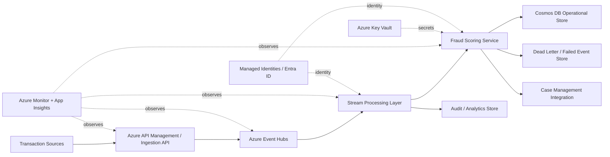
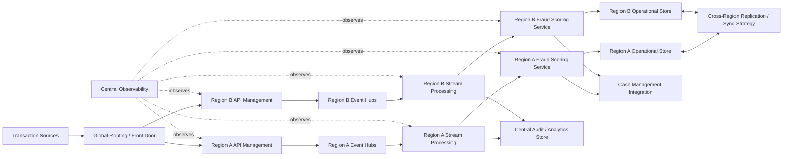

# Archimedes Demo Scenario

**Document ID:** `15-demo-scenario.md`  
**Solution:** Archimedes — AI Architecture Workbench  
**Version:** v2.2  
**Status:** Implementation-ready demo runbook  
**Last updated:** 2026-06-09  
**Related documents:** `01-archimedes-hld.md`, `05-api-contracts.md`, `06-stage-pipeline.md`, `07-agent-specifications.md`, `08-socrates-engine.md`, `11-evidence-and-claims.md`, `12-dependency-and-rereasoning.md`, `14-frontend-specification.md`

---

## 1. Purpose

This document defines the primary MVP demo scenario for Archimedes.

The demo should prove that Archimedes is not a generic architecture chatbot. It is an AI architecture workbench that:

- Converts a raw business need into structured requirements.
- Detects the architecture pattern.
- Generates multiple architecture options.
- Stress-tests decisions through Socrates adversarial reasoning.
- Produces architecture artifacts such as ADR, HLD, Mermaid diagram, and mini WAF review.
- Separates facts, assumptions, and recommendations.
- Uses evidence-backed reasoning through Foundry IQ.
- Reacts intelligently to requirement changes.
- Selectively regenerates impacted artifacts and shows before/after diffs.

The demo is designed around one strong narrative:

> A fintech company needs a real-time fraud detection platform on Azure. Archimedes helps the architect move from raw business need to evidence-backed architecture package. Then the business changes the scale and resiliency requirement, and Archimedes identifies the impacted stages, re-runs only those, and shows what changed.

---

## 2. Demo Goals

The demo must show five things clearly.

### 2.1 Structured architecture lifecycle

The user should see Archimedes progressing through visible lifecycle stages:

1. Intake
2. Requirements extraction
3. Pattern detection
4. Options generation
5. Socratic review
6. Evidence audit checkpoint
7. ADR generation
8. HLD generation
9. Mini WAF review
10. Final evidence audit
11. Requirement-change impact and re-reasoning

### 2.2 Socrates as the decision-quality differentiator

The Socrates stage should be the first major wow moment.

It should show multiple personas reviewing the options:

- Devil's Advocate
- SRE / Operations Lead
- Security Architect
- FinOps Lead
- Delivery Lead
- Synthesizer

The output should include:

- Blind spots
- Pre-mortem
- Key assumptions
- Ranked recommendation
- Confidence score
- Suggested mitigations

### 2.3 Evidence-backed reasoning

The demo should show that recommendations are not just generated text.

The UI should expose:

- Claims
- Evidence sources
- Source trust level
- Source freshness
- Unsupported claims, if any
- Assumptions requiring validation

### 2.4 Professional architecture artifacts

The demo should generate at least:

- Requirements summary
- Pattern detection result
- Options matrix
- Socrates decision brief
- ADR
- HLD narrative
- Mermaid architecture diagram
- Mini WAF review
- Evidence audit report

### 2.5 Requirement-change re-reasoning

The second major wow moment is the requirement change.

The user changes:

```text
From: 10K transactions per second, 99.95% availability, single-region acceptable
To:   100K transactions per second, active-active multi-region required
```

Archimedes should then:

- Detect the changed requirements.
- Classify the changes as scale, performance, availability, and region/resiliency changes.
- Identify impacted and stable stages.
- Re-run only impacted stages.
- Generate new artifact versions.
- Show a before/after diff.

---

## 3. Demo Audience

The scenario is suitable for:

- Architecture review board members
- Cloud COE / platform engineering leaders
- Enterprise architects
- CTO office stakeholders
- Hackathon judges
- Microsoft/Azure solution reviewers
- Hiring/interview portfolio reviewers

The demo should be understandable to both technical and architecture leadership audiences.

---

## 4. Demo Mode

The MVP should support two execution modes.

### 4.1 Live mode

Live mode runs the full pipeline using:

- Microsoft Agent Framework orchestration
- Foundry model deployment
- Foundry IQ knowledge retrieval
- Function tools
- Cosmos DB persistence
- Streamlit UI

This is the preferred demo mode if all services are healthy.

### 4.2 Safe demo mode

Safe demo mode uses pre-seeded or cached stage outputs.

This mode should still preserve the illusion of stage progression, but it should not depend on every model/tool call completing live during recording.

Safe demo mode is useful when:

- Foundry IQ retrieval is slow.
- Model responses vary too much.
- A tool call fails.
- Internet/service conditions are unpredictable.
- Demo recording time is limited.

The frontend should expose a developer-only toggle:

```text
Demo Mode: Live | Cached | Hybrid
```

For hackathon or portfolio recording, use **Hybrid** mode:

- Live intake, requirements, pattern detection, and options generation if stable.
- Cached Socrates outputs if latency is high.
- Cached before/after diff if re-reasoning is inconsistent.

---

## 5. Primary Demo Scenario

### 5.1 Scenario title

```text
Real-Time Fraud Detection Architecture for Fintech
```

### 5.2 Initial user input

Use this exact prompt for the demo:

```text
Design a real-time fraud detection platform on Azure for a fintech company processing 10K transactions per second. The platform must support PCI-DSS constraints, 99.95% availability, low-latency fraud scoring, and integration with downstream case management systems.
```

### 5.3 Requirement-change input

Use this exact prompt after the initial architecture package is generated:

```text
Actually, the peak load can go up to 100K transactions per second, and the business now wants active-active multi-region resilience. Update the architecture accordingly.
```

---

## 6. Expected User Journey

### 6.1 User journey summary

```text
User enters raw business need
    ↓
Archimedes extracts requirements
    ↓
Archimedes detects real-time streaming / event-driven fraud detection pattern
    ↓
Archimedes generates architecture options
    ↓
Socrates stress-tests the options
    ↓
Archimedes audits evidence
    ↓
Archimedes generates ADR, HLD, and mini WAF review
    ↓
User changes scale/resiliency requirement
    ↓
Archimedes identifies impacted stages
    ↓
Archimedes selectively re-runs impacted stages
    ↓
UI shows before/after architecture diff
```

### 6.2 Stage timeline behavior

The stage timeline should show:

```text
✅ Intake
✅ Requirements
✅ Pattern Detection
✅ Options
✅ Socrates Review
✅ Evidence Audit Checkpoint
✅ ADR
✅ HLD
✅ Mini WAF Review
✅ Final Evidence Audit
🔄 Requirement Change / Re-Reasoning
```

During re-reasoning, the timeline should show version changes:

```text
Options: v1 → v2
Socrates Review: v1 → v2
ADR: v1 → v2
HLD: v1 → v2
Mini WAF Review: v1 → v2
Final Evidence Audit: v1 → v2
```

---

## 7. Stage-by-Stage Expected Outputs

This section defines the expected output shape for each demo stage.

The exact wording can vary, but the substance should remain stable.

---

## 8. Stage 1 — Intake

### 8.1 Input

```text
Design a real-time fraud detection platform on Azure for a fintech company processing 10K transactions per second. The platform must support PCI-DSS constraints, 99.95% availability, low-latency fraud scoring, and integration with downstream case management systems.
```

### 8.2 Expected behavior

The Intake stage should:

- Create a new `ArchitectureSession`.
- Store the raw business need.
- Identify the domain as fintech.
- Identify the solution type as fraud detection / real-time decisioning.
- Initialize stage execution records.
- Initialize active version as `1`.

### 8.3 Expected UI output

```text
Session created: Real-Time Fraud Detection Architecture
Domain: Fintech
Primary concern: Real-time fraud scoring
Cloud preference: Azure
Current stage: Requirements Extraction
```

### 8.4 Expected quality gate

The Intake stage should pass if:

- A business need is present.
- A target domain is inferred or provided.
- The next stage can operate on the input.

---

## 9. Stage 2 — Requirements Extraction

### 9.1 Expected extracted requirements

The Requirements Engineer should produce structured requirements.

#### Functional requirements

```text
FR-001: Ingest transaction events in real time.
FR-002: Score transactions for fraud risk with low latency.
FR-003: Route suspicious transactions to downstream case management.
FR-004: Store transaction and scoring events for audit and investigation.
FR-005: Support operational monitoring and alerting.
```

#### Non-functional requirements

```text
NFR-001: Support 10K transactions per second.
NFR-002: Meet low-latency fraud scoring needs.
NFR-003: Provide 99.95% availability.
NFR-004: Support PCI-DSS aligned controls.
NFR-005: Support secure integration with downstream systems.
```

#### Constraints

```text
CON-001: Use Microsoft Azure services.
CON-002: Architecture must support regulated fintech workloads.
CON-003: Solution must preserve auditability of fraud decisions.
```

#### Assumptions

```text
ASM-001: Exact p99 latency target is not specified; assume sub-second scoring is desired.
ASM-002: Current downstream case management system exposes APIs or event integration.
ASM-003: Fraud model is already available or will be exposed as a scoring endpoint.
ASM-004: PCI-DSS scope must be minimized through tokenization and segmentation.
```

#### Open questions

```text
OQ-001: What is the exact p99 latency target?
OQ-002: Is active-active multi-region required?
OQ-003: Is the fraud model real-time only or also batch-trained?
OQ-004: Are raw cardholder data fields processed directly or tokenized upstream?
OQ-005: What case management system is used?
```

### 9.2 Expected quality gate

Expected status:

```text
passed_with_warnings
```

Expected warnings:

```text
Latency SLA is not explicitly defined.
Data residency requirements are not specified.
Exact fraud model hosting approach is not specified.
```

Expected blocking failures:

```text
None
```

### 9.3 Demo talking point

Say:

> Notice that Archimedes does not just jump to an architecture. It first converts the raw ask into requirements, assumptions, and open questions, then marks unresolved items as warnings instead of pretending they are known.

---

## 10. Stage 3 — Pattern Detection

### 10.1 Expected detected patterns

Primary pattern:

```text
real_time_streaming
```

Secondary patterns:

```text
event_driven_integration
transactional_system
analytics_audit_pipeline
```

### 10.2 Expected pattern explanation

```text
The dominant pattern is real-time streaming because the solution must ingest and score high-volume transaction events continuously with low latency. Event-driven integration applies because suspicious transactions must trigger downstream case-management workflows. A transactional/audit subsystem is also required to persist scoring decisions and investigation context.
```

### 10.3 Expected pattern-specific NFRs

```text
Ordering guarantees for transaction events.
Replay capability for audit and incident investigation.
Backpressure handling during bursts.
Idempotent processing of transaction events.
Exactly-once or effectively-once processing semantics where required.
Fraud scoring latency target.
Dead-letter handling for malformed or failed events.
```

### 10.4 Expected services to explore

```text
Azure Event Hubs
Azure Stream Analytics
Azure Functions
Azure Container Apps
Azure Kubernetes Service
Azure Cosmos DB
Azure SQL Database
Azure Cache for Redis
Azure API Management
Azure Monitor / Application Insights
Microsoft Defender for Cloud
Azure Key Vault
```

### 10.5 Expected quality gate

Expected status:

```text
passed
```

---

## 11. Stage 4 — Options Generation

### 11.1 Expected options

The Options Generator should produce at least three options.

---

### Option A — Managed Azure Streaming Platform

```text
Azure Event Hubs + Azure Stream Analytics + Azure Functions / Container Apps + Cosmos DB
```

#### Summary

A managed Azure-native streaming architecture optimized for fast MVP delivery and lower operational burden.

#### Likely components

```text
- Azure Event Hubs for transaction ingestion
- Azure Stream Analytics for stream processing and enrichment
- Azure Functions or Azure Container Apps for fraud scoring and routing
- Azure Cosmos DB for low-latency operational state and audit events
- Azure SQL Database or Data Lake for reporting/audit history
- Azure API Management for downstream API exposure
- Azure Monitor / Application Insights for observability
- Key Vault and managed identities for secrets and identity
```

#### Strengths

```text
Lower operational burden.
Faster implementation.
Good Azure-native integration.
Suitable for MVP and moderate scale.
```

#### Weaknesses

```text
May need careful validation for 10K TPS and latency targets.
Less portable across clouds.
Complex event processing may outgrow managed stream processing patterns.
```

#### Recommended status

```text
recommended_for_initial_10k_tps_scenario
```

---

### Option B — Containerized Stream Processing Platform

```text
Event Hubs or Kafka-compatible ingestion + AKS / Container Apps + Flink/Spark-style processing + dedicated fraud scoring service
```

#### Summary

A more flexible, engineering-heavy architecture for complex real-time processing and higher future scale.

#### Likely components

```text
- Event Hubs or Kafka-compatible broker
- AKS or Container Apps for custom stream processors
- Custom fraud scoring service
- Cosmos DB / Redis for state lookup
- Data Lake / Fabric / Synapse for downstream analytics
- API Management and Event Grid for integration
```

#### Strengths

```text
More control over processing logic.
Better fit for complex enrichment and future 100K TPS workloads.
More portable if using open-source processing components.
```

#### Weaknesses

```text
Higher operational burden.
Requires stronger platform/SRE skills.
Longer delivery timeline.
More complex incident management.
```

#### Recommended status

```text
strong_candidate_for_future_scale
```

---

### Option C — Serverless API-Centric Processing

```text
API Management + Functions + Cosmos DB + Event Grid
```

#### Summary

A simple event/API-driven design that may work for lower-volume workloads but is risky for sustained high-throughput low-latency fraud scoring.

#### Strengths

```text
Simple to build.
Low initial cost.
Good for prototypes and lower-volume event handling.
```

#### Weaknesses

```text
Risky for sustained 10K TPS.
Potential latency variability.
Scaling behavior must be validated carefully.
May not be ideal as the core transaction scoring path.
```

#### Recommended status

```text
rejected_for_core_scoring_path
```

---

### 11.2 Expected options matrix

| Option | Cost | Complexity | Scalability | Time to Market | Operational Burden | Initial Recommendation |
|---|---:|---:|---:|---:|---:|---|
| Option A: Managed Azure Streaming | Medium | Low-Medium | Medium-High | High | Low-Medium | Recommended for v1 |
| Option B: Containerized Stream Processing | Medium-High | High | High | Medium-Low | High | Future-scale option |
| Option C: Serverless API-Centric | Low | Low | Medium-Low | High | Low | Reject for core scoring |

### 11.3 Expected quality gate

Expected status:

```text
passed
```

Expected checks:

```text
At least 2 viable options generated: yes
At least 1 rejected option generated: yes
Trade-offs scored: yes
Evidence-linked service claims: yes
```

---

## 12. Stage 5 — Socrates Review

### 12.1 Socrates mode

Use:

```text
standard
```

Standard mode personas:

```text
Devil's Advocate
SRE / Operations Lead
Security Architect
FinOps Lead
Delivery Lead
Synthesizer
```

### 12.2 Expected persona outputs

#### Devil's Advocate

Expected findings:

```text
- Option A may appear simple, but the latency and throughput assumptions need load validation.
- Option C should not be used as the core scoring path because sustained high-volume workloads can expose scaling and latency risks.
- Vendor lock-in risk exists if the design deeply couples to Azure-native stream processing semantics.
```

#### SRE / Operations Lead

Expected findings:

```text
- Option B introduces more operational complexity and requires stronger SRE maturity.
- Option A is easier to monitor and operate for v1, but must include replay, dead-letter handling, and backpressure controls.
- The architecture must define RTO/RPO, alerting, dashboards, and incident runbooks.
```

#### Security Architect

Expected findings:

```text
- PCI-DSS scope must be controlled through network segmentation, tokenization, encryption, RBAC, Key Vault, and audit logging.
- Managed identities should be preferred over stored secrets.
- Data retention and access controls for fraud/audit data must be explicit.
```

#### FinOps Lead

Expected findings:

```text
- Option A has lower operational cost but may incur premium service costs as throughput scales.
- Option B may have higher baseline costs and skilled-operations cost.
- Cost model must include ingestion volume, retention, cross-region traffic, monitoring, and premium features.
```

#### Delivery Lead

Expected findings:

```text
- Option A is most feasible for a short delivery timeline.
- Option B requires more platform engineering and testing.
- Option C can be used for peripheral workflows but should not be selected for the critical scoring path.
```

### 12.3 Expected synthesizer output

```text
Recommended option: Option A for v1, with explicit performance validation and an evolution path toward Option B if scale or processing complexity increases.

Confidence: 0.78

Reasoning: Option A provides the best balance of delivery speed, operational simplicity, Azure-native integration, and sufficient scalability for the stated 10K TPS target, assuming load testing confirms latency requirements.

Blind spots:
- Exact p99 scoring latency is undefined.
- Active-active multi-region requirement is not confirmed.
- Fraud model hosting approach is not specified.
- PCI-DSS data scope is not fully clarified.
- Replay and exactly/effectively-once processing semantics need definition.

Pre-mortem:
- Peak traffic exceeds initial sizing.
- Fraud scoring service becomes the bottleneck.
- Downstream case management API throttles alerts.
- Operational team lacks clear replay and incident procedures.
- Cross-region or DR requirements appear late and force redesign.
```

### 12.4 Expected quality gate

Expected status:

```text
passed
```

Expected checks:

```text
At least 4 personas responded: yes
Blind spots generated: yes
Pre-mortem generated: yes
Confidence score assigned: yes
```

### 12.5 Demo talking point

Say:

> This is the Socrates moment. Instead of directly accepting the first architecture, Archimedes forces a structured adversarial review across SRE, security, cost, delivery, and failure-mode perspectives.

---

## 13. Stage 6 — Evidence Audit Checkpoint

### 13.1 Purpose

This checkpoint validates whether the options and Socrates review are grounded enough before producing formal architecture artifacts.

### 13.2 Expected output

```text
Evidence audit status: adequate

Facts cited: 12
Recommendations with supporting evidence: 5
Assumptions requiring validation: 4
Unsupported claims: 0 critical, 2 minor
Low-trust sources: 0
Stale citations: 0
Contradictions: 0

Recommendation: proceed, but keep latency target and data residency as open assumptions.
```

### 13.3 Expected assumptions requiring validation

```text
- Exact p99 fraud scoring latency target.
- Whether cardholder data is tokenized before ingestion.
- Whether active-active multi-region is required.
- Fraud model hosting and update approach.
```

### 13.4 Expected quality behavior

The pipeline may proceed with warnings because assumptions are visible and non-blocking for an initial architecture draft.

---

## 14. Stage 7 — ADR Generation

### 14.1 Expected ADR title

```text
ADR-001: Select Managed Azure Streaming Architecture for Initial Fraud Detection Platform
```

### 14.2 Expected ADR structure

The ADR should include:

```text
Status: Proposed
Context
Decision
Options considered
Decision drivers
Consequences
Assumptions
Risks and mitigations
Evidence summary
```

### 14.3 Expected decision

```text
Select Option A — Managed Azure Streaming Platform — for the initial 10K TPS fraud detection architecture, using Azure Event Hubs for ingestion, managed stream processing / containerized scoring services for fraud evaluation, Cosmos DB for operational state and audit access, and Azure Monitor/Application Insights for observability.
```

### 14.4 Expected rejected alternatives

```text
Option B is not rejected permanently; it is deferred as a future-scale option.
Option C is rejected for the core fraud scoring path because it is less suitable for sustained high-throughput low-latency processing.
```

### 14.5 Expected consequences

```text
Positive:
- Faster MVP delivery.
- Lower operational burden.
- Azure-native security and monitoring integration.

Negative:
- Some Azure service lock-in.
- Requires load testing to validate latency and throughput.
- May need redesign if active-active multi-region or 100K TPS becomes mandatory.
```

---

## 15. Stage 8 — HLD and Mermaid Diagrams

### 15.1 Expected HLD sections

The HLD should include:

```text
- Context
- Requirements summary
- Architecture overview
- Component responsibilities
- Data flow
- Security boundaries
- Operational considerations
- Observability
- Open assumptions
```

### 15.2 Expected initial architecture diagram

The generated Mermaid diagram should be similar to this shape.



### 15.3 Expected HLD quality gate

Expected status:

```text
passed_with_warnings
```

Expected warning:

```text
Trust boundaries should be expanded in the production HLD.
```

---

## 16. Stage 9 — Mini WAF Review

### 16.1 Expected review pillars

The Mini WAF Review should cover:

```text
Reliability
Security
Cost Optimization
Operational Excellence
Performance Efficiency
```

### 16.2 Expected findings

#### Reliability

```text
- Define Event Hubs partitioning and consumer scale strategy.
- Add replay and dead-letter handling.
- Clarify RTO/RPO and regional failover requirements.
```

#### Security

```text
- Use managed identities and Key Vault.
- Encrypt data in transit and at rest.
- Minimize PCI-DSS scope through tokenization and data minimization.
- Apply network segmentation and private endpoints where appropriate.
```

#### Cost Optimization

```text
- Cost is sensitive to ingestion volume, retention, premium messaging capacity, and monitoring volume.
- Use an assumption-first cost model until exact throughput and retention are known.
```

#### Operational Excellence

```text
- Add dashboards for ingestion lag, scoring latency, failed events, downstream API failures, and fraud model errors.
- Define runbooks for replay, throttling, and downstream outages.
```

#### Performance Efficiency

```text
- Load test the scoring service.
- Validate stream processor throughput.
- Cache reference data where needed.
- Define p95/p99 latency SLOs.
```

### 16.3 Expected quality gate

Expected status:

```text
passed
```

---

## 17. Stage 10 — Final Evidence Audit

### 17.1 Expected output

```text
Final evidence quality: adequate

Proceed recommendation: proceed_with_validated_assumptions

Key assumptions to validate before implementation:
- p99 scoring latency
- PCI-DSS data scope
- Fraud model hosting approach
- Data residency
- Multi-region requirement

No critical unsupported claims detected.
```

### 17.2 Expected frontend behavior

The UI should show:

```text
Evidence Quality: Adequate
Unsupported Claims: 0 critical
Assumptions Requiring Validation: 5
Ready for architecture review: Yes, with warnings
```

---

## 18. Stage 11 — Requirement Change and Re-Reasoning

### 18.1 Requirement-change input

```text
Actually, the peak load can go up to 100K transactions per second, and the business now wants active-active multi-region resilience. Update the architecture accordingly.
```

### 18.2 Expected detected changes

```text
Change 1:
Requirement: NFR-001
Type: scale
Old value: 10K TPS
New value: 100K TPS

Change 2:
Requirement: NFR-003 / new availability-resiliency requirement
Type: availability / region / resilience
Old value: 99.95% availability, region strategy unspecified
New value: active-active multi-region resilience
```

### 18.3 Expected impacted stages

```text
Impacted:
- Requirements
- Pattern Detection
- Options Generation
- Socrates Review
- Evidence Audit Checkpoint
- ADR
- HLD
- Mini WAF Review
- Final Evidence Audit

Stable:
- Business need
- Domain classification
- Compliance framework selection
- Functional need for fraud detection
- Downstream case management requirement
```

### 18.4 Expected re-run plan

```text
Selective re-run plan created:
1. Update requirements to include 100K TPS and active-active multi-region.
2. Reconfirm patterns.
3. Regenerate options with higher scale and multi-region requirements.
4. Run Socrates review again.
5. Generate ADR v2.
6. Generate HLD v2.
7. Generate Mini WAF Review v2.
8. Run Final Evidence Audit v2.
9. Generate before/after diff.
```

### 18.5 Expected new option behavior

After the requirement change, Option A may no longer be the clear recommendation.

Expected updated recommendation:

```text
Option B or a hybrid Option D becomes the recommended architecture.
```

Possible Option D:

```text
Hybrid High-Scale Active-Active Architecture:
- Regionally deployed Event Hubs / ingestion layer
- Containerized scoring services on AKS or Container Apps
- Partition-aware processing
- Region-local operational stores
- Global routing and failover
- Cross-region replication / eventual consistency for investigation data
- Centralized analytics and audit lake
```

### 18.6 Expected updated Socrates findings

#### SRE / Operations Lead

```text
100K TPS and active-active multi-region significantly increase operational complexity. The design must address regional partitioning, failover, replay, consumer lag, scoring service scaling, and incident response across regions.
```

#### Security Architect

```text
Multi-region architecture increases the need for explicit data residency, encryption, key management, regional access controls, and PCI-DSS scope boundaries.
```

#### FinOps Lead

```text
Cost sensitivity becomes high. Cross-region traffic, duplicated infrastructure, monitoring volume, and premium throughput tiers are major cost drivers.
```

#### Delivery Lead

```text
The revised architecture is no longer a simple MVP. It should be phased: first validate high-throughput single-region design, then introduce multi-region active-active when requirements and budget are confirmed.
```

### 18.7 Expected updated ADR

```text
ADR-002: Revise Fraud Detection Architecture for 100K TPS and Active-Active Multi-Region Resilience

Decision:
Move from the initial managed Azure streaming architecture to a high-scale regionalized architecture with partition-aware ingestion, horizontally scalable scoring services, and multi-region resilience.

Status:
Proposed

Consequence:
Higher cost, higher operational complexity, stronger resiliency, and better fit for peak throughput.
```

### 18.8 Expected updated HLD diagram



### 18.9 Expected before/after diff

The diff view should show:

```text
Requirement changes:
- TPS: 10K → 100K
- Region strategy: unspecified/single-region acceptable → active-active multi-region

Architecture changes:
- Added global routing layer.
- Added region-specific ingestion and processing layers.
- Added region-local scoring services.
- Added cross-region replication/sync strategy.
- Added centralized observability and audit considerations.

Decision changes:
- v1 recommended managed Azure streaming architecture for fast MVP.
- v2 recommends high-scale regionalized architecture or phased hybrid approach.

Risk changes:
- Cost sensitivity increased from medium to high.
- Operational complexity increased from medium to high.
- Reliability design requirement increased significantly.

Stable items:
- Fintech domain remains unchanged.
- Fraud detection business capability remains unchanged.
- PCI-DSS constraint remains unchanged.
- Case management integration remains required.
```

### 18.10 Demo talking point

Say:

> This is the second wow moment. Archimedes does not restart from scratch. It identifies what changed, computes the impacted stages, preserves stable decisions, regenerates only the affected artifacts, and shows a before/after architecture diff.

---

## 19. Demo Script

This section provides a suggested narration script.

### 19.1 Opening

```text
Archimedes is an AI architecture workbench. It takes a raw business need and walks it through a structured architecture lifecycle — requirements, patterns, options, adversarial review, ADR, HLD, WAF review, evidence audit, and change-aware re-reasoning.

Socrates is embedded inside Archimedes as the adversarial decision-quality engine.
```

### 19.2 Initial input

```text
I will start with a raw business need for a fintech fraud detection platform.
```

Paste:

```text
Design a real-time fraud detection platform on Azure for a fintech company processing 10K transactions per second. The platform must support PCI-DSS constraints, 99.95% availability, low-latency fraud scoring, and integration with downstream case management systems.
```

### 19.3 Requirements stage narration

```text
Archimedes first extracts functional and non-functional requirements. It also marks assumptions and open questions instead of silently guessing.
```

Point to:

```text
10K TPS
PCI-DSS
99.95% availability
Low-latency scoring
Open question: exact p99 latency
```

### 19.4 Pattern detection narration

```text
Before generating options, it detects the architecture pattern. In this case, the dominant pattern is real-time streaming, with event-driven integration and audit storage as supporting patterns.
```

### 19.5 Options narration

```text
It then generates multiple options, including one it explicitly rejects. This is important — architecture is not just about generating a preferred design, but also about documenting why alternatives were not selected.
```

### 19.6 Socrates narration

```text
Now Socrates runs a structured adversarial review. Different personas examine the design from failure, operations, security, cost, and delivery perspectives.
```

Point to:

```text
Blind spots
Pre-mortem
Confidence score
Key assumptions
```

### 19.7 Evidence narration

```text
Before formal artifacts are generated, the Evidence Auditor checks whether major claims are supported, whether assumptions are clearly marked, and whether any unsupported claims need review.
```

### 19.8 ADR/HLD narration

```text
Archimedes now generates professional architecture artifacts: an ADR that captures the decision and an HLD with a Mermaid architecture diagram.
```

### 19.9 WAF narration

```text
It also runs a mini Azure Well-Architected review across reliability, security, cost, operations, and performance.
```

### 19.10 Requirement-change narration

```text
Now I will change the requirement. This is where Archimedes should behave like an architecture workbench rather than a static document generator.
```

Paste:

```text
Actually, the peak load can go up to 100K transactions per second, and the business now wants active-active multi-region resilience. Update the architecture accordingly.
```

### 19.11 Re-reasoning narration

```text
Archimedes detects the requirement changes, identifies impacted and stable stages, and selectively regenerates only the affected artifacts.
```

Point to:

```text
Impacted stages
Stable stages
v1 → v2 artifacts
Before/after diff
```

### 19.12 Closing

```text
The key point is that Archimedes is not just producing architecture text. It preserves decisions, evidence, assumptions, versions, and change history. That makes it useful for architecture reviews, cloud COEs, and solution design teams.
```

---

## 20. Suggested 5-Minute Demo Recording Plan

| Time | Segment | What to show |
|---:|---|---|
| 0:00–0:30 | Introduction | Explain Archimedes and Socrates |
| 0:30–1:00 | Input | Paste fraud detection business need |
| 1:00–1:45 | Requirements + Pattern | Show extracted requirements and detected pattern |
| 1:45–2:30 | Options | Show options matrix and rejected option |
| 2:30–3:15 | Socrates | Show persona findings, blind spots, pre-mortem |
| 3:15–3:45 | Artifacts | Show ADR, HLD, Mermaid diagram, WAF review |
| 3:45–4:40 | Requirement change | Paste change, show impacted/stable stages and diff |
| 4:40–5:00 | Close | Summarize value and differentiation |

---

## 21. Demo Data Fixtures

To make the demo reliable, maintain fixtures under:

```text
demo/fixtures/
├── initial_input.txt
├── change_input.txt
├── stage_outputs/
│   ├── 01_intake.json
│   ├── 02_requirements.json
│   ├── 03_pattern_detection.json
│   ├── 04_options.json
│   ├── 05_socrates_review.json
│   ├── 06_evidence_audit_checkpoint.json
│   ├── 07_adr.md
│   ├── 08_hld.md
│   ├── 09_waf_review.json
│   ├── 10_final_evidence_audit.json
│   └── 11_rereasoning_diff.json
└── diagrams/
    ├── hld_v1.mmd
    └── hld_v2.mmd
```

The frontend can load these in demo mode if live execution fails.

---

## 22. Expected API Calls During Demo

### 22.1 Create session

```http
POST /api/v1/sessions
```

Payload:

```json
{
  "title": "Real-Time Fraud Detection Architecture",
  "business_need": "Design a real-time fraud detection platform on Azure for a fintech company processing 10K transactions per second...",
  "mode": "live"
}
```

### 22.2 Start pipeline

```http
POST /api/v1/sessions/{session_id}/pipeline/start
```

### 22.3 Subscribe to events

```http
GET /api/v1/sessions/{session_id}/events
```

Expected event stream:

```text
stage.started
stage.completed
quality_gate.completed
artifact.created
evidence_audit.completed
pipeline.completed
```

### 22.4 Submit requirement change

```http
POST /api/v1/sessions/{session_id}/requirements/change
```

Payload:

```json
{
  "change_text": "Actually, the peak load can go up to 100K transactions per second, and the business now wants active-active multi-region resilience. Update the architecture accordingly."
}
```

### 22.5 Run re-reasoning

```http
POST /api/v1/sessions/{session_id}/rereasoning/run
```

### 22.6 Fetch diff

```http
GET /api/v1/sessions/{session_id}/diffs/latest
```

---

## 23. Frontend Demo Checklist

Before recording, verify that the UI can show:

- [ ] New session creation.
- [ ] Raw business need input.
- [ ] 11-stage timeline.
- [ ] Stage status updates.
- [ ] Requirements table.
- [ ] Pattern detection card.
- [ ] Options matrix.
- [ ] Socrates persona cards.
- [ ] Synthesizer recommendation.
- [ ] Evidence audit summary.
- [ ] ADR view.
- [ ] HLD view.
- [ ] Mermaid diagram rendering.
- [ ] Mini WAF review.
- [ ] Requirement-change input.
- [ ] Impacted vs stable stages.
- [ ] Artifact version list.
- [ ] Before/after diff.
- [ ] Claims/evidence drawer.

---

## 24. Backend Demo Checklist

Before recording, verify that the backend can:

- [ ] Create an `ArchitectureSession`.
- [ ] Persist stage executions.
- [ ] Generate and apply `StagePatch` objects.
- [ ] Enforce quality gates.
- [ ] Store `VersionedArtifact` records.
- [ ] Store `ClaimRecord` records.
- [ ] Store `EvidenceSource` records.
- [ ] Run Socrates standard mode.
- [ ] Run Evidence Auditor checkpoint.
- [ ] Generate ADR artifact.
- [ ] Generate HLD artifact.
- [ ] Run Mermaid render check or fallback.
- [ ] Detect requirement changes.
- [ ] Compute impacted and stable stages.
- [ ] Create v2 artifact versions.
- [ ] Generate before/after diff.
- [ ] Stream stage events to frontend.

---

## 25. Foundry IQ Demo Checklist

Before recording, verify that Foundry IQ retrieval can answer questions related to:

- [ ] Azure architecture patterns for real-time streaming.
- [ ] Azure Well-Architected Framework pillars.
- [ ] Azure Event Hubs use cases and architecture guidance.
- [ ] Azure security and identity best practices.
- [ ] Azure monitoring / Application Insights guidance.
- [ ] Azure reliability and resiliency guidance.
- [ ] Cloud Adoption Framework or landing zone guidance.

If retrieval quality is poor, use cached evidence fixtures for the demo.

---

## 26. Demo Acceptance Criteria

The demo is acceptable if all of the following are true:

- [ ] User can submit the initial fraud detection prompt.
- [ ] Pipeline reaches at least Stage 10 for the initial prompt.
- [ ] Requirements are extracted and visible.
- [ ] Pattern detection identifies real-time streaming.
- [ ] Options include at least two viable options and one rejected option.
- [ ] Socrates produces persona findings, blind spots, pre-mortem, and confidence score.
- [ ] Evidence audit produces a clear quality status.
- [ ] ADR and HLD artifacts are generated.
- [ ] Mermaid diagram is visible or fallback diagram text is shown.
- [ ] Requirement change is accepted.
- [ ] Impacted and stable stages are shown.
- [ ] At least HLD and ADR move from v1 to v2.
- [ ] Before/after diff is visible.

---

## 27. Fallback Plan

### 27.1 If Foundry IQ retrieval fails

Use cached evidence and show:

```text
Foundry IQ retrieval unavailable. Using cached demo evidence from previous successful run.
```

Do not hide the issue during development demos. For final video, use Hybrid mode.

### 27.2 If Mermaid rendering fails

Show:

```text
Diagram render check failed. Displaying Mermaid source and fallback component list.
```

Then show the component list and Mermaid source.

### 27.3 If Socrates is slow

Switch Socrates mode:

```text
standard → light
```

Or use cached Socrates output.

### 27.4 If re-reasoning takes too long

Use cached v2 artifacts and run the diff live.

### 27.5 If the full pipeline is unstable

Run in this order:

```text
Cached initial pipeline
Live requirement change detection
Cached impacted-stage regeneration
Live diff rendering
```

This still demonstrates the key product idea.

---

## 28. Known Demo Risks

| Risk | Impact | Mitigation |
|---|---|---|
| Foundry IQ retrieval returns generic answers | Weak evidence story | Curate KB carefully and use retrieval test pack |
| Socrates output is too verbose | Demo loses focus | Summarize personas in UI cards |
| Mermaid diagram fails to render | HLD visual weakens | Use render check and fallback component list |
| Requirement-change detection misses active-active impact | Killer demo weakens | Seed explicit dependency rules for scale and region |
| Cost model appears too exact | Credibility risk | Use assumption-first cost ranges, not precise claims |
| Pipeline takes too long | Recording risk | Use Hybrid demo mode |

---

## 29. Optional Alternate Demo Scenarios

The fintech scenario is the primary demo. These alternatives can be used later.

### 29.1 Healthcare document intelligence platform

```text
Design a document intelligence platform for a healthcare provider that extracts information from clinical documents, supports HIPAA-aligned controls, and provides a RAG-based assistant for clinicians.
```

Good for showing:

- RAG pattern detection
- Compliance/security review
- Evidence and citation quality

### 29.2 Retail personalization platform

```text
Design a real-time personalization platform for an e-commerce company that processes user behavior events and recommends products within 200 milliseconds.
```

Good for showing:

- Streaming + ML inference
- Latency trade-offs
- Cost/performance review

### 29.3 Enterprise migration modernization

```text
Design a modernization approach for a legacy monolith running on-premises that must move to Azure with minimal downtime and phased migration.
```

Good for showing:

- Migration pattern detection
- ADR generation
- Phased implementation planning

---

## 30. Final Demo Narrative

Use this one-line summary at the end:

> Archimedes turns architecture work into a structured, evidence-backed, versioned decision process. Socrates makes the decisions stronger by stress-testing them before they become artifacts.

Use this closing statement:

> The most important capability is not that Archimedes can generate architecture text. It is that it can preserve the reasoning trail — requirements, assumptions, evidence, decisions, artifacts, quality gates, and change impact — and then re-reason when the business changes direction.

---

## 31. Implementation Checklist for This Demo Document

To implement this demo, create:

```text
demo/
├── fixtures/
│   ├── initial_input.txt
│   ├── change_input.txt
│   ├── stage_outputs/
│   └── diagrams/
├── scripts/
│   ├── seed_demo_session.py
│   ├── run_demo_pipeline.py
│   └── reset_demo_data.py
└── README.md
```

The `seed_demo_session.py` script should:

- Create one clean demo session.
- Load initial and changed prompts.
- Optionally load cached artifacts.
- Reset stage statuses.
- Clear old diffs.

The `run_demo_pipeline.py` script should:

- Trigger the initial pipeline.
- Wait for completion or timeout.
- Trigger requirement change.
- Trigger re-reasoning.
- Generate latest diff.

The `reset_demo_data.py` script should:

- Delete or archive old demo sessions.
- Recreate fixture-backed demo data.
- Verify that Streamlit can load the session.

---

## 32. Final Notes

The primary success factor for the demo is clarity.

Do not try to show every detail in the generated artifacts. Instead, emphasize the product flow:

```text
Raw need → structured architecture lifecycle → adversarial review → evidence-backed artifacts → requirement change → selective re-reasoning → before/after diff
```

That story is the real differentiator.
